# Task 2

## Tìm hiểu về SQL injection

SQL injection (SQLi) là một lỗ hổng bảo mật web cho phép attacker can thiệp vào những câu truy vấn mà một ứng dụng thực hiện đối với cơ sở dữ liệu của nó. Điều này có thể cho phép attacker xem dữ liệu mà thông thường chúng không thể truy xuất được. Dữ liệu này có thể là thuộc về người dùng khác hoặc bất kỳ dữ liệu nào mà ứng dụng có thể truy cập. Trong nhiều trường hợp, attacker có thể sửa đổi hoặc xóa dữ liệu này, gây ra những thay đổi liên tục đối với nội dung hoặc hành vi của ứng dụng.

SQL injection có thể được chia thành 3 loại chính: In-band SQLi, Blind SQLi và Out-of-band SQLi.

### In-band SQLi (Classic SQLi)

In-band SQL injection là loại tấn công phổ biến và dễ khai thác nhất. Nó xảy ra khi attacker sử dụng cùng một kênh liên lạc để triển khai cuộc tấn công và thu thập kết quả.

- **Error-based SQLi**: Kỹ thuật tấn công này dựa vào thông báo lỗi được trả về từ máy chủ cơ sở dữ liệu để lấy thông tin về cấu trúc của cơ sở dữ liệu. Thông thường, chúng ta sẽ nhập những ký tự nhất định như `'` hoặc `"` vào input rồi quan sát xem có lỗi được trả về hay không.

- **Union-based SQLi**: Kỹ thuật tấn công này có thể được coi là nguy hiểm nhất trong SQL injection bởi vì nó cho phép attacker trực tiếp lấy được hầu hết các thông tin về cơ sở dữ liệu. Attacker sẽ tận dụng toán tử `UNION` để kết hợp kết quả của hai hay nhiều câu lệnh `SELECT` thành một kết quả đơn. Khi thực hiện kỹ thuật tấn công này, chúng ta cần xác định số cột được trả về từ câu truy vấn gốc và cột nào trong đó có loại dữ liệu phù hợp để có thể chứa được kết quả của câu truy vấn chúng ta chèn vào.

### Blind SQLi (Inferential SQLi)

Ở loại tấn công này, attacker không nhận được một response rõ ràng nào từ cơ sở dữ liệu. Thay vào đó, attacker có thể từng bước xây dựng lại cấu trúc của cơ sở dữ liệu bằng cách gửi các payload sau đó quan sát hành vi của máy chủ cơ sở dữ liệu và ứng dụng web.

- **Boolean-based SQLi**: Kỹ thuật tấn công này dựa vào việc gửi một câu truy vấn SQL tới cơ sở dữ liệu để khiến ứng dụng trả về một kết quả. Kết quả này có thể khác nhau phụ thuộc vào câu truy vấn trả về đúng hay sai. Khi thực hiện kỹ thuật này, chúng ta có thể thử với các điều kiện như `OR 1=1` và `OR 1=2` rồi quan sát sự khác nhau giữa những response của ứng dụng.

- **Time-based SQLi**: Kỹ thuật tấn công này dựa vào việc gửi một câu truy vấn SQL tới cơ sở dữ liệu để buộc nó phải đợi trong một khoảng thời gian xác định (tính bằng giây) trước khi phản hồi. Thời gian phản hồi sẽ giúp cho attacker biết được câu truy vấn là đúng hay sai. Khi thực hiện kỹ thuật này, chúng ta có thể sử dụng các payload khác nhau để chỉ định độ trễ của việc thực câu truy vấn tuỳ thuộc vào từng loại database cụ thể. Ví dụ như ở Microsoft SQL Server, chúng ta có thể sử dụng `'; IF (1=2) WAITFOR DELAY '0:0:10'--` và `'; IF (1=1) WAITFOR DELAY '0:0:10'--` để kiểm tra.

### Out-of-band SQLi

Out-of-band SQL injection không phổ biến lắm bởi nó phụ thuộc vào những tính năng được kích hoạt ở máy chủ cơ sở dữ liệu. Ở loại tấn công này, attacker không nhận được một response từ ứng dụng trên cùng một kênh liên lạc. Nhưng attacker có thể khiến cho ứng dụng gửi dữ liệu tới một remote endpoint mà họ điều khiển.

Việc khai thác Out-of-band SQLi chỉ có thể thực hiện được nếu máy chủ có những lệnh trigger DNS hay HTTP request.

### Nguồn tham khảo

- <https://portswigger.net/web-security/sql-injection>
- <https://www.acunetix.com/websitesecurity/sql-injection2/>

## Giải các bài lab SQL injection của PortSwigger

### Lab 1: [SQL injection vulnerability in WHERE clause allowing retrieval of hidden data](https://portswigger.net/web-security/sql-injection/lab-retrieve-hidden-data)

> This lab contains a SQL injection vulnerability in the product category filter. When the user selects a category, the application carries out a SQL query like the following:
>
> ```sql
> SELECT * FROM products WHERE category = 'Gifts' AND released = 1
> ```
>
> To solve the lab, perform a SQL injection attack that causes the application to display one or more unreleased products.

Truy cập vào lab, em thấy trang web cho phép chúng ta xem được tất cả các sản phẩm hoặc xem sản phẩm theo từng danh mục:

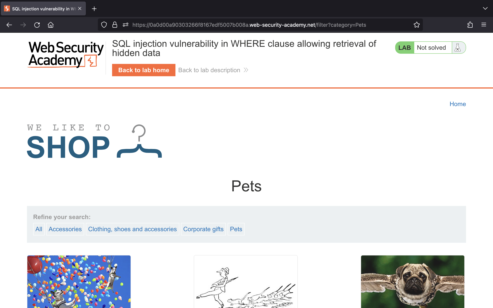

Bài lab yêu cầu chúng ta phải khiến cho ứng dụng hiển thị một hoặc nhiều sản phẩm chưa release.

Dựa vào câu truy vấn mà bài lab cung cấp, có thể hiểu rằng sản phẩm nào đã release thì `released = 1`, chúng ta cần xem cả những sản phầm chưa release nên cần bypass phần kiểm tra release này.

Do vậy, em thay đổi giá trị của `category` thành `' or 1=1--` sẽ bỏ được phần `AND released = 1` khỏi câu truy vấn. Lúc này câu truy vấn mà ứng dụng thực thi sẽ trở thành:

```sql
SELECT * FROM products WHERE category = '' or 1=1--' AND released = 1
```

Bởi vì `1=1` luôn đúng nên câu truy vấn sẽ trả về tất cả các sản phẩm bao gồm cả những sản phẩm chưa release:

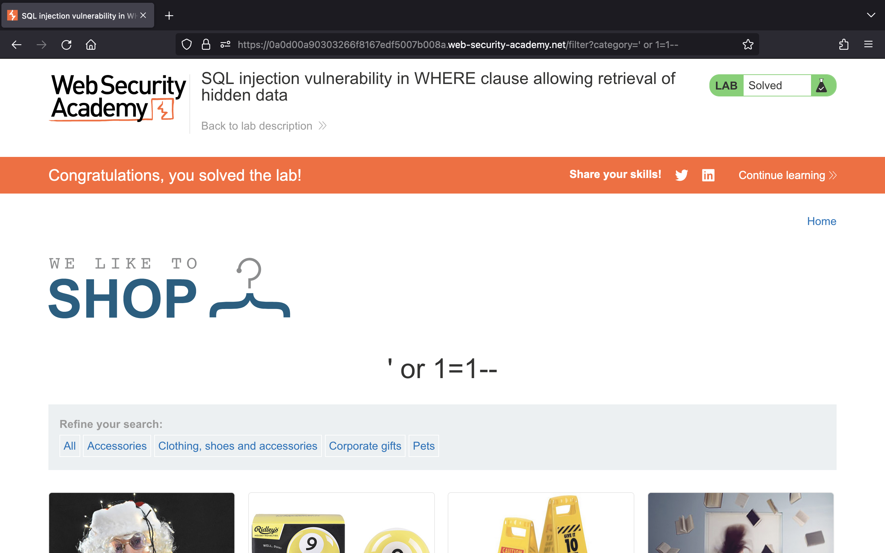

### Lab 2: [SQL injection vulnerability allowing login bypass](https://portswigger.net/web-security/sql-injection/lab-login-bypass)

>  This lab contains a SQL injection vulnerability in the login function.
>
> To solve the lab, perform a SQL injection attack that logs in to the application as the `administrator` user.

Truy cập lab, em vào trang đăng nhập:

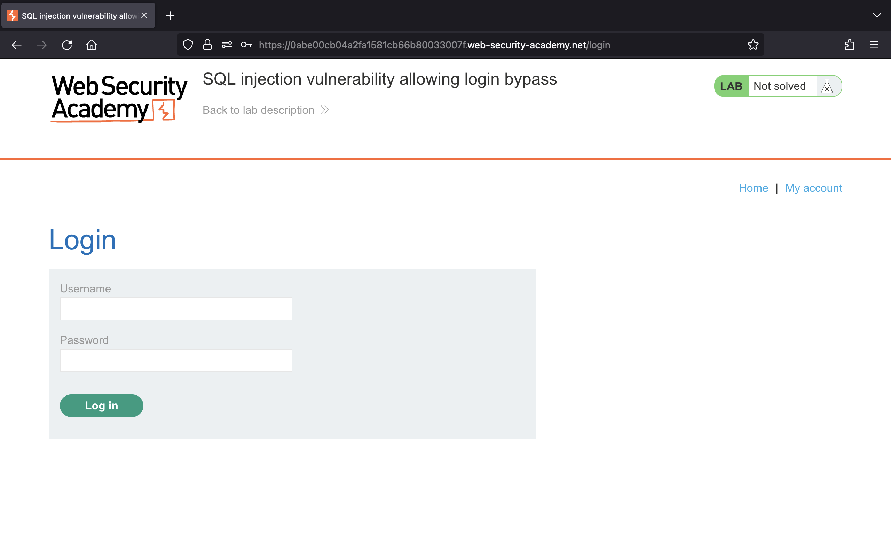

Bài lab yêu cầu chúng ta đăng nhập với user là `administrator` nhưng chúng ta không biết password, vậy cần bypass phần kiểm tra password. Em nhập username là `administrator'--` và password bất kì đã đăng nhập thành công:

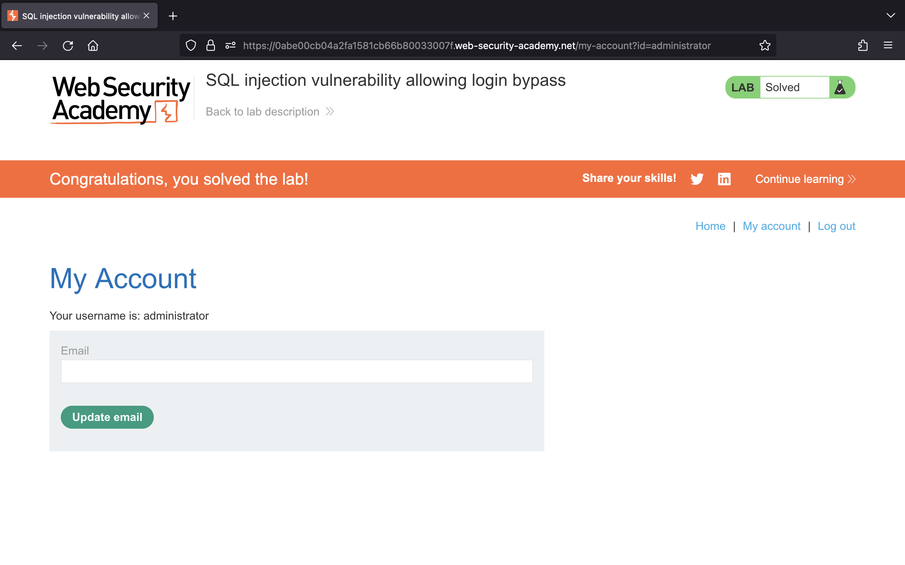

### Lab 3: [SQL injection UNION attack, determining the number of columns returned by the query](https://portswigger.net/web-security/sql-injection/union-attacks/lab-determine-number-of-columns)

> This lab contains a SQL injection vulnerability in the product category filter. The results from the query are returned in the application's response, so you can use a UNION attack to retrieve data from other tables. The first step of such an attack is to determine the number of columns that are being returned by the query. You will then use this technique in subsequent labs to construct the full attack.
>
> To solve the lab, determine the number of columns returned by the query by performing a SQL injection UNION attack that returns an additional row containing null values. 

Truy cập lab, em vào xem sản phẩm theo danh mục Pets:

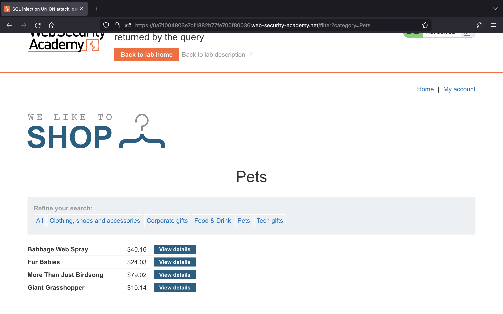

Bài lab yêu cầu chúng ta khiến câu truy vấn trả về thêm 1 hàng chứa các giá trị null nên em thử với payload `' UNION SELECT NULL--` nhận được lỗi:

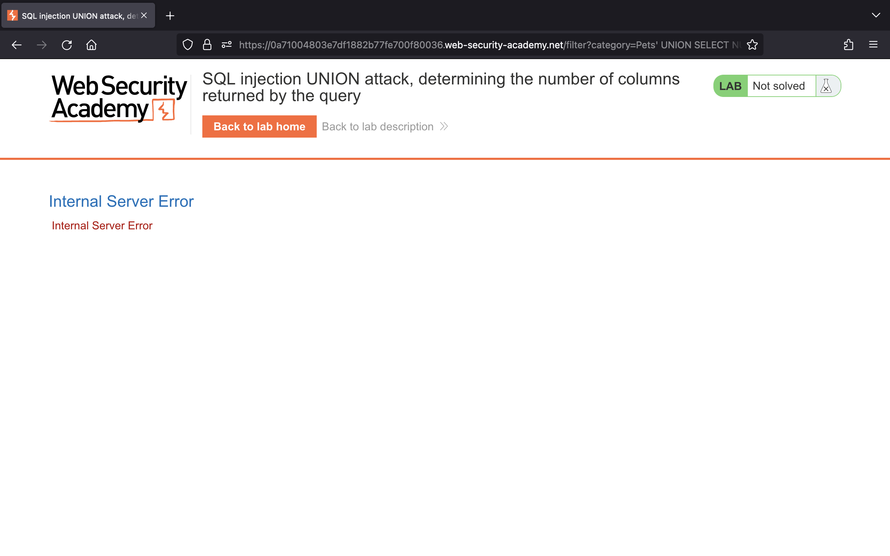

Vậy là câu truy vấn trả về nhiều hơn 1 cột. Em thêm lần lượt giá trị null vào payload để kiểm tra và tới payload `' UNION SELECT NULL, NULL, NULL--` đã thành công:

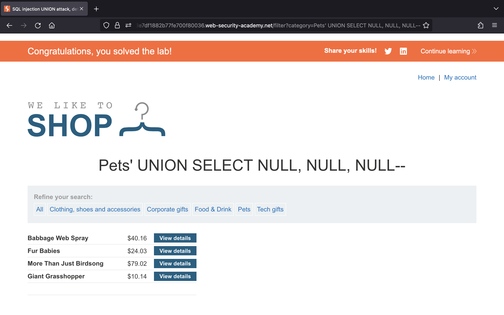

### Lab 4: [SQL injection UNION attack, finding a column containing text](https://portswigger.net/web-security/sql-injection/union-attacks/lab-find-column-containing-text)

> This lab contains a SQL injection vulnerability in the product category filter. The results from the query are returned in the application's response, so you can use a UNION attack to retrieve data from other tables. To construct such an attack, you first need to determine the number of columns returned by the query. You can do this using a technique you learned in a previous lab. The next step is to identify a column that is compatible with string data.
>
> The lab will provide a random value that you need to make appear within the query results. To solve the lab, perform a SQL injection UNION attack that returns an additional row containing the value provided. This technique helps you determine which columns are compatible with string data. 

Truy cập lab, em làm tương tự như lab 3 để tìm được số cột:

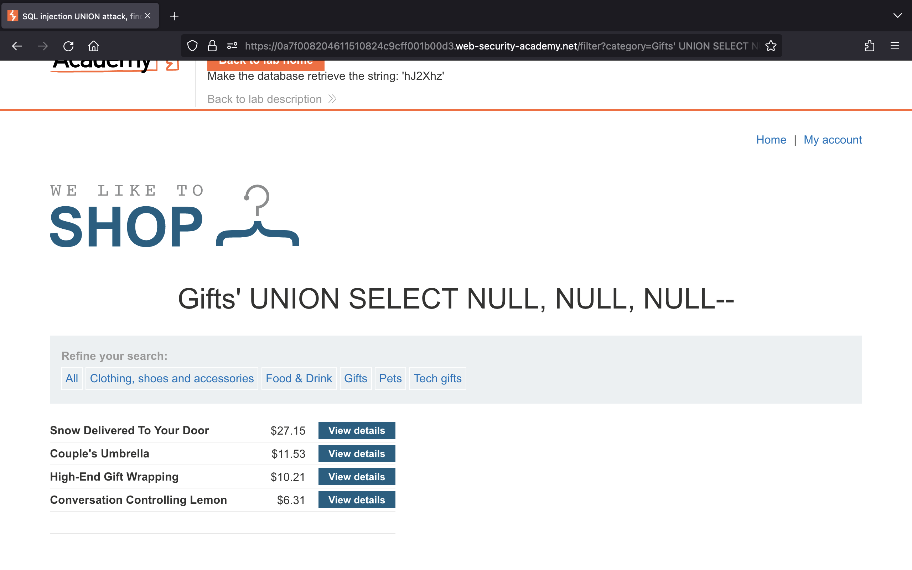

Giờ cần tìm cột có data type phù hợp để chứa được string `'hJ2Xhz'` nên em thay lần lượt string đó vào từng `NULL` trong payload.

Thử thay `'hJ2Xhz'` vào `NULL` đầu tiên nhận được lỗi:

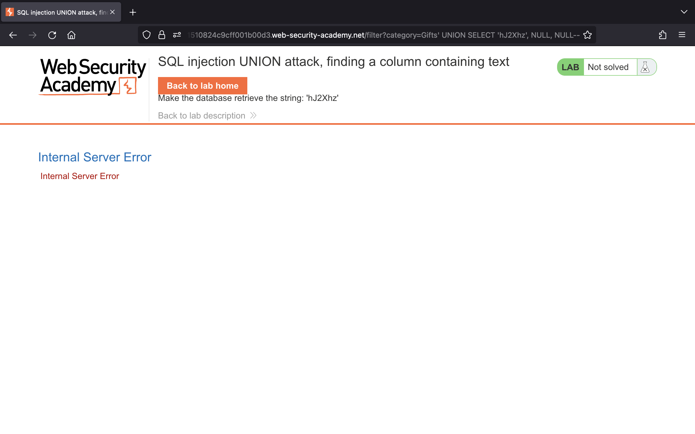

Vậy là cột 1 không được rồi. Em thay tiếp string `'hJ2Xhz'` vào `NULL` thứ hai thì thành công:

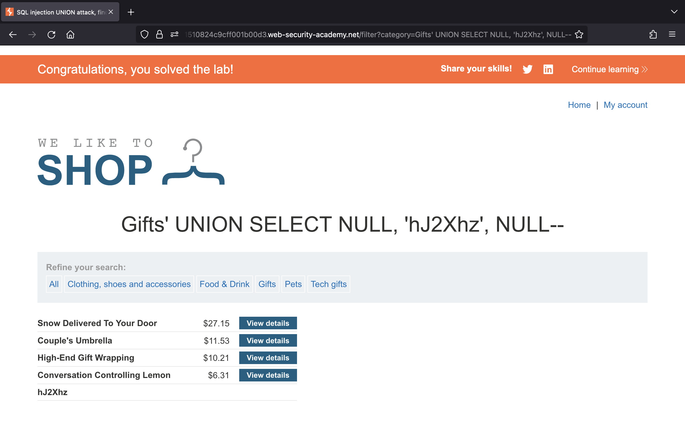

### Lab 5: [SQL injection attack, querying the database type and version on Oracle](https://portswigger.net/web-security/sql-injection/examining-the-database/lab-querying-database-version-oracle)

> This lab contains a SQL injection vulnerability in the product category filter. You can use a UNION attack to retrieve the results from an injected query.
>
> To solve the lab, display the database version string.
>
> <details>
> <summary>Hint</summary>
>
> On Oracle databases, every `SELECT` statement must specify a table to select `FROM`. If your `UNION SELECT` attack does not query from a table, you will still need to include the `FROM` keyword followed by a valid table name.
>
> There is a built-in table on Oracle called `dual` which you can use for this purpose. For example: `UNION SELECT 'abc' FROM dual`
> </details>

Truy cập lab, em vào xem danh mục Pets:

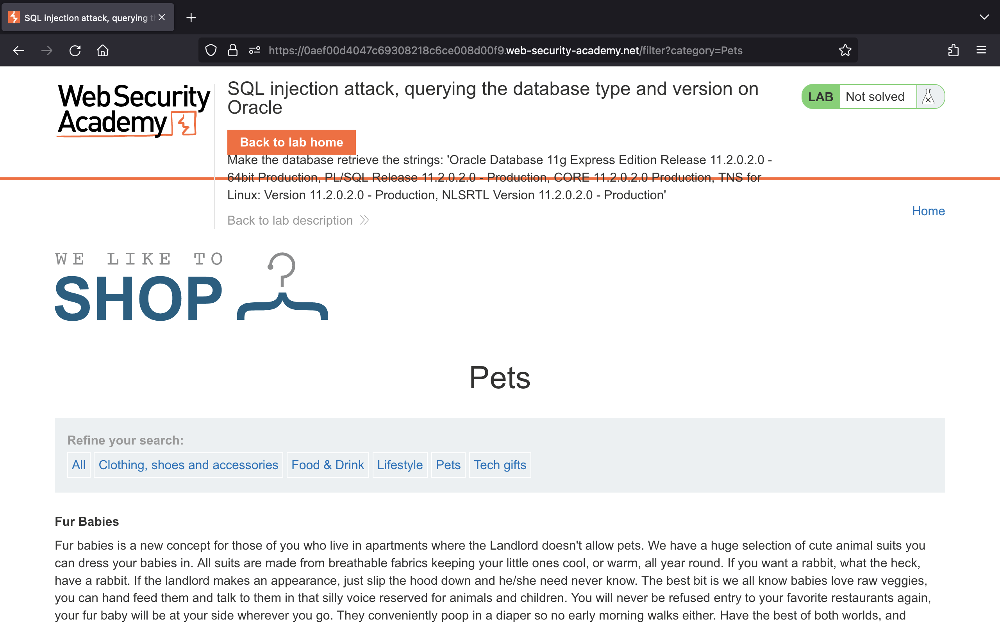

Bài lab yêu cầu chúng ta phải khiến cho ứng dụng trả về version của database.

Trước tiên, cần xem câu truy vấn ban đầu trả về bao nhiêu cột. Dựa vào hint, mỗi câu lệnh `SELECT` ở Oracle database phải chỉ định một bảng hợp lệ nên em sử dụng payload `' UNION SELECT NULL FROM dual--` để kiểm tra:

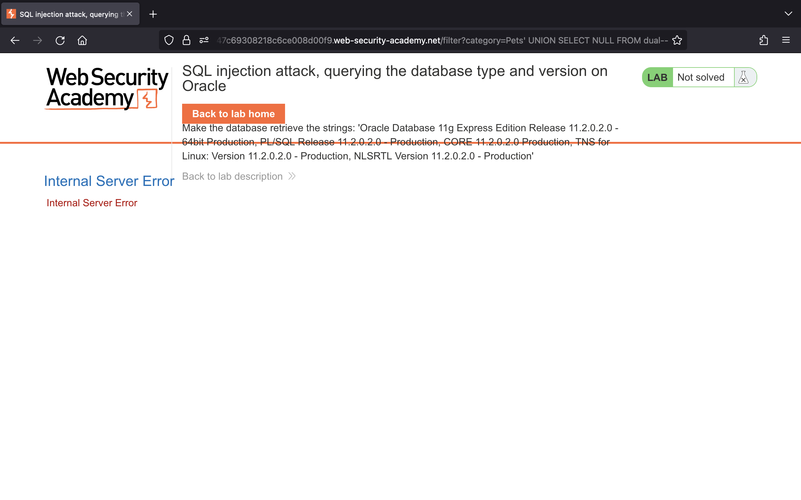

Đã có lỗi xảy ra, như vậy là câu truy vấn gốc trả về nhiều hơn 1 cột. Em tiếp tục thêm giá trị null vào để kiểm tra và xác định được số cột là 2.

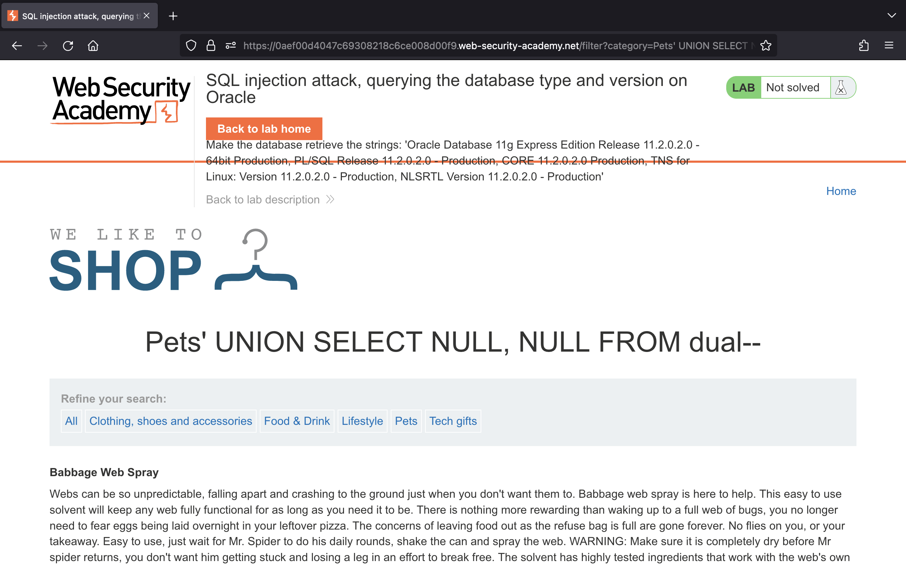

Tiếp theo, cần xem cột nào có thể chứa string, em dùng payload `' UNION SELECT 'hehe', NULL FROM dual--` thấy được cột 1 có thể nhận string.

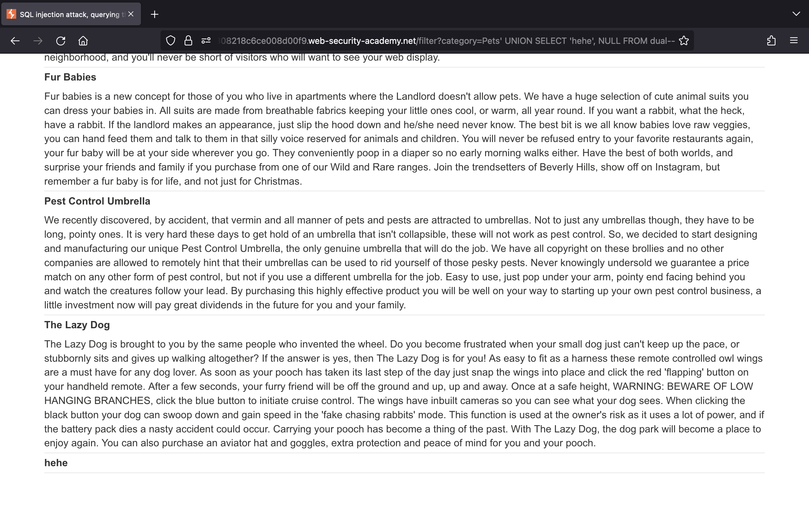

Giờ có thể lấy database version bằng cách sử dụng payload `' UNION SELECT banner, NULL FROM v$version--`:

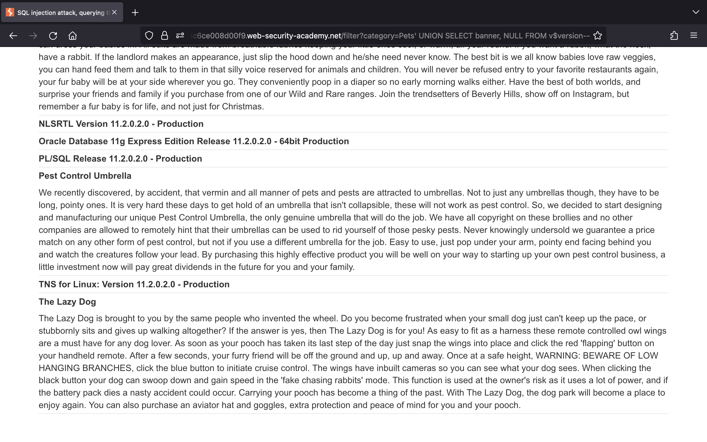

### Lab 6: [SQL injection attack, querying the database type and version on MySQL and Microsoft](https://portswigger.net/web-security/sql-injection/examining-the-database/lab-querying-database-version-mysql-microsoft)

> This lab contains a SQL injection vulnerability in the product category filter. You can use a UNION attack to retrieve the results from an injected query.
>
> To solve the lab, display the database version string.

Truy cập lab, em vào xem danh mục Gifts:

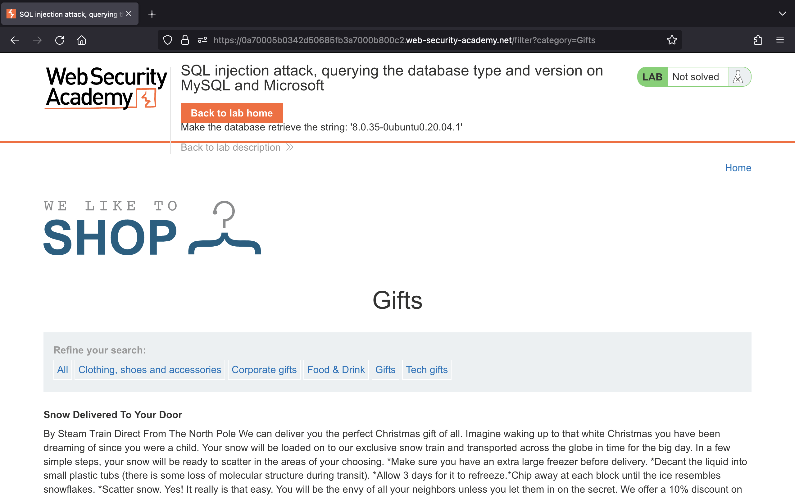

Trước tiên, em xác định số cột được trả về từ câu truy vấn là 2 bằng cách sử dụng payload `' UNION SELECT NULL, NULL--+`:

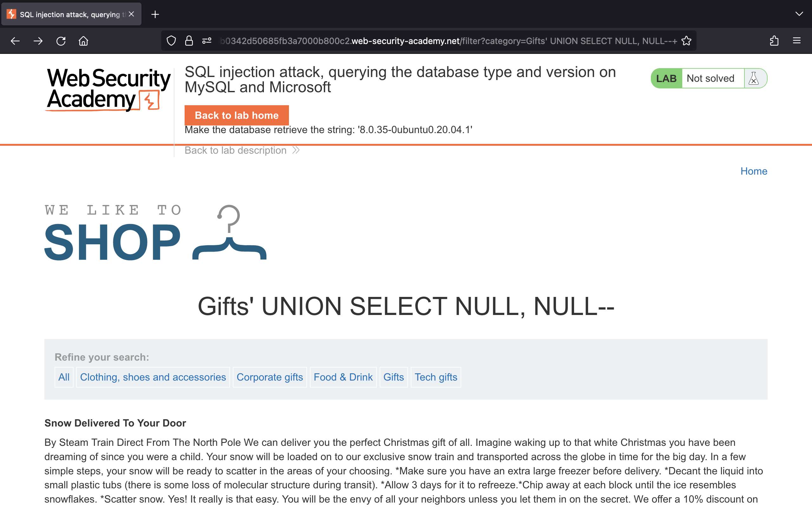

Tiếp theo, em xác định được cột 1 có thể chứa string bằng cách sử dụng payload `' UNION SELECT 'hehe', NULL--+`:

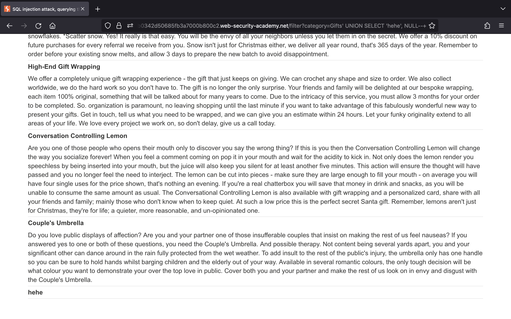

Và cuối cùng, em sử dụng payload `' UNION SELECT @@version, NULL--+` đã xem được database version:

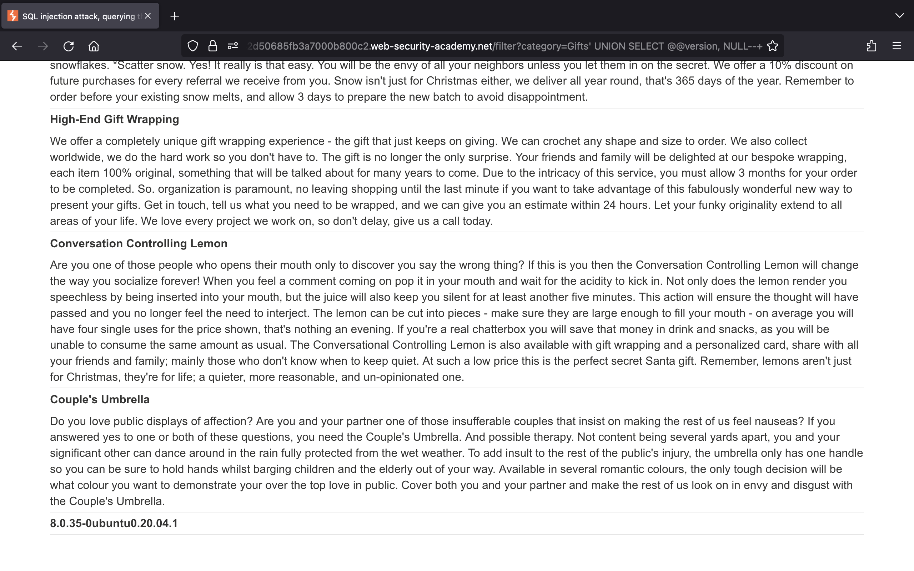

### Lab 7: [SQL injection attack, listing the database contents on non-Oracle databases](https://portswigger.net/web-security/sql-injection/examining-the-database/lab-listing-database-contents-non-oracle)

> This lab contains a SQL injection vulnerability in the product category filter. The results from the query are returned in the application's response so you can use a UNION attack to retrieve data from other tables.
>
> The application has a login function, and the database contains a table that holds usernames and passwords. You need to determine the name of this table and the columns it contains, then retrieve the contents of the table to obtain the username and password of all users.
>
> To solve the lab, log in as the `administrator` user.

Truy cập lab, em vào xem danh mục Pets:

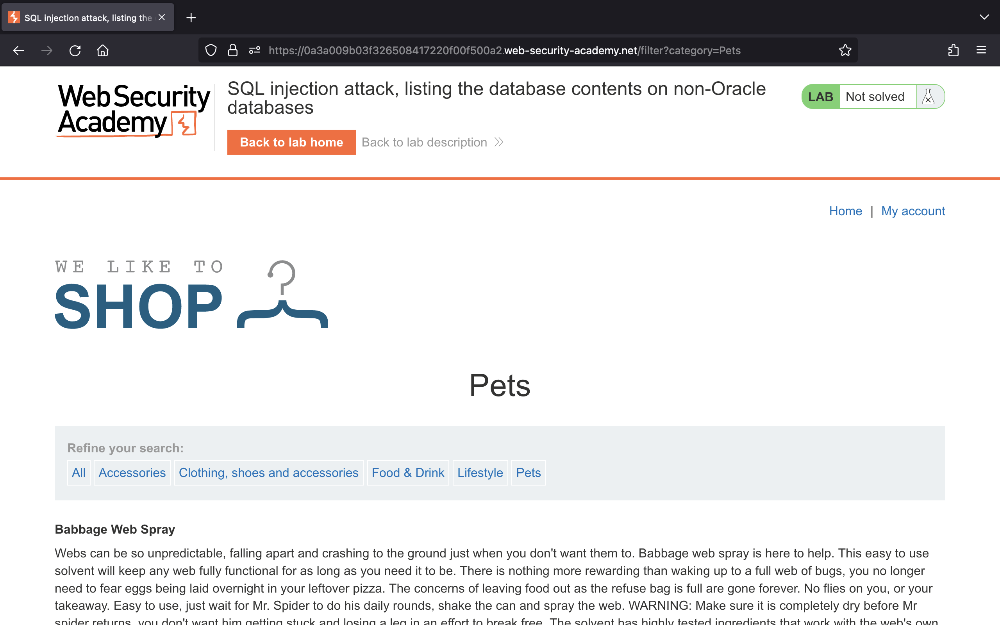

Tương tự như mấy lab trước, em biết được câu truy vấn trả về 2 cột và cột 1 có thể chứa string nên em sử dụng payload `' UNION SELECT table_name, NULL FROM information_schema.tables--` đã xem được danh sách các bảng của database:

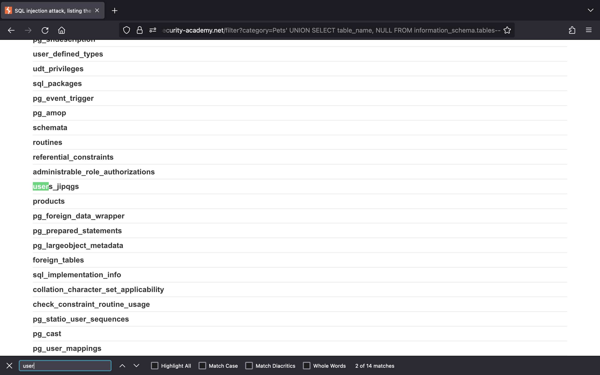

Tiếp theo, em liệt kê các cột của bảng `users_jipqgs` bằng cách sử dụng payload `' UNION SELECT column_name, NULL FROM information_schema.columns WHERE table_name='users_jipqgs'--` thấy được cột `password_uaaenk` và cột `username_unitwp`:

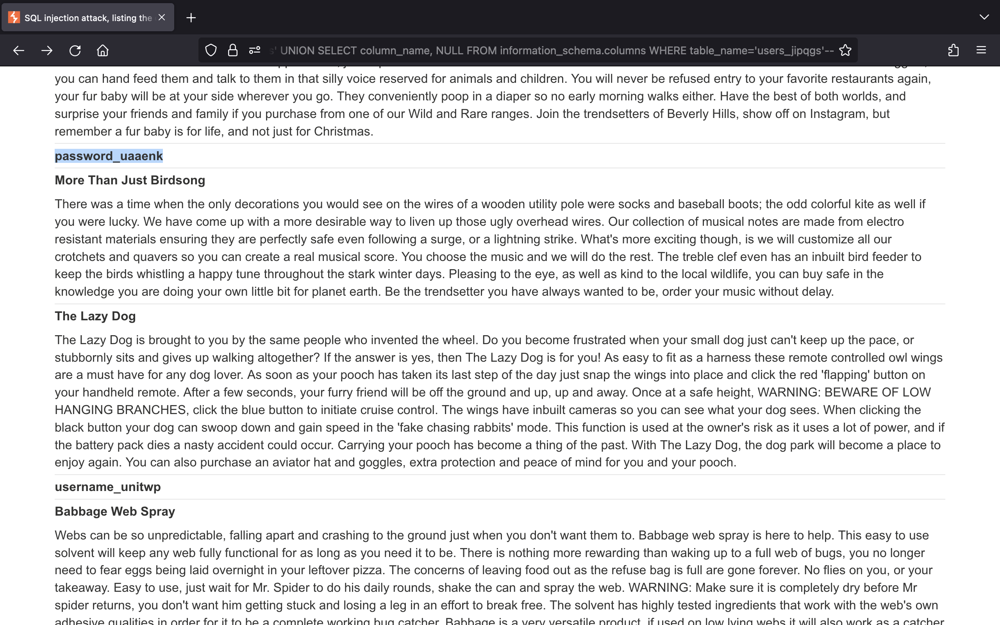

Em đọc nội dung của 2 cột đó sử dụng payload `' UNION SELECT password_uaaenk, username_unitwp FROM users_jipqgs--` thấy được thông tin của `administrator`:

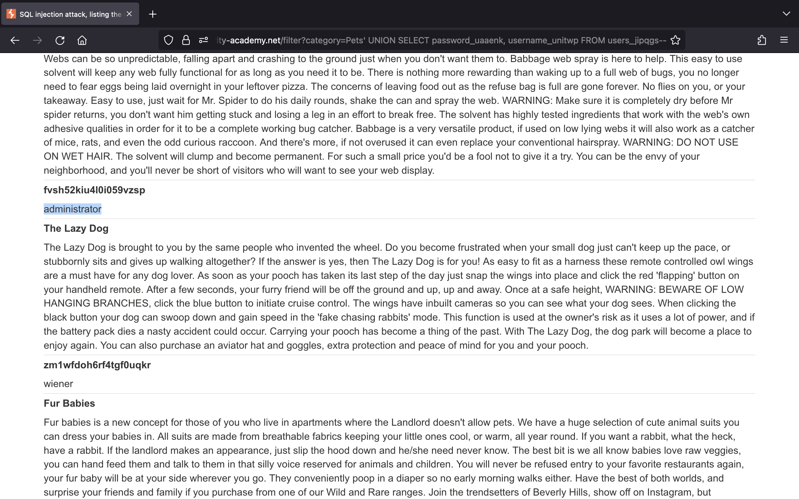

Và cuối cùng đăng nhập thành công với `administrator`:`fvsh52kiu4l0i059vzsp`.

### Lab 8: [Lab: SQL injection attack, listing the database contents on Oracle](https://portswigger.net/web-security/sql-injection/examining-the-database/lab-listing-database-contents-oracle)

> This lab contains a SQL injection vulnerability in the product category filter. The results from the query are returned in the application's response so you can use a UNION attack to retrieve data from other tables.
>
> The application has a login function, and the database contains a table that holds usernames and passwords. You need to determine the name of this table and the columns it contains, then retrieve the contents of the table to obtain the username and password of all users.
>
> To solve the lab, log in as the `administrator` user. 
>
> <details>
> <summary>Hint</summary>
>
> On Oracle databases, every `SELECT` statement must specify a table to select `FROM`. If your `UNION SELECT` attack does not query from a table, you will still need to include the `FROM` keyword followed by a valid table name.
>
> There is a built-in table on Oracle called `dual` which you can use for this purpose. For example: `UNION SELECT 'abc' FROM dual` 
> </details>

Tương tự như lab trước nhưng do ứng dụng sử dụng Oracle database nên payload có chút khác biệt. Em biết được số cột mà câu truy vấn trả về là 2 nên em sử dụng payload `' UNION SELECT table_name, NULL FROM all_tables--` để liệt kê các bảng của database:

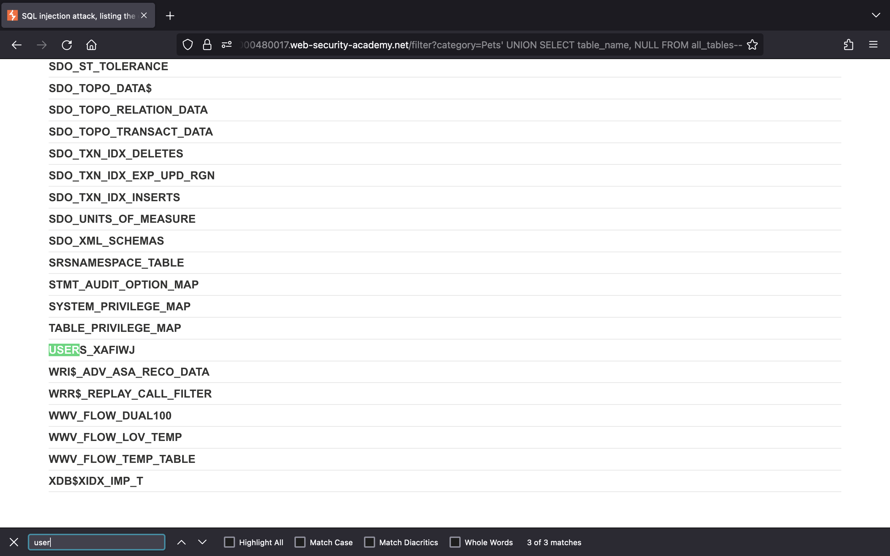

Tiếp theo, em liệt kê các cột của bảng `USERS_XAFIWJ` sử dụng payload `' UNION SELECT column_name, NULL FROM all_tab_columns WHERE table_name='USERS_XAFIWJ'--` thấy được cột `PASSWORD_OSXRXI` và cột `USERNAME_ORDSTE`:

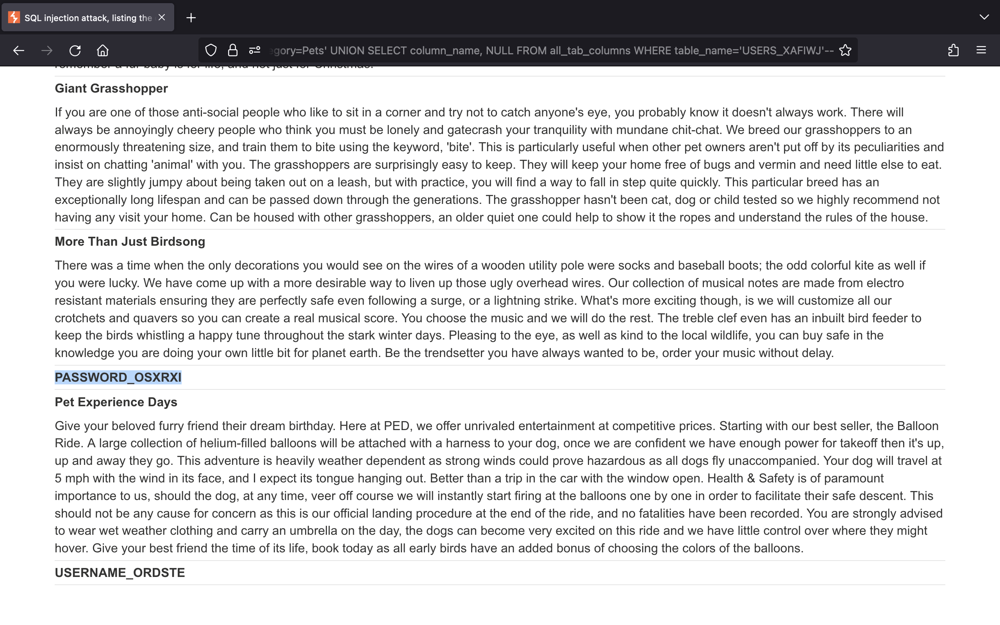

Em đọc nội dung của 2 cột đó sử dụng payload `' UNION SELECT PASSWORD_OSXRXI, USERNAME_ORDSTE FROM USERS_XAFIWJ--` thấy được thông tin của `administrator`:

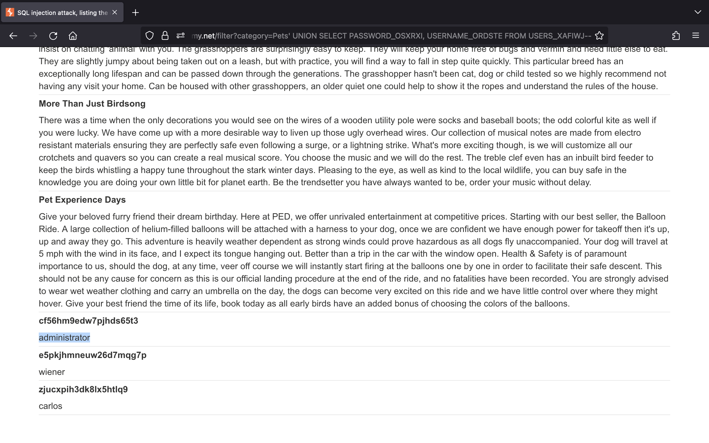

Và cuối cùng đăng nhập thành công với `administrator`:`cf56hm9edw7pjhds65t3`.

### Lab 9: [SQL injection UNION attack, retrieving data from other tables](https://portswigger.net/web-security/sql-injection/union-attacks/lab-retrieve-data-from-other-tables)

> This lab contains a SQL injection vulnerability in the product category filter. The results from the query are returned in the application's response, so you can use a UNION attack to retrieve data from other tables. To construct such an attack, you need to combine some of the techniques you learned in previous labs.
>
> The database contains a different table called users, with columns called username and password.
>
> To solve the lab, perform a SQL injection UNION attack that retrieves all usernames and passwords, and use the information to log in as the administrator user.

Em sử dụng payload `' UNION SELECT table_name, NULL FROM information_schema.tables--` để liệt kê các bảng của database và thấy được bảng `users`:

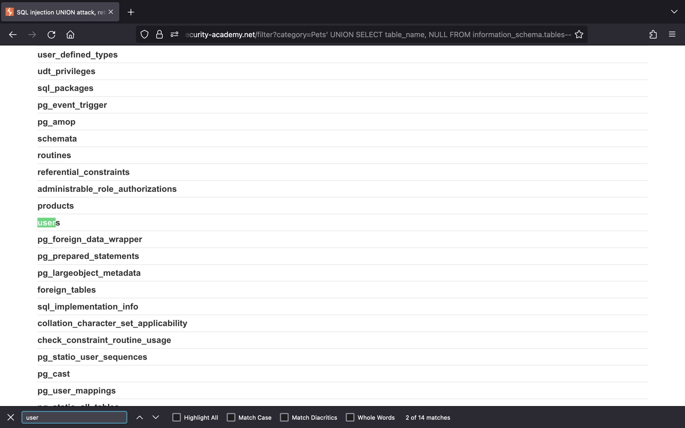

Tiếp theo, để liệt kê các cột của bảng `users` em sử dụng payload `' UNION SELECT column_name, NULL FROM information_schema.columns WHERE table_name='users'--` thấy được cột `password` và cột `username`:

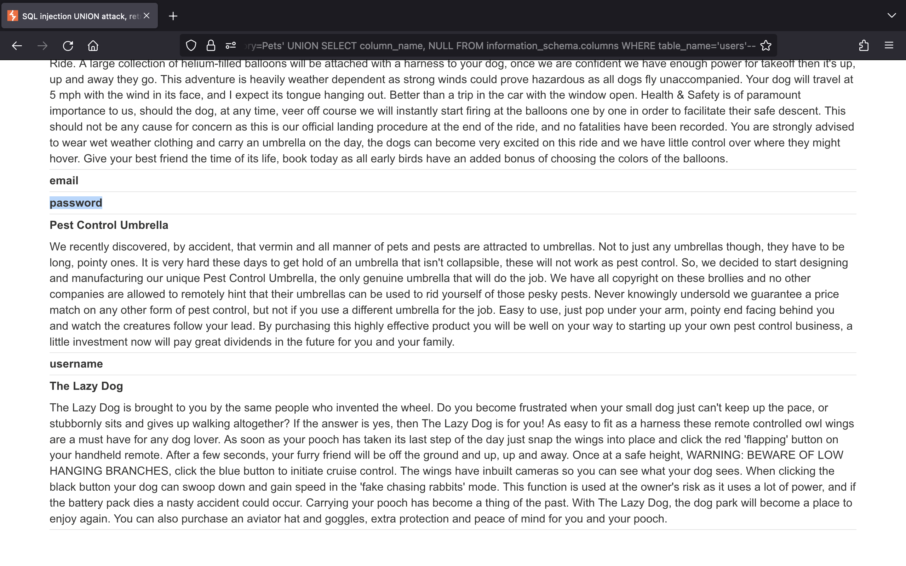

Em đọc 2 cột đó sử dụng payload `' UNION SELECT password, username FROM users--` thấy được thông tin của `administrator`:

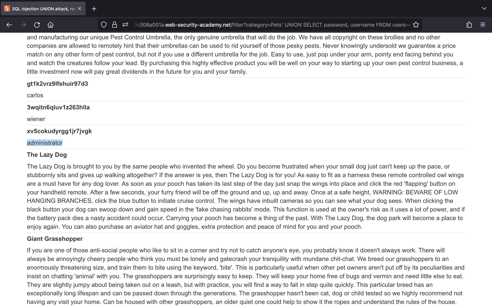

Và cuối cùng đăng nhập thành công với `administrator`:`xv5cokudyrgg1jr7jvgk`.

### Lab 10: [SQL injection UNION attack, retrieving multiple values in a single column](https://portswigger.net/web-security/sql-injection/union-attacks/lab-retrieve-multiple-values-in-single-column)

> This lab contains a SQL injection vulnerability in the product category filter. The results from the query are returned in the application's response so you can use a UNION attack to retrieve data from other tables.
>
> The database contains a different table called `users`, with columns called `username` and `password`.
>
> To solve the lab, perform a SQL injection UNION attack that retrieves all usernames and passwords, and use the information to log in as the `administrator` user.

Truy cập lab, em vào xem danh mục Pets.

Em sử dụng payload `' UNION SELECT NULL, NULL--` xác định được câu truy vấn trả về 2 cột:


Tiếp theo cần xác định cột nào có thể chứa string. Em thay lần lượt `'hehe'` vào từng `NULL` trong payload thì xác định được cột 2 có thể chứa string:

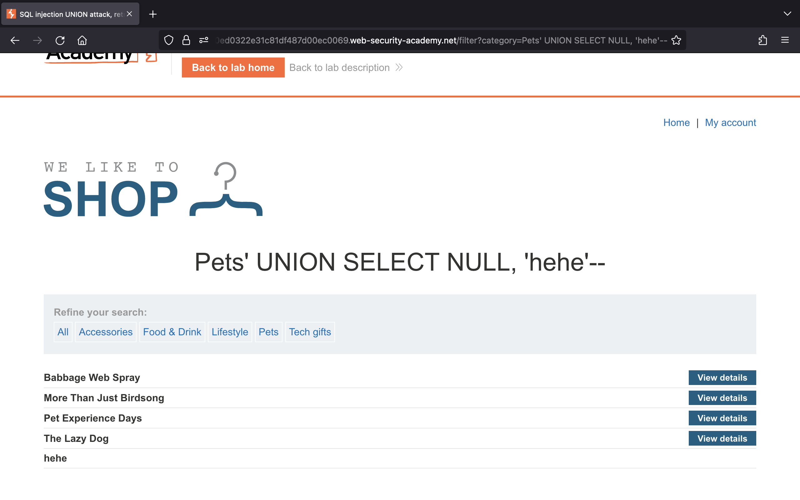

Giờ em sẽ đọc nội dung của cột `username` và `password` trong bảng `users`. Nhưng chỉ có một cột có thể chứa string nên em dùng toán tử `||` để nối các giá trị lại với nhau, vậy có payload `' UNION SELECT NULL, username || ':' || password FROM users--`:

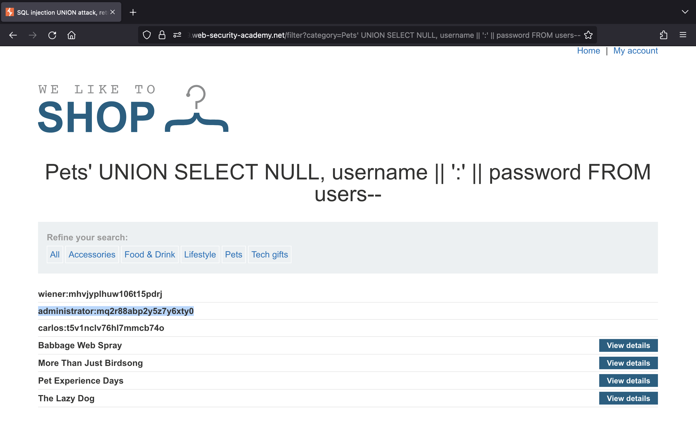

Và cuối cùng đăng nhập thành công với `administrator`:`mq2r88abp2y5z7y6xty0`.

## Khai thác SQL injection trên web đã viết ở Task 1

### SQLi ở chức năng xoá

Truy cập vào trang web thấy được giao diện như sau:

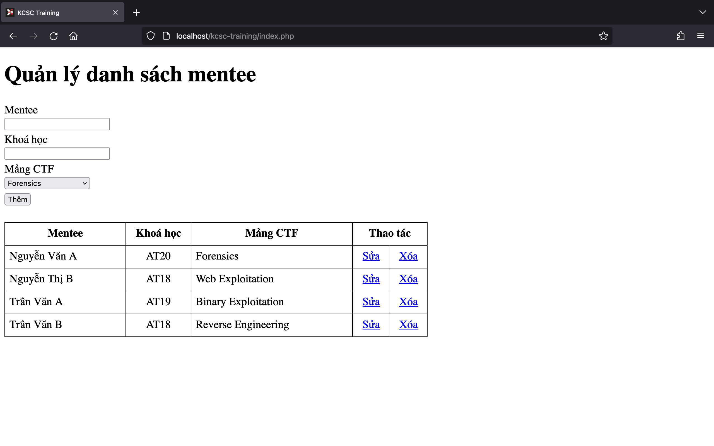

Inspect chữ `Xoá` ở dòng đầu tiên, em sửa giá trị của tham số `id` thành `66 OR 1=1--`:

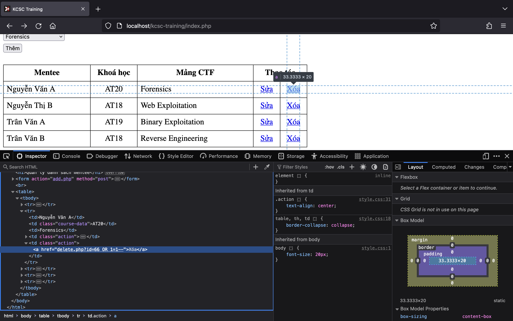

Sau đó nhấn `Xoá` thì đã xoá được danh sách mentee:

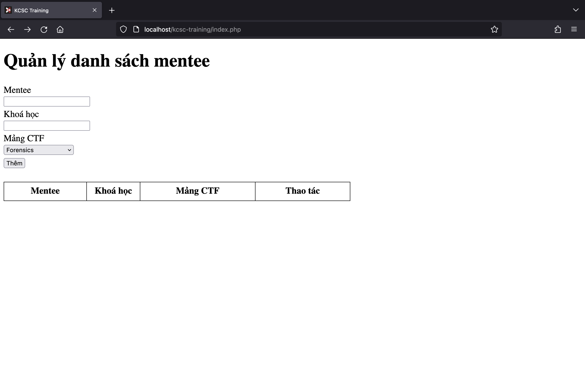

### SQLi ở chức năng sửa

Tương tự, khi nhấn vào `Sửa`, em thay đổi giá trị của tham số `id` thành `72 OR 1=1--`:

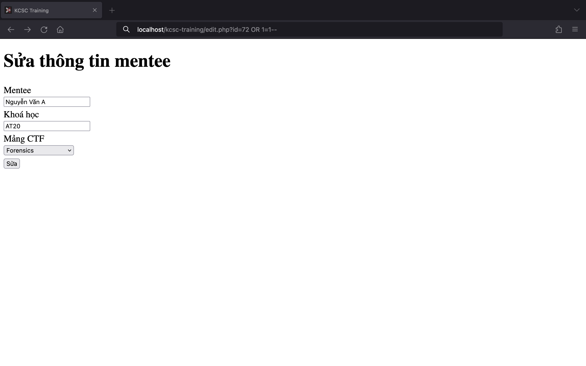

Sau khi nhấn sửa thì các thông tin của những mentee còn lại giống với mentee có `id` là `72`:

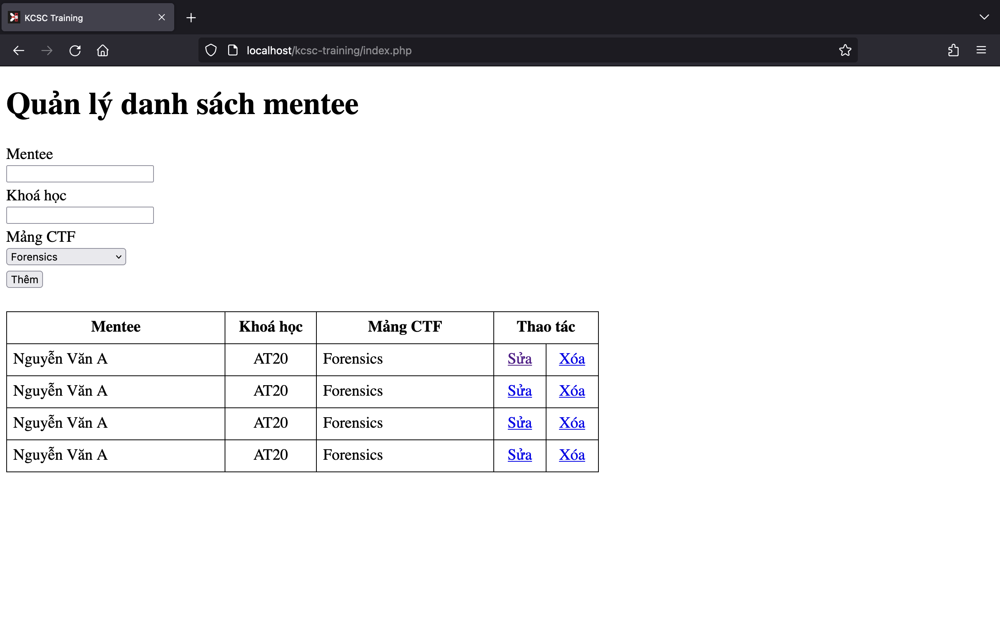