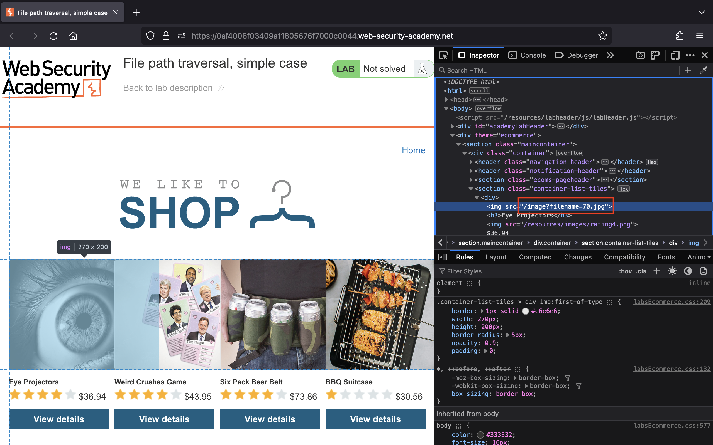
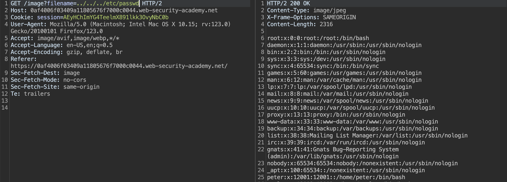
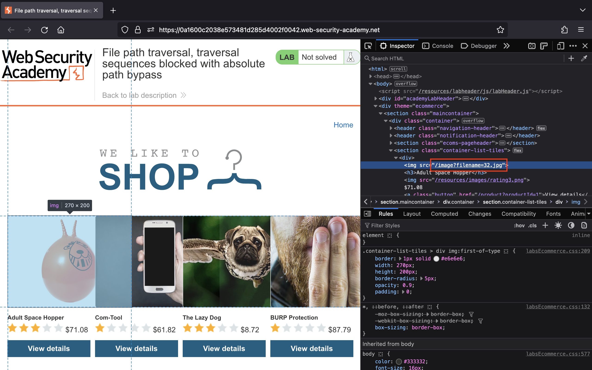
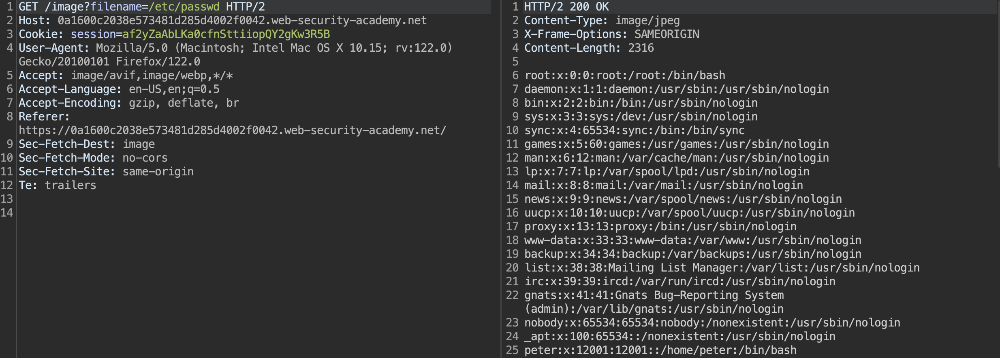
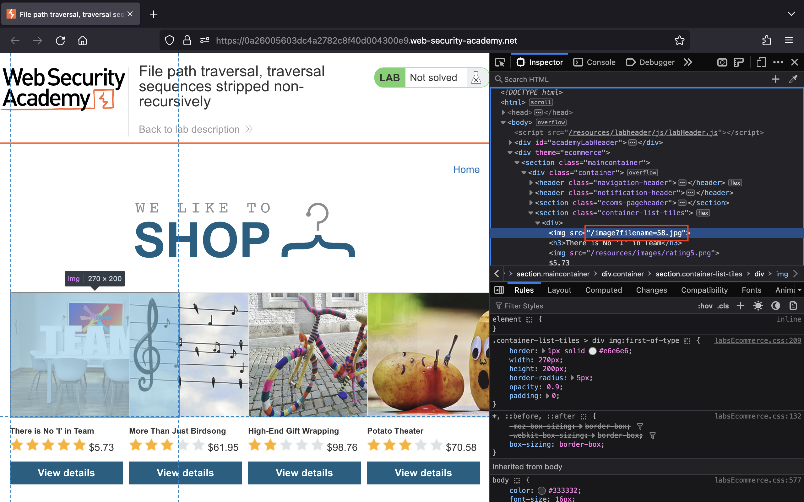
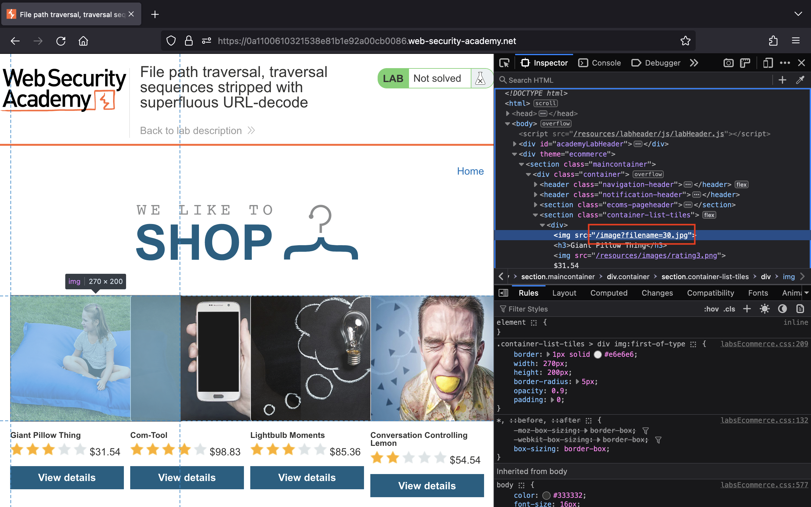
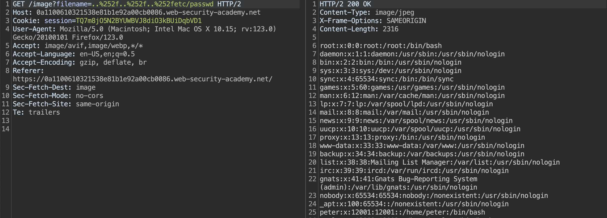
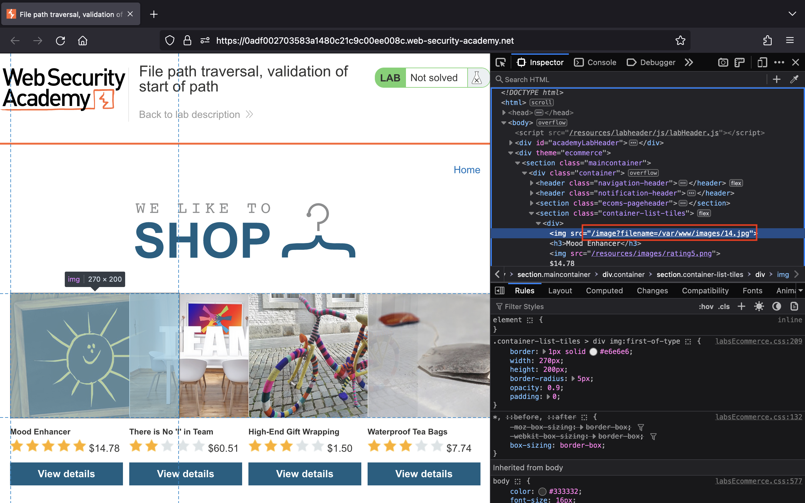
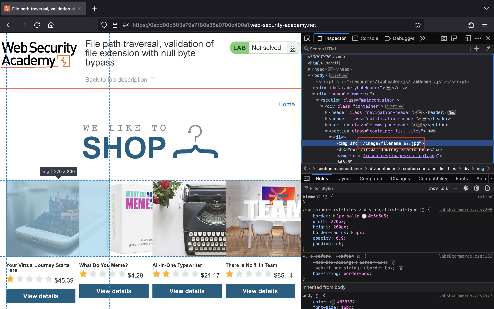
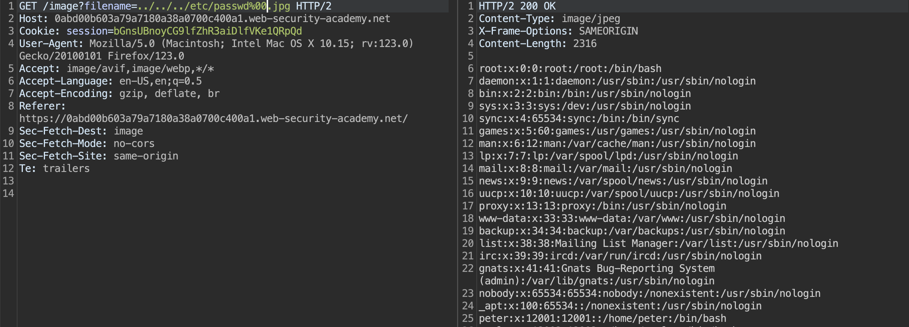

# Task 3

## Tìm hiểu về lỗ hổng Path Traversal

### Path traversal là gì?

Path traversal (hay còn được gọi là directory traversal) là một lỗ hổng bảo mật trong các ứng dụng web cho phép attacker truy cập và xem các file tuỳ ý trên server, từ đó có thể dẫn tới việc bị lộ source code của ứng dụng, các thông tin đăng nhập hệ thống và các file nhạy cảm của hệ điều hành...

Trong một số trường hợp, attacker có thể viết các file tuỳ ý trên server, cho phép họ chỉnh sửa dữ liệu, hành vi của ứng dụng và chiếm quyền điều khiển server.

### Path traversal hoạt động như thế nào?

Các file tạo nên website hay web app được đặt trong thư mục root của server. Thư mục này thường chứa các thư mục con cho mỗi website hay web app. Ví dụ, trên Linux/UNIX với Apache server, thư mục root là `/var/www/` và trên Microsoft Windows server với IIS, thư mục root là `C:\inetpub\wwwroot`.

Ví dụ, một ứng dụng mua sắm sẽ hiển thị các hình ảnh của từng sản phẩm bằng cách sử dụng thẻ HTML như sau:

```html

```

Khi request tới URL này sẽ trả về nội dung của file. Các file ảnh được lưu trữ ở thư mục `/var/www/images/`. Để hiển thị hình ảnh, ứng dụng sẽ nối tên file được request vào thư mục này và sử dụng filesystem API để đọc nội dung của file qua đường dẫn sau:

```text
/var/www/images/218.png
```

Bởi vì ứng dụng không thực hiện các biện pháp ngăn chặn tấn công path traversal nên attacker có thể đọc nội dung của file `/etc/passwd` bằng cách request tới URL như sau:

```text
https://insecure-website.com/loadImage?filename=../../../etc/passwd
```

Do đó, ứng dụng sẽ đọc nội dung của file qua đường dẫn sau:

```text
/var/www/images/../../../etc/passwd
```

Sử dụng `../` là hợp lệ trong đường dẫn file, nó có nghĩa là di chuyển lên một cấp trong cấu trúc thư mục. Vì vậy, bằng việc sử dụng `../../../` thì attacker có thể di chuyển từ `/var/www/images/` tới root filesystem và file chính xác được đọc là:

```text
/etc/passwd
```

Ở các hệ điều hành dựa trên Unix thì file này chứa các thông tin về những người dùng trên server, nhưng attacker cũng có thể sử dụng kỹ thuật này để lấy được các file tuỳ ý khác.

Ở Windows, attacker có thể dùng cả hai `../` và `..\` để khai thác path traversal. Dưới đây là một ví dụ:

```text
https://insecure-website.com/loadImage?filename=..\..\..\windows\win.ini
```

### Cách ngăn chặn lỗ hổng path traversal

Cách hiệu quả nhất để ngăn chặn những lỗ hổng path traversal là tránh truyền dữ liệu đầu vào do người dùng cung cấp tới filesystem API. Nhưng nếu không thể tránh việc này, chúng ta có thể sử dụng hai lớp bảo vệ sau để ngăn chặn cuộc tấn công xảy ra:

- Xác thực dữ liệu đầu vào của người dùng trước khi xử lý bằng cách so sánh nó với các giá trị được phép trong whitelist. Hoặc là chúng ta có thể xác thực dữ liệu đầu vào chỉ chứa nội dung được phép, ví dụ như các ký tự chữ và số.

- Sau khi xác thực dữ liệu đầu vào, chúng ta nối nó tới thư mục mong muốn và sử dụng filesystem API để chuẩn hoá đường dẫn.

## Tìm hiểu về lỗ hổng Local File Inclusion

### Local file inclusion là gì?

Local file inclusion (LFI) là một lỗ hổng bảo mật trong các ứng dụng web cho phép attacker truy cập, xem hoặc bao gồm các file trong thư mục root trên server.

### Local file inclusion hoạt động như thế nào?

Thông thường, khi xây dựng ứng dụng web, các nhà phát triển cần truy cập các file nằm trong thư mục ứng dụng hoặc trong thư mục con của nó. Ví dụ, họ muốn bao gồm các file cấu hình, mô-đun ứng dụng hoặc truy cập và hiển thị các file do người dùng tải lên như hình ảnh, văn bản...

Để truy cập các file này, các nhà phát triển thường truyền tên file thông qua tham số dữ liệu đầu vào của người dùng. Ví dụ, một ứng dụng hiển thị ảnh được tải lên bởi người dùng, ứng dụng có thể cho phép các tên tùy ý đối với các hình ảnh này. Trong trường hợp ngôn ngữ kịch bản như PHP, các nhà phát triển cũng có thể cần bao gồm các file chứa source code.

Lỗ hổng này xảy ra khi attacker có thể bao gồm một đường dẫn hay tên file tuỳ ý trong dữ liệu đầu vào. Ví dụ, attacker có thể tận dụng chức năng hiển thị hình ảnh dựa trên tham số URL để hiển thị source code của ứng dụng.

Ví dụ, một ứng dụng PHP cho phép người dùng đọc những bài thơ được lưu trữ ở thư mục `poems` bằng việc thực thi đoạn code bên dưới trong file `poems/display.php`:

```php
<?php 
    $file = $_GET["file"];
    $handle = fopen($file, 'r');
    $poem = fread($handle, 1);
    fclose($handle);
    echo $poem;
?>
```

Chúng ta có thể thấy tên file được lấy trực tiếp từ tham số `file`. Do đó, chúng ta có thể xem được bài thơ `poem.txt` khi request tới URL sau:

```text
http://victim.example/my_app/display.php?file=poem.txt
```

Tuy nhiên, attacker có thể thao túng GET request để xem được file cấu hình `database.php` chứa username và password được sử dụng để kết nối tới database bằng cách sử dụng payload sau:

```text
http://victim.example/my_app/display.php?file=../config/database.php
```

### Cách ngăn chặn lỗ hổng local file inclusion

- Tránh hoàn toàn việc truyền tên file trong dữ liệu đầu vào của người dùng.

- Nếu ứng dụng cần sử dụng tên file từ dữ liệu đầu vào của người dùng, chúng ta cần tạo một whitelist của các file an toàn.

- Nếu chúng ta không thể tạo whitelist vì có tên file tùy ý được người dùng sử dụng, chúng ta có thể lưu các tên file này vào database và sử dụng ID của hàng trong dữ liệu đầu vào.

## Phân biệt giữa Path Traversal và Local File Inclusion

- Path traversal cho phép attacker truy cập các file nằm ở *bên ngoài* thư mục root và khi khai thác lổ hổng này không liên quan đến việc thực thi những đoạn code độc hại.

- Local file inclusion cho phép attacker bao gồm các file code hoặc xem các file nằm ở *bên trong* thư mục root và các thư mục con của nó.

Hai lỗ hổng này thường gây nhầm lẫn bởi chúng thường xuất hiện cùng nhau và có cùng một nguyên nhân: các nhà phát triển cho phép truyền đường dẫn tới các file cục bộ thông qua dữ liệu đầu vào của người dùng.

## Nguồn tham khảo

- <https://portswigger.net/web-security/file-path-traversal>
- <https://www.invicti.com/learn/directory-traversal-path-traversal/>
- <https://www.invicti.com/learn/local-file-inclusion-lfi/>

## Giải các bài lab Path Traversal của PortSwigger

### Lab 1: [File path traversal, simple case](https://portswigger.net/web-security/file-path-traversal/lab-simple)

> This lab contains a path traversal vulnerability in the display of product images.
>
> To solve the lab, retrieve the contents of the `/etc/passwd` file.

Truy cập bài lab, em thấy ứng dụng tải ảnh thông qua URL `image` với tham số `filename`:



Em đổi giá trị của tham số `filename` thành `../../../etc/passwd` đã thành công đọc được file `passwd`:



### Lab 2: [File path traversal, traversal sequences blocked with absolute path bypass](https://portswigger.net/web-security/file-path-traversal/lab-absolute-path-bypass)

> This lab contains a path traversal vulnerability in the display of product images.
>
> The application blocks traversal sequences but treats the supplied filename as being relative to a default working directory.
>
> To solve the lab, retrieve the contents of the `/etc/passwd` file.

Truy cập bài lab, em thấy ứng dụng tải ảnh thông qua URL `image` với tham số `filename`:



Em đổi giá trị của tham số `filename` thành `/etc/passwd` đã thành công đọc được file `passwd`:



### Lab 3: [File path traversal, traversal sequences stripped non-recursively](https://portswigger.net/web-security/file-path-traversal/lab-sequences-stripped-non-recursively)

> This lab contains a path traversal vulnerability in the display of product images.
>
> The application strips path traversal sequences from the user-supplied filename before using it.
>
> To solve the lab, retrieve the contents of the `/etc/passwd` file.

Truy cập bài lab, em thấy ứng dụng tải ảnh thông qua URL `image` với tham số `filename`:



Bởi vì ứng dụng không loại bỏ triệt để `../` nên em đổi giá trị của tham số `filename` thành `....//....//....//etc/passwd` đã thành công đọc được file `passwd`:


### Lab 4: [File path traversal, traversal sequences stripped with superfluous URL-decode](https://portswigger.net/web-security/file-path-traversal/lab-superfluous-url-decode)

> This lab contains a path traversal vulnerability in the display of product images.
>
> The application blocks input containing path traversal sequences. It then performs a URL-decode of the input before using it.
>
> To solve the lab, retrieve the contents of the `/etc/passwd` file.

Truy cập bài lab, em thấy ứng dụng tải ảnh thông qua URL `image` với tham số `filename`:



Theo như mô tả, ứng dụng đã chặn `../` và thực hiện URL decode dữ liệu đầu vào của chúng ta trước khi sử dụng. Do đó, em đổi giá trị của tham số `filename` thành `..%252f..%252f..%252fetc/passwd` đã thành công đọc được file `passwd`:



### Lab 5: [File path traversal, validation of start of path](https://portswigger.net/web-security/file-path-traversal/lab-validate-start-of-path)

> This lab contains a path traversal vulnerability in the display of product images.
>
> The application transmits the full file path via a request parameter, and validates that the supplied path starts with the expected folder.
>
> To solve the lab, retrieve the contents of the `/etc/passwd` file.

Truy cập bài lab, em thấy ứng dụng tải ảnh thông qua URL `image` với tham số `filename`:



Lần này ứng dụng yêu cầu file ảnh phải bắt đầu với đường dẫn `/var/www/images/` nên em đổi giá trị của tham số `filename` thành `/var/www/images/../../../etc/passwd` đã thành công đọc được file `passwd`:


### Lab 6: [Lab: File path traversal, validation of file extension with null byte bypass](https://portswigger.net/web-security/file-path-traversal/lab-validate-file-extension-null-byte-bypass)

> This lab contains a path traversal vulnerability in the display of product images.
>
> The application validates that the supplied filename ends with the expected file extension.
>
> To solve the lab, retrieve the contents of the `/etc/passwd` file.

Truy cập bài lab, em thấy ứng dụng tải ảnh thông qua URL `image` với tham số `filename`:



Lần này ứng dụng đã yêu cầu file phải có extension là `.jpg` hoặc `.png` nên em tận dụng null byte để thực hiện khai thác.

Em đổi giá trị của tham số `filename` thành `../../../etc/passwd%00.jpg` đã thành công đọc được file `passwd`:


