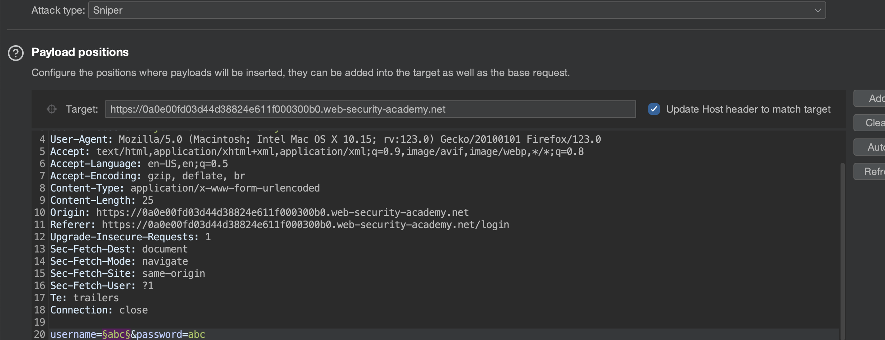
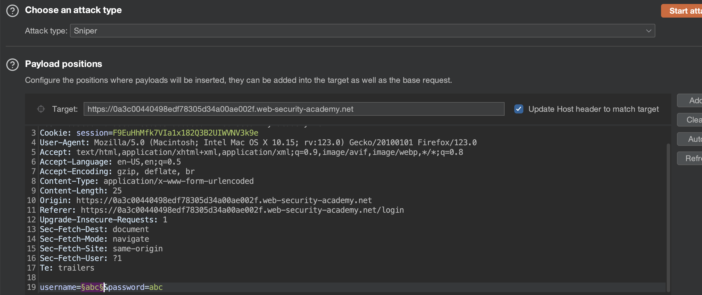
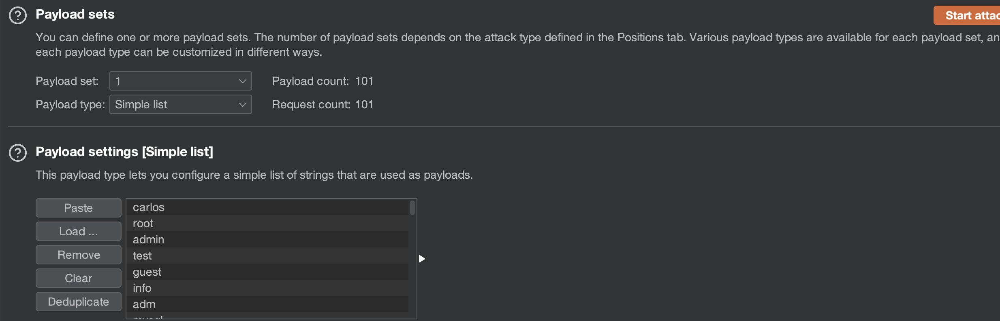
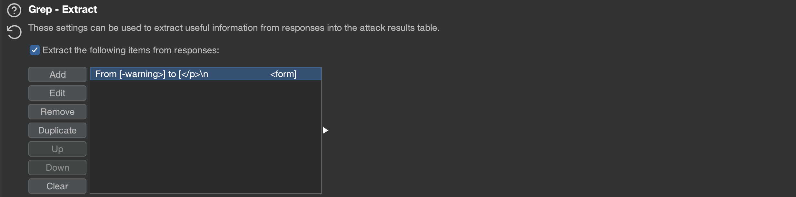

# Task 5

## Tìm hiểu về lỗ hổng Authentication

### Authentication là gì?

Authentication (xác thực) là quá trình xác minh danh tính của người dùng.

Có ba loại xác thực chính:

- Thông tin nào đó chúng ta biết, ví dụ như mật khẩu hoặc câu trả lời cho câu hỏi bảo mật. Chúng được gọi là "knowledge factors" - "yếu tố kiến thức".
- Thứ chúng ta có, là một vật như điện thoại di động hoặc mã thông báo bảo mật. Chúng được gọi là "possession factors" - "yếu tố sở hữu".
- Thứ gì đó là chúng ta, ví dụ như sinh trắc học. Chúng được gọi là "inherence factors" - "yếu tố vốn có".

### Sự khác biệt giữa Authentication và Authorization?

Authentication (xác thực) là quá trình xác minh chúng ta là ai. Ví dụ, việc xác thực sẽ xác định xem người đang truy cập tới website với tên `ABC` có chính xác là người đã có tài khoản trước đó không.

Authorization (uỷ quyền) là quá trình xác minh chúng ta có được phép làm điều gì đó hay không. Ví dụ, khi người dùng tên `ABC` được xác thực là một người dùng bình thường, `ABC` có thể được uỷ quyền để xoá tài khoản của chính mình.

### Tác động của lỗ hổng Authentication

Tác động của lỗ hổng authentication có thể nghiêm trọng. Nếu attacker bypass được phương pháp xác thực hay brute-force để truy cập vào tài khoản của người dùng khác, họ sẽ có quyền truy cập đến tất cả các dữ liệu và chức năng mà tài khoản bị xâm nhập có. Nếu họ có thể xâm phạm tài khoản có đặc quyền cao như quản trị viên hệ thống, họ có thể kiểm soát toàn bộ ứng dụng và có khả năng giành được quyền truy cập vào cơ sở hạ tầng nội bộ.

Ngay cả khi xâm phạm tài khoản có đặc quyền thấp attacker vẫn có thể truy cập vào những dữ liệu như thông tin doanh nghiệp nhạy cảm về mặt thương mại. Hay khi tài khoản không có quyền truy cập tới bất kỳ dữ liệu nhạy cảm nào, attacker vẫn có thể truy cập tới các trang bổ sung, từ đó có thêm hướng tấn công khác. Thông thường, các cuộc tấn công có mức độ nghiêm trọng cao không thể thực hiện từ các trang có thể truy cập công khai nhưng chúng có thể xảy ra từ một trang nội bộ.

### Khai thác lỗ hổng trong đăng nhập dựa trên mật khẩu

Đối với các trang web áp dụng quy trình đăng nhập dựa trên mật khẩu, người dùng có thể tự đăng ký tài khoản hoặc được quản trị viên cung cấp một tài khoản. Tài khoản này được liên kết với một tên người dùng duy nhất và một mật khẩu bí mật mà người dùng nhập vào form đăng nhập để xác thực.

Trong trường hợp này, việc biết mật khẩu sẽ được coi là bằng chứng đầy đủ về danh tính của người dùng. Do đó, tính bảo mật của trang web sẽ bị xâm phạm nếu attacker có thể lấy hoặc đoán thông tin đăng nhập của người dùng khác.

#### Tấn công brute-force

Tấn công brute-force là khi attacker sử dụng cách thức thử và sai để đoán thông tin đăng nhập hợp lệ của người dùng. Các cuộc tấn công này thường được tự động hoá bằng cách sử dụng danh sách gồm tên người dùng và mật khẩu. Việc tự động hoá quá trình này, đặc biệt là sử dụng các công cụ chuyên dụng sẽ cho phép attacker thực hiện được số lượng lớn lần thử đăng nhập ở tốc độ cao.

##### Brute-force tên người dùng

Tên người dùng đặc biệt dễ đoán nếu chúng tuân theo một mẫu có thể nhận dạng được, chẳng hạn như địa chỉ email. Ví dụ, chúng ta thường thấy thông tin đăng nhập ở dạng `firstname.lastname@somecompany.com`. Hoặc tên người dùng có đặc quyền cao mà chúng ta có thể đoán được như `administrator` hay `admin`.

##### Brute-force mật khẩu

Mật khẩu cũng có thể bị brute-force tương tự, tuỳ thuộc vào độ mạnh của nó. Nhiều trang web áp dụng chính sách mật khẩu, buộc người dùng phải đặt mật khẩu có độ khó:

- Có một số lượng kí tự tối thiểu
- Phải kết hợp giữa chữ hoa và chữ thường
- Phải có ít nhật một kí tự đặc biệt

Tuy nhiên, chúng ta cũng có thể sử dụng kiến thức cơ bản về hành vi của con người để khai thác các lỗ hổng mà người dùng vô tình đưa vào hệ thống. Thay vì tạo một mật khẩu mạnh với sự kết hợp ngẫu nhiên của các kí tự, người dùng thường lấy một mật khẩu mà họ có thể nhớ và cố gắng đặt mật khẩu đó sao cho phù hợp với chính sách mật khẩu. Ví dụ, nếu `mypassword` không được phép, người dùng có thể thử `Mypassword1!` hay `Myp4$$w0rd` thay thế.

Trong trường hợp chính sách yêu cầu người dùng thay đổi mật khẩu của họ thường xuyên, thông thường người dùng chỉ thực hiện những thay đổi nhỏ, có thể dự đoán được đối với mật khẩu ưa thích của họ. Ví dụ, `Mypassword1!` sẽ trở thành `Mypassword1?` hay `Mypassword2!`.

##### Liệt kê tên người dùng

Liệt kê tên người dùng là khi attacker có thể quan sát các thay đổi trong hành vi của trang web để xác định xem tên người dùng nhất định có hợp lệ hay không.

Việc liệt kê tên người dùng thường xảy ra trên trang đăng nhập. Ví dụ, khi chúng ta nhập tên người dùng hợp lệ nhưng mật khẩu không chính xác hoặc trên form đăng ký chúng ta nhập một tên đã được sử dụng. Điều này giúp giảm đáng kể thời gian và công sức cần thiết để thực hiện brute-force vì attacker có thể nhanh chóng tạo ra một wordlist chứa các tên người dùng hợp lệ.

Trong khi thực hiện brute-force một trang đăng nhập, chúng ta nên đặc biệt chú ý tới những sự khác biệt về:

- Status codes
- Error messages
- Response times

#### Thiếu sót trong việc bảo vệ chống lại brute-force

Một cuộc tấn công brute-force sẽ liên quan đến nhiều lần đoán sai trước khi attacker có thể xâm phạm tài khoản của người dùng thành công. Hai cách phổ biến nhất để ngăn chặn các cuộc tấn công brute-force là:

- Khoá tài khoản của người dùng đang truy cập nếu họ đăng nhập thất bại quá nhiều lần
- Chặn địa chỉ IP của người dùng nếu họ thực hiện quá nhiều lần đăng nhập liên tiếp

Ví dụ, đôi khi chúng ta có thể thấy rằng IP của mình bị chặn nếu bạn đăng nhập không thành công quá nhiều. Trong một số trường hợp, bộ đếm số lần thử không thành công sẽ được đặt lại nếu chủ sở hữu IP đăng nhập thành công. Điều này có nghĩa là attacker chỉ cần đăng nhập vào tài khoản của chính họ sau mỗi vài lần thử để ngăn chặn việc đạt đến giới hạn đăng nhập.

Trong trường hợp này, chúng ta chỉ cần bao gồm thông tin xác thực đăng nhập của riêng mình đều đặn trong toàn bộ wordlist là đủ để khiến việc bảo vệ này gần như vô dụng.

##### Khoá tài khoản

Một cách mà các trang web cố gắng ngăn chặn hành vi brute-force là khóa tài khoản nếu đáp ứng một số tiêu chí đáng ngờ nhất định, thường là một số lần đăng nhập không thành công. Cũng giống như các lỗi đăng nhập thông thường, response cho biết tài khoản đã bị khóa cũng có thể giúp attacker liệt kê tên người dùng.

##### Chặn địa chỉ IP

Trong trường hợp này, việc thực hiện quá nhiều request đăng nhập trong một khoảng thời gian ngắn sẽ khiến địa chỉ IP của chúng ta bị chặn. Thông thường, IP chỉ có thể được bỏ chặn theo một trong các cách sau:

- Tự động được bỏ chặn sau một khoảng thời gian nhất định đã trôi qua
- Thủ công bởi quản trị viên
- Sau khi giải CAPTCHA thành công

### Khai thác lỗ hổng trong xác thực đa yếu tố (multi-factor authentication)

Chúng ta thấy ngày càng phổ biến việc sử xác thực hai yếu tố (2FA) bắt buộc hoặc tuỳ chọn trong các trang web dựa trên những gì chúng ta biết và những gì chúng ta có. Điều này thường yêu cầu người dùng nhập cả mật khẩu truyền thống và mã xác minh tạm thời được gửi tới các thiết bị mà họ sở hữu như điện thoại.

#### Mã xác thực hai yếu tố

Mã xác minh thường được người dùng đọc từ một loại thiết bị vật lý nào đó. Nhiều trang web có mức độ bảo mật cao hiện cung cấp thiết bị chuyên dụng cho mục đích này, chẳng hạn như RSA token hoặc thiết bị bàn phím mà chúng ta có thể sử dụng để truy cập ngân hàng trực tuyến hoặc máy tính xách tay làm việc của mình. Các trang web cũng thường sử dụng những thiết bị dành riêng cho thiết bị di động, ví dụ như Google Authenticator,...

Một số trang web cũng gửi mã xác minh tới điện thoại di động của người dùng dưới dạng tin nhắn văn bản.

#### Bypass xác thực hai yếu tố

Đôi khi, việc triển khai xác thực hai yếu tố sai sót có thể dẫn tới bị bypass hoàn toàn.

Nếu người dùng được nhắc nhập mật khẩu lần đầu tiên, sau đó được nhắc nhập mã xác minh trên một trang riêng, thì người dùng thực sự đã ở trong trạng thái "đăng nhập" trước khi họ nhập mã xác minh. Trong trường hợp này, chúng ta nên kiểm tra liệu có thể trực tiếp chuyển sang trang "chỉ đăng nhập" sau khi hoàn thành bước xác thực đầu tiên hay không. Chúng ta sẽ thấy rằng một trang web không thực sự kiểm tra xem chúng ta có hoàn thành bước thứ hai trước khi tải trang hay không.

#### Sai sót về logic của xác thực hai yếu tố

Thiếu logic trong xác thực hai yếu tố có nghĩa là khi người dùng hoàn thành bước đăng nhập ban đầu, trang web không xác minh đầy đủ rằng chính người dùng đó đang hoàn thành bước thứ hai.

Ví dụ, một người dùng đang nhập vào tài khoản của họ ở bước đầu tiên như sau:

```text
POST /login-steps/first HTTP/1.1
Host: vulnerable-website.com
...
username=carlos&password=qwerty
```

Sau đó, người dùng sẽ được gán cho một cookie liên quan đến tài khoản của họ trước khi chuyển sang bước thứ hai của quy trình đăng nhập:

```text
HTTP/1.1 200 OK
Set-Cookie: account=carlos

GET /login-steps/second HTTP/1.1
Cookie: account=carlos
```

Khi người dùng submit mã xác minh, request sẽ sử dụng cookie này để xác định tài khoản của người dùng nào đang cố truy cập:

```text
POST /login-steps/second HTTP/1.1
Host: vulnerable-website.com
Cookie: account=carlos
...
verification-code=123456
```

Trong trường hợp này, một attacker có thể đăng nhập bằng tài khoản của riêng họ nhưng sau đó thay đổi giá trị của cookie `account` thành bất kỳ tên người dùng tuỳ ý nào khi submit mã xác minh.

```text
POST /login-steps/second HTTP/1.1
Host: vulnerable-website.com
Cookie: account=victim-user
...
verification-code=123456
```

#### Brute-force mã xác minh 2FA

Cũng giống như mật khẩu, các trang web cần thực hiện các bước để ngăn chặn brute-force mã 2FA. Điều này đặc biệt quan trọng bởi vì mã thường có 4 hoặc 6 chữ số. Nếu không có sự bảo vệ phù hợp thì việc bẻ khoá một mã như vậy là điều dễ dàng.

Một số trang web cố gắng ngăn chặn điều này bằng cách tự động đăng xuất người dùng nếu họ nhập một số mã xác minh không chính xác. Điều này không hiệu quả trong thực tế vì attacker thậm chí có thể tự động hóa quy trình gồm nhiều bước này bằng cách tạo macro cho Burp Intruder. Tiện ích mở rộng Turbo Intruder cũng có thể được sử dụng cho mục đích này.

### Khai thác lỗ hổng trong các cơ chế xác thực khác

Ngoài chức năng đăng nhập cơ bản, hầu hết các trang web sẽ cung cấp các chức năng bổ sung để cho phép người dùng quản lý tài khoản của họ. Ví dụ, người dùng có thể thay đổi mật khẩu hoặc lấy lại mật khẩu trong trường hợp mà họ quên. Những cơ chế này có thể chứa lỗ hổng và sẽ bị khai thác bởi attacker.

#### Giữ người dùng đăng nhập

Một tính năng phổ biến đó là tuỳ chọn duy trì trạng thái đăng nhập ngay cả khi người dùng đóng phiên trình duyệt. Tính năng này thường là một checkbox được gắn nhãn như "Remember me" hay "Keep me logged in".

Chức năng này thường được triển khai bằng cách tạo ra một loại "remember me" token được lưu trữ như cookie. Một số trang web tạo ra cookie này dựa trên một sự kết hợp có thể đoán được của các giá trị tĩnh, chẳng hạn như tên người dùng và dấu thời gian, một số còn sử dụng mật khẩu như một phần của cookie. Sử dụng cách này đặc biệt nguy hiểm bởi attacker có thể tạo tài khoản riêng và suy luận cách cookie được tạo ra. Sau khi đã tìm ra công thức, attacker có thể thực hiện brute-force cookie của người dùng khác để có quyền truy cập vào tài khoản của họ.

Một số trang web cho rằng nếu cookie được mã hoá theo cách nào đó thì sẽ không thể đoán được ngay cả khi nó sử dụng các giá trị tĩnh. Mặc dù điều này có thể đúng nếu được thực hiện chính xác. Tuy nhiên, việc thực hiện mã hoá đơn giản như Base64 không mang lại bất kỳ sự bảo vệ nào.

#### Đặt lại mật khẩu người dùng

Trong thực tế, có một số người dùng sẽ quên mật khẩu của mình, vì vậy thông thường sẽ có cách cho phép họ đặt lại mật khẩu của mình. Vì việc xác thực dựa trên mật khẩu không thể thực hiện được trong trường hợp này nên các trang web phải dựa vào các phương pháp thay thế để đảm bảo người dùng xác thực đang đặt lại mật khẩu của chính họ. Vì lý do này, chức năng đặt lại mật khẩu rất nguy hiểm và cần được thực hiện một cách an toàn.

##### Gửi mật khẩu qua email

Một số trang web sẽ tạo mật khẩu mới và gửi mật khẩu này cho người dùng thông qua email.

Email thường không được coi là an toàn vì hộp thư đến không thực sự được thiết kế để lưu trữ an toàn thông tin bí mật. Nhiều người dùng cũng đồng bộ hộp thư đến của họ giữa nhiều thiết bị.

##### Đặt lại mật khẩu bằng URL

Một phương pháp đặt lại mật khẩu mạnh mẽ hơn là gửi một URL duy nhất tới người dùng để đưa họ tới trang đặt lại mật khẩu. Việc triển khai phương pháp này kém an toàn hơn nếu sử dụng URL có tham số dễ đoán để xác định tài khoản nào đang được đặt lại mật khẩu. Ví dụ:

```text
http://vulnerable-website.com/reset-password?user=victim-user
```

Cách triển khai tốt hơn cho quy trình này là tạo một token khó đoán và tạo URL dựa trên đó. URL này sẽ không cung cấp gợi ý nào về mật khẩu của người dùng nào đang được đặt lại:

```text
http://vulnerable-website.com/reset-password?token=a0ba0d1cb3b63d13822572fcff1a241895d893f659164d4cc550b421ebdd48a8
```

#### Thay đổi mật khẩu người dùng

Thông thường, việc thay đổi mật khẩu bao gồm việc nhập mật khẩu hiện tại và sau đó là mật khẩu mới hai lần. Về cơ bản, các trang web dựa trên cùng một quy trình để kiểm tra xem tên người dùng và mật khẩu hiện tại có khớp với trang đăng nhập thông thường hay không. Do đó, các trang này có thể dễ bị tấn công bởi các kỹ thuật tương tự.

Chức năng thay đổi mật khẩu đặc biệt nguy hiểm nếu nó cho phép attacker truy cập trực tiếp mà không cần đăng nhập với tư cách là người dùng nạn nhân. Ví dụ, nếu tên người dùng được cung cấp trong một trường ẩn, attacker có thể chỉnh sửa giá trị này trong request để nhắm tới người dùng tùy ý. Điều này có thể bị khai thác để liệt kê tên người dùng và mật khẩu.

### Cách ngăn chặn lỗ hổng Authentication

- Cẩn thận với thông tin đăng nhập của người dùng
- Không dựa vào người dùng về vấn đề bảo mật
- Ngăn chặn việc liệt kê tên người dùng
- Triển khai các biện pháp phù hơp để ngăn chặn brute-force
- Kiểm tra kỹ logic khi xác minh
- Chú ý tới các chức năng bổ sung
- Thực hiện xác thực đa yếu tố phù hợp

## Tìm hiểu về lỗ hổng Broken Access Control

### Access Control là gì?

Access control (kiểm soát truy cập) là việc áp dụng các ràng buộc về ai hoặc cái gì được uỷ quyền để truy cập các chức năng hoặc tài nguyên. Trong ứng dụng web, kiểm soát truy cập phụ thuộc vào xác thực (authentication) và quản lý phiên (session manegement):

- Xác thực sẽ xác nhận người dùng chính là người họ nói.
- Quản lý phiên xác định các HTTP request tiếp theo nào đang được thực hiện bởi cùng một người dùng.
- Kiểm soát truy cập xác định xem người dùng có được phép thực hiện hành động mà họ đang cố gắng thực hiện hay không.

### Vertical access controls - Kiểm soát truy cập theo chiều dọc

Kiểm soát truy cập theo chiều dọc là các cơ chế hạn chế quyền truy cập vào các chức năng nhạy cảm đối với những loại người dùng cụ thể.

Với kiểm soát truy cập theo chiều dọc, các loại người dùng khác nhau sẽ có quyền truy cập vào các chức năng ứng dụng khác nhau. Ví dụ, người quản trị viên có thể sửa đổi hoặc xoá bất kỳ tài khoản nào của người dùng, trong khi người dùng thông thường không có quyền truy cập vào các hành động này. Kiểm soát truy cập theo chiều dọc có thể là cách triển khai chi tiết hơn các mô hình bảo mật được thiết kế để thực thi các chính sách kinh doanh như phân chia nhiệm vụ và đặc quyền tối thiểu.

### Horizontal access controls - Kiểm soát truy cập theo chiều ngang

Kiểm soát truy cập theo chiều ngang là các cơ chế hạn chế quyền truy cập vào tài nguyên đối với những người dùng cụ thể.

Với kiểm soát truy cập theo chiều ngang, những người dùng khác nhau sẽ có quyền truy cập vào một tập hợp con các tài nguyên cùng loại. Ví dụ, một ứng dụng ngân hàng sẽ cho phép người dùng xem các giao dịch và thực hiện thanh toán từ tài khoản của chính họ chứ không phải tài khoản của bất kỳ người dùng nào khác.

### Context-dependent access controls - Kiểm soát truy cập phụ thuộc vào ngữ cảnh

Kiểm soát truy cập phụ thuộc vào ngữ cảnh sẽ hạn chế quyền truy cập vào chức năng và tài nguyên dựa trên trạng thái của ứng dụng hoặc sự tương tác của người dùng với nó.

Hình thức kiểm soát này sẽ ngăn người dùng thực hiện các hành động không đúng thứ tự. Ví dụ, một trang web bán lẻ có thể ngăn người dùng sửa đổi nội dung giỏ hàng của họ sau khi họ đã thanh toán.

### Ví dụ về broken access control

Lỗ hổng broken access control tồn tại khi một người dùng có thể truy cập những tài nguyên hoặc thực hiện các hành động mà lẽ ra họ không thể thực hiện được.

#### Vertical privilege escalation - Leo thang đặc quyền theo chiều dọc

Nếu người dùng có thể truy cập vào chức năng mà họ không được phép truy cập thì đây được hiểu là theo thang đặc quyền theo chiều dọc. Ví dụ, nếu người dùng không phải là quản trị viên mà lại có quyền truy cập vào trang quản trị nơi họ có thể xoá tài khoản người dùng thì đây là theo thang đặc quyền theo chiều dọc.

##### Chức năng không được bảo vệ

Ví dụ, một website có thể lưu trữ chức năng nhạy cảm tại URL sau:

```text
https://insecure-website.com/admin
```

Bất kỳ người dùng nào cũng có thể truy cập tới URL này, không chỉ người dùng quản trị có liên kết đến chức năng trong giao diện người dùng của họ. Trong một số trường hợp, URL quản trị có thể bị tiết lộ ở các vị trí khác, chẳng hạn như file `robots.txt`:

```text
https://insecure-website.com/robots.txt
```

Ngay cả khi URL không được tiết lộ ở bất cứ đâu, attacker vẫn có thể sử dụng wordlist để brute-force xác định vị trí của chức năng nhạy cảm.

Trong một số trường hợp, chức năng nhạy cảm bị ẩn đi bằng cách cho nó một URL khó đoán hơn. Đây là một ví dụ về cái được gọi là "security by obscurity". Tuy nhiên, việc ẩn đi chức năng nhạy cảm không mang lại khả năng kiểm soát truy cập hiệu quả vì người dùng có thể tìm ra URL bị xáo trộn theo một số cách.

Ví dụ, một ứng dụng chứa chức năng quản trị tại URL sau:

```text
https://insecure-website.com/administrator-panel-yb556
```

Attacker có thể không đoán được điều này một cách trực tiếp. Tuy nhiên, ứng dụng vẫn có thể rò rỉ URL cho người dùng. URL có thể bị tiết lộ bằng JavaScript để xây dựng giao diện người dùng dựa trên vai trò của người dùng:

```text
<script>
    var isAdmin = false;
    if (isAdmin) {
        ...
        var adminPanelTag = document.createElement('a');
        adminPanelTag.setAttribute('https://insecure-website.com/administrator-panel-yb556');
        adminPanelTag.innerText = 'Admin panel';
        ...
    }
</script>
```

Tập lệnh này sẽ thêm liên kết vào giao diện người dùng nếu họ là người dùng quản trị. Tuy nhiên, tập lệnh chứa URL sẽ hiển thị với tất cả người dùng bất kể vai trò của họ.

##### Phương pháp kiểm soát truy cập dựa trên tham số

Một vài ứng dụng xác định quyền truy cập hoặc vai trò của người dùng sau khi đăng nhập, sau đó lưu trữ thông tin này ở vị trí do người dùng kiểm soát. Điều này có thể là:

- Một trường ẩn
- Một cookie
- Một tham số

Ví dụ, một ứng dụng đưa ra quyết định kiểm soát dựa trên giá trị được gửi:

```text
https://insecure-website.com/login/home.jsp?admin=true
https://insecure-website.com/login/home.jsp?role=1
```

Cách tiếp cận này không an toàn vì người dùng có thể sửa đổi giá trị và chức năng truy cập mà họ không được phép, chẳng hạn như chức năng quản trị.

##### Kiểm soát truy cập bị phá vỡ do cấu hình sai

Một số ứng dụng thực thi các biện pháp kiểm soát truy cập bằng cách hạn chế quyền truy cập vào các URL và HTTP method dựa trên vai trò cụ thể của người dùng. Ví dụ, một ứng dụng có thể cấu hình sai quy tắc như sau:

```text
DENY: POST, /admin/deleteUser, managers
```

Quy tắc này từ chối quyền truy cập vào phương thức `POST` trên URL `/admin/deleteUser` đối với người dùng trong nhóm người quản lý. Nhiều thứ có thể sai sót trong tình huống này, dẫn đến bypass kiểm soát truy cập.

Một số framework hỗ trợ nhiều HTTP header không tiêu chuẩn có thể được sử dụng để ghì đè URL trong request ban đầu, chẳng hạn như `X-Original-URL` và `X-Rewrite-URL`. Nếu một website sử dụng các biện pháp kiểm soát giao diện người dùng nghiêm ngặt để hạn chế quyền truy cập dựa trên URL nhưng ứng dụng cho phép ghì đè URL thông qua request header thì có thể bypass kiểm soát truy cập bằng cách sử dụng một request như sau:

```text
POST / HTTP/1.1
X-Original-URL: /admin/deleteUser
...
```

Một cuộc tấn công thay thế liên quan đến phương thức HTTP được sử dụng trong request. Một số trang web chấp nhận các phương thức HTTP khác nhau khi thực hiện một hành động. Nếu attacker có thể sử dụng phương thức `GET` hoặc phương thức khác để thực hiện các hành động trên URL bị hạn chế, chúng có thể bypass kiểm soát truy cập được triển khai ở lớp nền tảng.

##### Kiểm soát truy cập bị phá vỡ do sự khác biệt về khớp URL

Các trang web có thể khác nhau về mức độ nghiêm ngặt của đường dẫn của request gửi đến endpoint được xác định. Ví dụ, chúng có thể chấp nhận cách viết hoa không nhất quán, do đó request tới `/ADMIN/DELETEUSER` vẫn có thể được ánh xạ tới endpoint `/admin/deleteUser`.

Sự khác biệt tương tự cũng có thể phát sinh nếu các nhà phát triển sử dụn Spring framework đã bật tuỳ chọn `useSuffixPatternMatch`. Điều này cho phép các đường dẫn có extension của file tuỳ ý được ánh xạ tới endpoint tương đương không có extension. Ví dụ, request tới `/admin/deleteUser.anything` vẫn khớp với `/admin/deleteUser`. Trước Spring 5.3, tuỳ chọn này được bật theo mặc định.

Trên các hệ thống khác, chúng ta có thể gặp phải sự khác biệt về việc liệu `/admin/deleteUser` và `/admin/deleteUser/` có được coi là hai endpoint riêng biệt không. Trong trường hợp này, chúng ta có thể bypass kiểm soát truy cập bằng cách thêm dấu gạnh chéo vào cuối đường dẫn.

#### Horizontal privilege escalation - Leo thang đặc quyền theo chiều ngang

Leo thang đặc quyền theo chiều ngang xảy ra nếu người dùng có quyền truy cập vào tài nguyên thuộc về người dùng khác, thay vì tài nguyên của chính họ. Ví dụ, nếu một nhân viên có thể truy cập vào hồ sơ của các nhân viên khác cũng như của chính họ thì đây là leo thang đặc quyền theo chiều ngang.

Các cuộc tấn công leo thang đặc quyền theo chiều ngang có thể sử dụng các phương pháp khai thác tương tự như leo thang đặc quyền theo chiều dọc. Ví dụ, người dùng có thể truy cập trang tài khoản của chính họ bằng URL sau:

```text
https://insecure-website.com/myaccount?id=123
```

Nếu attacker sửa đổi giá trị của tham số `id` thành giá trị của người khác, hắn có thể có quyền truy cập vào trang tài khoản của người dùng khác cũng như các dữ liệu và chức năng liên quan.

#### Horizontal to vertical privilege escalation - Leo thang đặc quyền theo chiều ngang sang chiều dọc

Thông thường, một cuộc tấn công leo thang đặc quyền theo chiều ngang có thể biến thành một cuộc tấn công leo thang đặc quyền theo chiều dọc bằng cách xâm phạm người dùng có đặc quyền cao hơn. Ví dụ, việc leo thang đặc quyền theo chiều ngang có thể cho phép attacker đặt lại hoặc lấy mật khẩu của người dùng khác. Nếu attacker nhắm mục tiêu vào người dùng quản trị và xâm phạm tài khoản của họ thì attacker có thể có được quyền truy cập quản trị và thực hiện leo thang đặc quyền theo chiều dọc.

Attacker có thể có quyền truy cập vào trang tài khoản của người dùng khác bằng cách sử dụng kĩ thuật giả mạo tham số đã được mô tả để leo thang đặc quyền theo chiều ngang:

```text
https://insecure-website.com/myaccount?id=456
```

Nếu mục tiêu là quản trị viên ứng dụng thì attacker sẽ có quyền truy cập vào trang tài khoản quản trị. Trang này có thể tiết lộ mật khẩu của quản trị viên hoặc cung cấp cách thức thay đổi mật khẩu hoặc có thể cung cấp quyền truy cập trực tiếp vào chức năng đặc quyền.

#### Insecure direct object references (IDOR)

Tham chiếu đối tượng trực tiếp không an toàn là một mục con của lỗ hổng kiểm soát truy cập. IDOR xảy ra nếu ứng dụng sử dụng đầu vào do người dùng cung cấp để truy cập trực tiếp vào các đối tượng và attacker có thể sửa đổi đầu vào để có được quyền truy cập trái phép.

#### Lỗ hổng kiểm soát truy cập trong xử lý nhiều bước

Nhiều trang web triển khai các chức năng quan trọng thông qua một loạt các bước. Điều này phổ biến khi:

- Cần phải lấy được nhiều đầu vào hoặc tuỳ chọn khác nhau.
- Người dùng cần xem xét và xác nhận chi tiết trước khi thực hiện hành động.

Ví dụ, chức năng quản trị người dùng có thể bao gồm các bước sau:

- Tải form chứa thông tin chi tiết về một người dùng cụ thể
- Gửi các thay đổi
- Xem xét lại các thay đổi và xác nhận

Đôi khi, một trang web sẽ triển khai các biện pháp kiểm soát truy cập nghiêm ngặt với một số bước này nhưng lại bỏ qua các bước khác. Thử tưởng tượng một trang web nơi các biện pháp kiểm soát truy cập được áp dụng chính xác cho bước đầu tiên và bước thứ hai nhưng lại không áp dụng được cho bước thứ ba. Trang web giả định rằng người dùng sẽ chỉ đạt đến bước 3 nếu họ đã hoàn thành các bước đầu tiên được kiểm soát đúng cách. Attacker có thể truy cập trái phép vào chức năng bằng cách bỏ qua hai bước đầu tiên và trực tiếp gửi request tới bước thứ ba với các tham số được yêu cầu.

#### Kiểm soát truy cập dựa vào Referer

Một số trang web kiểm soát quyền truy cập dựa vào header `Referer` được gửi trong HTTP request. Header `Referer` có thể được thêm vào request bởi trình duyệt để cho biết trang nào đã bắt đầu request.

Ví dụ, một ứng dụng thực hiện kiểm soát truy cập chặt chẽ đối với trang quản trị chính tại `/admin` nhưng đối với những trang phụ như `/admin/deleteUser` thì chỉ kiểm tra header `Referer`. Nếu header Referer chứa URL `/admin` thì request được cho phép.

Trong trường hợp này, header `Referer` có thể bị attacker kiểm soát hoàn toàn. Điều này có nghĩa là họ có thể giả mạo request trực tiếp tới các trang phụ nhạy cảm bằng cách cung cấp header `Referer` được yêu cầu và có được quyền truy cập trái phép.

#### Kiểm soát truy cập dựa vào Location

Một số trang web thực hiện các biện pháp kiểm soát truy cập dựa trên vị trí địa lý của người dùng. Ví dụ, điều này có thể áp dụng cho các ứng dụng ngân hàng hoặc dịch vụ truyền thông nơi áp dụng luật pháp của tiểu bang hoặc các hạn chế kinh doanh. Các biện pháp kiểm soát quyền truy cập này thường có thể bị phá vỡ bằng cách sử dụng web proxy, VPN hoặc thao túng cơ chế định vị địa lý phía máy khách.

### Cách ngăn chặn lỗ hổng kiểm soát truy cập

Các lỗ hổng kiểm soát truy cập có thể được ngăn chặn bằng cách áp dụng phương pháp phòng thủ chuyên sâu và áp dụng các nguyên tắc sau:

- Không dựa vào việc làm xáo trộn URL nhạy cảm để kiểm soát truy cập.
- Trừ khi một tài nguyên được thiết kế để có thể truy cập công khai, theo mặc định, hãy từ chối quyền truy cập.
- Bất cứ khi nào có thể, hãy sử dụng một cơ chế duy nhất để thực hiện các biện pháp kiểm soát truy cập.
- Các nhà phát triển bắt buộc phải khai báo quyền truy cập được phép cho từng tài nguyên và từ chối truy cập theo mặc định.
- Kiểm tra kỹ lưỡng các biện pháp để đảm bảo chúng hoạt động như thiết kế.

## Nguồn tham khảo

- <https://portswigger.net/web-security/authentication>
- <https://portswigger.net/web-security/access-control>

## Giải các bài lab Authentication của PortSwigger

### Lab 1: [Username enumeration via different responses](https://portswigger.net/web-security/authentication/password-based/lab-username-enumeration-via-different-responses)

> This lab is vulnerable to username enumeration and password brute-force attacks. It has an account with a predictable username and password, which can be found in the following wordlists:
>
> - [Candidate usernames](https://portswigger.net/web-security/authentication/auth-lab-usernames)
> - [Candidate passwords](https://portswigger.net/web-security/authentication/auth-lab-passwords)
>
> To solve the lab, enumerate a valid username, brute-force this user's password, then access their account page.

Truy cập vào lab, em thấy trang web như sau:


Đi tới trang đăng nhập, em thử với tài khoản `abc:abc` thì thấy trang web thông báo "Invalid username":


Như vậy, chúng ta có thể sử dụng wordlist được cung cấp để brute-force tìm ra username hợp lệ.

Bên dưới là POST request khi chúng ta đăng nhập:


Em gửi request tới Burp Intruder để thực hiện brute-force:




Sau một lúc chờ đợi, em tìm được username hợp lệ là `application`:


Tiếp theo, brute-force password của người dùng `application`:


Em tìm được password chính xác là `letmein`:


Cuối cùng, em đăng nhập thành công với tài khoản `application:letmein`:


### Lab 2: [2FA simple bypass](https://portswigger.net/web-security/authentication/multi-factor/lab-2fa-simple-bypass)

> This lab's two-factor authentication can be bypassed. You have already obtained a valid username and password, but do not have access to the user's 2FA verification code. To solve the lab, access Carlos's account page.
>
> - Your credentials: `wiener:peter`
> - Victim's credentials: `carlos:montoya`

Truy cập vào lab, em thấy trang web như sau:


Em đăng nhập với tài khoản được cung cấp `wiener:peter`:


Chúng ta cần mã xác minh để có thể đăng nhập thành công. Em nhấn vào `Email client` để lấy mã:


Quay lại nhập mã và em đăng nhập thành công là người dùng `wiener`:


Tiếp theo, em đăng xuất khỏi tài khoản rồi đăng nhập vào tài khoản của nạn nhân được cung cấp `carlos:montoya`:


Để bypass bước nhập mã xác minh này, em đổi `login2` thành `my-account` để đi tới trang tài khoản và giải được bài lab:


### Lab 3: [Password reset broken logic](https://portswigger.net/web-security/authentication/other-mechanisms/lab-password-reset-broken-logic)

> This lab's password reset functionality is vulnerable. To solve the lab, reset Carlos's password then log in and access his "My account" page.
>
> - Your credentials: `wiener:peter`
> - Victim's username: `carlos`

Truy cập vào lab, em thấy trang web như sau:


Em nhấn "Forgot password?" để thực hiện đặt lại mật khẩu của `wiener`:


Tiếp theo, em nhấn vào "Email client" để xem email chứa liên kết tới trang đặt lại mật khẩu:


Truy cập vào liên kết đó, em tới được trang sau:


Em đổi mật khẩu mới là `abc`. Vào Burp tìm POST request để cập nhật mật khẩu mới:


Gửi requeset đó sang Repeater, em thay đổi giá trị của `username` thành `carlos` rồi gửi request thành công:


Cuối cùng, quay trở lại đăng nhập với tài khoản `carlos:abc`, em đã giải được bài lab:


### Lab 4: [Username enumeration via subtly different responses](https://portswigger.net/web-security/authentication/password-based/lab-username-enumeration-via-subtly-different-responses)

> This lab is subtly vulnerable to username enumeration and password brute-force attacks. It has an account with a predictable username and password, which can be found in the following wordlists:
>
> - [Candidate usernames](https://portswigger.net/web-security/authentication/auth-lab-usernames)
> - [Candidate passwords](https://portswigger.net/web-security/authentication/auth-lab-passwords)
>
> To solve the lab, enumerate a valid username, brute-force this user's password, then access their account page.

Truy cập vào lab, em thấy trang web như sau:


Đi tới trang "My account", em thử đăng nhập với tài khoản `abc:abc` thì thấy thông báo "Invalid username or password.":


Bên dưới là POST request khi thực hiện đăng nhập:


Em gửi request đó tới Burp Intruder để brute-force username sử dụng wordlist được cung cấp:





Có thể thấy response bên dưới chứa thông báo lỗi thiếu một dấu chấm ở cuối chỉ ra username hợp lệ. Do vậy username hợp lệ là `alpha`:


Em tiếp tục thực hiện brute-force password của `alpha` sử dụng wordlist được cung cấp:


Sau một lúc chờ đợi, em tìm được password của `alpha` là `batman`:


Quay lại trang web, đăng nhập với tài khoản `alpha:batman` em đã giải được bài lab:


### Lab 5: [Username enumeration via response timing](https://portswigger.net/web-security/authentication/password-based/lab-username-enumeration-via-response-timing)

> This lab is vulnerable to username enumeration using its response times. To solve the lab, enumerate a valid username, brute-force this user's password, then access their account page.
>
> - Your credentials: `wiener:peter`
> - [Candidate usernames](https://portswigger.net/web-security/authentication/auth-lab-usernames)
> - [Candidate passwords](https://portswigger.net/web-security/authentication/auth-lab-passwords)
>
> **Hint**
>
> To add to the challenge, the lab also implements a form of IP-based brute-force protection. However, this can be easily bypassed by manipulating HTTP request headers.

Truy cập vào lab, em thấy trang web như sau:


Em thử đăng nhập với tài khoản `abc:abc` thì thấy thông báo "Invalid username or password."


Bên dưới là POST request khi thực hiện đăng nhập:


Gửi request đó tới Intruder để thực hiện brute-force. Bởi vì chúng ta sẽ bị chặn nếu thực hiện đăng nhập không thành công nhiều lần nên em thêm vào header `X-Forwarded-For` để bypass. Ngoài ra, nếu `username` là hợp lệ thì thời gian chúng ta nhận được response nhanh hay chậm sẽ tuỳ thuộc vào độ dài của `password` nên em cho nó một chuỗi siêu dài:


Sau một lúc chờ đợi, em tìm được username hợp lệ là `apollo`:


Em tiếp tục thực hiện brute-force password với wordlist được cung cấp:


Em tìm được password là `1111`:


Cuối cùng, em đăng nhập với tài khoản `apollo:1111` đã giải được bài lab:


### Lab 6: [Broken brute-force protection, IP block](https://portswigger.net/web-security/authentication/password-based/lab-broken-bruteforce-protection-ip-block)

> This lab is vulnerable due to a logic flaw in its password brute-force protection. To solve the lab, brute-force the victim's password, then log in and access their account page.
>
> - Your credentials: `wiener:peter`
> - Victim's username: `carlos`
> - [Candidate passwords](https://portswigger.net/web-security/authentication/auth-lab-passwords)
>
> **Hint**
>
> Advanced users may want to solve this lab by using a macro or the Turbo Intruder extension. However, it is possible to solve the lab without using these advanced features.

Truy cập vào lab, em thấy trang web như sau:


Em đi tới trang "My account" và đăng nhập thử với tài khoản `abc:abc` thì thấy thông báo "Invalid username":


Nhập thử sai 3 lần thì bị chặn:


Tuy nhiên, đợi 1 phút rồi thử lại, em nhận thấy chúng ta có thể đăng nhập thử một tài khoản bất kỳ 2 lần rồi sau đó lại đăng nhập với tài khoản hợp lệ được cung cấp sẽ reset bộ đếm số lần đăng nhập không thành công.

Bên dưới là POST request khi thực hiện đăng nhập:


Em gửi request đó sang Intruder để brute-force:


Sau một lúc chờ đợi, em tìm được password của người dùng `carlos` là `12345`:


Cuối cùng, em đăng nhập thành công với tài khoản `carlos:12345` và giải được bài lab:


### Lab 7: [Username enumeration via account lock](https://portswigger.net/web-security/authentication/password-based/lab-username-enumeration-via-account-lock)

> This lab is vulnerable to username enumeration. It uses account locking, but this contains a logic flaw. To solve the lab, enumerate a valid username, brute-force this user's password, then access their account page.
>
> - [Candidate usernames](https://portswigger.net/web-security/authentication/auth-lab-usernames)
> - [Candidate passwords](https://portswigger.net/web-security/authentication/auth-lab-passwords)

### Lab 8: [2FA broken logic](https://portswigger.net/web-security/authentication/multi-factor/lab-2fa-broken-logic)

> This lab's two-factor authentication is vulnerable due to its flawed logic. To solve the lab, access Carlos's account page.
>
> - Your credentials: `wiener:peter`
> - Victim's username: `carlos`
>
> You also have access to the email server to receive your 2FA verification code.
>
> **Hint**
>
> Carlos will not attempt to log in to the website himself.

### Lab 9: [Brute-forcing a stay-logged-in cookie](https://portswigger.net/web-security/authentication/other-mechanisms/lab-brute-forcing-a-stay-logged-in-cookie)

> This lab allows users to stay logged in even after they close their browser session. The cookie used to provide this functionality is vulnerable to brute-forcing.
>
> To solve the lab, brute-force Carlos's cookie to gain access to his "My account" page.
>
> - Your credentials: `wiener:peter`
> - Victim's username: `carlos`
> - [Candidate passwords](https://portswigger.net/web-security/authentication/auth-lab-passwords)

### Lab 10: [Offline password cracking](https://portswigger.net/web-security/authentication/other-mechanisms/lab-offline-password-cracking)

> This lab stores the user's password hash in a cookie. The lab also contains an XSS vulnerability in the comment functionality. To solve the lab, obtain Carlos's `stay-logged-in` cookie and use it to crack his password. Then, log in as `carlos` and delete his account from the "My account" page.
>
> - Your credentials: `wiener:peter`
> - Victim's username: `carlos`

### Lab 11: [Password reset poisoning via middleware](https://portswigger.net/web-security/authentication/other-mechanisms/lab-password-reset-poisoning-via-middleware)

> This lab is vulnerable to password reset poisoning. The user `carlos` will carelessly click on any links in emails that he receives. To solve the lab, log in to Carlos's account. You can log in to your own account using the following credentials: `wiener:peter`. Any emails sent to this account can be read via the email client on the exploit server.

### Lab 12: [Password brute-force via password change](https://portswigger.net/web-security/authentication/other-mechanisms/lab-password-brute-force-via-password-change)

> This lab's password change functionality makes it vulnerable to brute-force attacks. To solve the lab, use the list of candidate passwords to brute-force Carlos's account and access his "My account" page.
>
> - Your credentials: `wiener:peter`
> - Victim's username: `carlos`
> - [Candidate passwords](https://portswigger.net/web-security/authentication/auth-lab-passwords)

Truy cập vào lab, em thấy trang web như sau:


Em đăng nhập với tài khoản được cung cấp `wiener:peter`:


Ở chức năng thay đổi mật khẩu, khi em nhập "Current password" là `abc` rồi nhập "New password" và "Confirm new password" lần lượt là `qaz` và `xsw` thì thấy thông báo "New passwords do not match":


Xem trong HTTP history, em tìm POST request khi thực hiện đổi mật khẩu:


Gửi request đó tới Intruder, em đổi giá trị của `username` thành `carlos` rồi thực hiện brute-force `current-password`:


Sau một lúc chờ đợi, em tìm được mật khẩu của `carlos` là `987654321`:


Cuối cùng, em đăng nhập với tài khoản `carlos:987654321` đã giải được bài lab:


### Lab 13: [Broken brute-force protection, multiple credentials per request](https://portswigger.net/web-security/authentication/password-based/lab-broken-brute-force-protection-multiple-credentials-per-request)

> This lab is vulnerable due to a logic flaw in its brute-force protection. To solve the lab, brute-force Carlos's password, then access his account page.
>
> - Victim's username: `carlos`
> - [Candidate passwords](https://portswigger.net/web-security/authentication/auth-lab-passwords)

### Lab 14: [2FA bypass using a brute-force attack](https://portswigger.net/web-security/authentication/multi-factor/lab-2fa-bypass-using-a-brute-force-attack)

> This lab's two-factor authentication is vulnerable to brute-forcing. You have already obtained a valid username and password, but do not have access to the user's 2FA verification code. To solve the lab, brute-force the 2FA code and access Carlos's account page.
>
> Victim's credentials: `carlos:montoya`
>
>
> **Note**
>
> As the verification code will reset while you're running your attack, you may need to repeat this attack several times before you succeed. This is because the new code may be a number that your current Intruder attack has already attempted.
>
> **Hint**
>
> You will need to use Burp macros in conjunction with Burp Intruder to solve this lab. For more information about macros, please refer to the Burp Suite documentation. Users proficient in Python might prefer to use the Turbo Intruder extension, which is available from the BApp store.

## Giải các lài lab Access Control của PortSwigger

### Lab 1: [Unprotected admin functionality](https://portswigger.net/web-security/access-control/lab-unprotected-admin-functionality)

> This lab has an unprotected admin panel.
>
> Solve the lab by deleting the user `carlos`.

Truy cập vào lab, em thấy trang web như sau:


Sau khi truy cập vào file `robots.txt` em thấy có URL `/administrator-panel` được chỉ định:


Truy cập tới URL `/administrator-panel` em thấy có chức năng xoá người dùng:


Thực hiện xoá người dùng `carlos`, em đã giải được bài lab:


### Lab 2: [Unprotected admin functionality with unpredictable URL](https://portswigger.net/web-security/access-control/lab-unprotected-admin-functionality-with-unpredictable-url)

> This lab has an unprotected admin panel. It's located at an unpredictable location, but the location is disclosed somewhere in the application.
>
> Solve the lab by accessing the admin panel, and using it to delete the user `carlos`.

Truy cập vào lab, em thấy trang web như sau:


Khi nhấn chuột phải chọn "View page source", em thấy source code chứa một đoạn code JavaScript để kiểm tra một người dùng có phải là quản trị viên hay không. Tuy nhiên, nó lại để lộ ra URL tới trang quản trị:


Truy cập tới URL `/admin-9g4wau` em thấy trang có chức năng xoá người dùng:


Thực hiện xoá đi người dùng `carlos`, em đã giải được bài lab:


### Lab 3: [User role controlled by request parameter](https://portswigger.net/web-security/access-control/lab-user-role-controlled-by-request-parameter)

> This lab has an admin panel at `/admin`, which identifies administrators using a forgeable cookie.
>
> Solve the lab by accessing the admin panel and using it to delete the user `carlos`.
>
> You can log in to your own account using the following credentials: `wiener:peter`.

Truy cập vào lab, em thấy trang web như sau:


Em đăng nhập bằng tài khoản được cung cấp `wiener:peter` rồi kiểm tra cookie thì thấy có cookie `Admin` với giá trị `false`:


Em thực hiện đổi giá trị của cookie `Admin` thành `true` rồi reload trang web thì thấy xuất hiện một liên kết tới trang quản trị:


Nhấn vào liên kết đó, em đã tới được trang quản trị cho phép xoá người dùng:


Xoá đi người dùng `carlos`, em đã giải được bài lab:


### Lab 4: [User role can be modified in user profile](https://portswigger.net/web-security/access-control/lab-user-role-can-be-modified-in-user-profile)

> This lab has an admin panel at `/admin`. It's only accessible to logged-in users with a `roleid` of 2.
>
> Solve the lab by accessing the admin panel and using it to delete the user `carlos`.
>
> You can log in to your own account using the following credentials: `wiener:peter`.

Truy cập vào lab, em thấy trang web như sau:


Em đăng nhập với tài khoản được cung cấp `wiener:peter`:


Em thử cập nhật email thành `a@a.com`, bên dưới là POST request chứa email thay đổi ở dạng JSON:


Nhận thấy trong response có `"roleid":1` nên em gửi request đó sang Repeater. Em thêm `"roleid":2` rồi gửi request:


Quay trở lại trang web và reload em đã thấy "Admin panel":


Truy cập vào trang quản trị, em xoá đi người dùng `carlos` đã giải được bài lab:


### Lab 5: [User ID controlled by request parameter](https://portswigger.net/web-security/access-control/lab-user-id-controlled-by-request-parameter)

> This lab has a horizontal privilege escalation vulnerability on the user account page.
>
> To solve the lab, obtain the API key for the user `carlos` and submit it as the solution.
>
> You can log in to your own account using the following credentials: `wiener:peter`.

Truy cập vào lab, em thấy trang web như sau:


Em đăng nhập với `wiener:peter` em thấy được API key của người dùng `wiener`:


Em thực hiện đổi giá trị của tham số `id` thành `carlos` đã thấy được API key của người dùng này:


Cuối cùng, em submit API key `BNguLj9PIwaxc7ZO0glxkzHlDVyQA4wS` đã giải được bài lab:


### Lab 6: [User ID controlled by request parameter, with unpredictable user IDs](https://portswigger.net/web-security/access-control/lab-user-id-controlled-by-request-parameter-with-unpredictable-user-ids)

> This lab has a horizontal privilege escalation vulnerability on the user account page, but identifies users with GUIDs.
>
> To solve the lab, find the GUID for `carlos`, then submit his API key as the solution.
>
> You can log in to your own account using the following credentials: `wiener:peter`.

Truy cập vào lab, em thấy trang web như sau:


Em đăng nhập với `wiener:peter`:


Lần này ứng dụng đã sử dụng GUID để xác minh tài khoản của người dùng.

Em nhấn "Home" để quay trở lại xem các bài viết, em thấy có bài viết của người dùng `carlos`, đồng thời cũng thấy được `userId` của người dùng này:


Chuột phải vào `carlos` chọn "Inspect" và copy `4e1facbd-5f86-4acd-8bcc-8b8c6a42f3ee`:


Tiếp đến, quay trở lại trang "My account", em thay đổi giá trị của tham số `id` thành chuỗi vừa copy đã xem được API key của người dùng `carlos`:


Cuối cùng, em submit API key `jVT7UIFdYtXq6XOiyhiWq2cDqpb8lzjJ` đã giải được bài lab:


### Lab 7: [User ID controlled by request parameter with data leakage in redirect](https://portswigger.net/web-security/access-control/lab-user-id-controlled-by-request-parameter-with-data-leakage-in-redirect)

> This lab contains an access control vulnerability where sensitive information is leaked in the body of a redirect response.
>
> To solve the lab, obtain the API key for the user `carlos` and submit it as the solution.
>
> You can log in to your own account using the following credentials: `wiener:peter`.

Truy cập vào lab, em thấy trang web như sau:


Em đăng nhập với tài khoản được cung cấp `wiener:peter`:


Sau khi em thay đổi giá trị của tham số `id` thành `carlos` thì bị điều hướng về `/login`.

Tuy nhiên, vào kiểm tra HTTP history trong Burp Suite, em vẫn có thể thấy được API key của người dùng `carlos` trong response:


Submit API key `EI2w22nwCO47IseJJvs0fd8maiCaZIw0`, em đã giải được bài lab:


### Lab 8: [User ID controlled by request parameter with password disclosure](https://portswigger.net/web-security/access-control/lab-user-id-controlled-by-request-parameter-with-password-disclosure)

> This lab has user account page that contains the current user's existing password, prefilled in a masked input.
>
> To solve the lab, retrieve the administrator's password, then use it to delete the user `carlos`.
>
> You can log in to your own account using the following credentials: `wiener:peter`.

Truy cập vào lab, em thấy trang web như sau:


Em đăng nhập với `wiener:peter`:


Sau khi đổi giá trị của tham số `id` thành `administrator` em thấy được mật khẩu của quản trị viên là `ldnavcxi84k8avydghy9`:


Nhấn "Log out" và em đăng nhập thành công với `administrator:ldnavcxi84k8avydghy9`:


Truy cập tới "Admin panel" em xoá đi người dùng `carlos` đã giải được bài lab:


### Lab 9: [Insecure direct object references](https://portswigger.net/web-security/access-control/lab-insecure-direct-object-references)

> This lab stores user chat logs directly on the server's file system, and retrieves them using static URLs.
>
> Solve the lab by finding the password for the user `carlos`, and logging into their account.

Truy cập vào lab, em thấy trang web như sau:


Khi nhấn vào "Live chat" em thấy trang như sau:


Tại đây chúng ta có thể nhắn tin và tải xuống lịch sử cuộc trò chuyện bằng cách nhấn "View transcript":


Sau khi nhấn "View transcript", lịch sử trò chuyện được gửi đi bằng POST request sau:


Để ý bên dưới là GET request tới file `2.txt` có response chứa lịch sử trò chuyện:


Gửi request đó tới Burp Repeater, em đổi `2.txt` thành `1.txt` rồi gửi request thì xem được nội dung của một cuộc trò chuyện khác chứa mật khẩu của `carlos`:


Cuối cùng, em đăng nhập thành công với tài khoản `carlos:9jv593c1ak9fk15ughzc` đã giải được bài lab:


### Lab 10: [URL-based access control can be circumvented](https://portswigger.net/web-security/access-control/lab-url-based-access-control-can-be-circumvented)

> This website has an unauthenticated admin panel at `/admin`, but a front-end system has been configured to block external access to that path. However, the back-end application is built on a framework that supports the `X-Original-URL` header.
>
> To solve the lab, access the admin panel and delete the user `carlos`.

Truy cập vào lab, em thấy trang web như sau:


Khi nhấn vào "Admin panel" em thấy mình bị chặn:


Dưới đây là GET request khi truy cập tới "Admin panel":


Em gửi request đó sang Repeater, xoá đi `admin` ở dòng 1 và thêm vào header `X-Original-Url: /admin` ở dòng 9, em truy cập thành công tới trang quản trị:


Tiếp theo, em thay đổi giá trị của header `X-Original-Url` thành `/admin/delete` và thêm `?username=carlos` ở dòng 1 rồi gửi request đã xoá được người dùng `carlos`:


Và giải được bài lab:


### Lab 11: [Method-based access control can be circumvented](https://portswigger.net/web-security/access-control/lab-method-based-access-control-can-be-circumvented)

> This lab implements access controls based partly on the HTTP method of requests. You can familiarize yourself with the admin panel by logging in using the credentials `administrator:admin`.
>
> To solve the lab, log in using the credentials `wiener:peter` and exploit the flawed access controls to promote yourself to become an administrator.

Truy cập vào lab, em thấy trang web như sau:


Em đăng nhập với tài khoản quản trị được cung cấp `administrator:admin` để biết được cách thực cấp quyền cho người dùng ra sao:


Em thử cấp quyền quản trị cho người dùng `carlos`, bên dưới là POST request khi nhấn "Upgrade user":


Gửi request đó sang Repeater, em quay trở lại trang web đăng nhập với tài khoản `wiener:peter` và lấy giá trị của cookie `session`:


Quay lại Repeater, em thay giá trị của `session` thành `dVM3B7rEymwSm2rNtUncKylQIXj4cu2b`, của `username` thành `wiener` và chuột phải chọn "Change request method" rồi gửi request:


Vậy là đã có thể leo quyền thành admin và em giải được bài lab:


### Lab 12: [Multi-step process with no access control on one step](https://portswigger.net/web-security/access-control/lab-multi-step-process-with-no-access-control-on-one-step)

> This lab has an admin panel with a flawed multi-step process for changing a user's role. You can familiarize yourself with the admin panel by logging in using the credentials `administrator:admin`.
>
> To solve the lab, log in using the credentials `wiener:peter` and exploit the flawed access controls to promote yourself to become an administrator.

Truy cập vào lab, em thấy trang web như sau:


Em đăng nhập với tài khoản quản trị được cung cấp `administrator:admin` và vào xem trang quản trị:


Em thử cấp quyền admin cho người dùng `carlos` bằng cách nhấn "Upgrade user" thấy cần một bước xác nhận nữa:


Em chọn "Yes" đã cấp quyền thành công:


Bên dưới là request khi nhấn "Yes":


Gửi request đó sang Repeater, rồi quay trở lại trang web, em đăng nhập với tài khoản `wiener:peter` và lấy cookie `session`:


Trở lại Repeater, em đổi giá trị của `session` thành `hUoGZNE1mLHWcdsV7dKPNynIWMrSQDG1`, của `username` thành `wiener` rồi gửi request thành công:


Vậy là người dùng `wiener` đã trở thành admin và em đã giải được bài lab:


### Lab 13: [Referer-based access control](https://portswigger.net/web-security/access-control/lab-referer-based-access-control)

> This lab controls access to certain admin functionality based on the Referer header. You can familiarize yourself with the admin panel by logging in using the credentials `administrator:admin`.
>
> To solve the lab, log in using the credentials `wiener:peter` and exploit the flawed access controls to promote yourself to become an administrator.

Truy cập vào lab, em thấy trang web như sau:


Em đăng nhập với tài khoản quản trị được cung cấp `administrator:admin` và vào xem trang quản trị:


Em thử cấp quyền admin cho người dùng `carlos`, bên dưới là request khi nhấn "Upgrade user":


Gửi request đó sang Repeater, em quay lại trang web đăng nhập với tài khoản `wiener:peter` và lấy cookie `session` của người dùng này.

Em thay đổi giá trị của `username` thành `wiener`, của `session` thành `JDXggqMWOxtNbrOot2TdtJSaO6lOY0mI` vừa lấy được rồi gửi request:


Vậy là người dùng `wiener` đã trở thành admin và em giải được bài lab:


