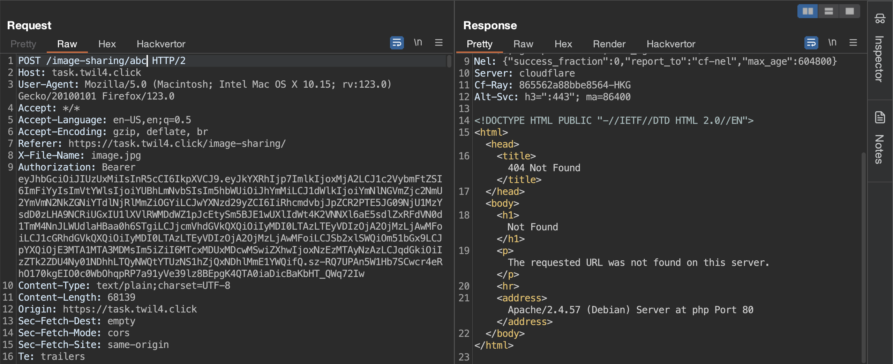
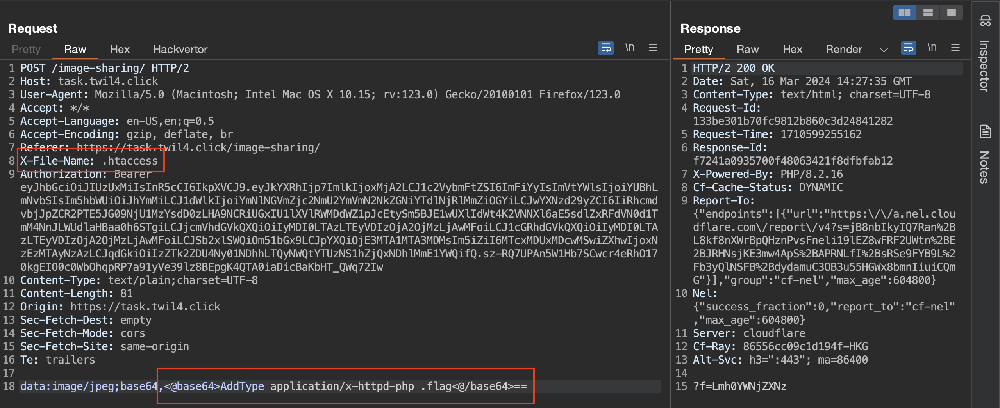
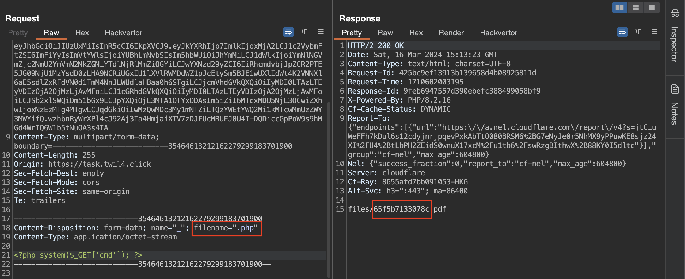

# Task 7


Trước tiên, để bắt đầu tìm kiếm lỗ hổng, em đăng ký cho mình một tài khoản và sau đó đăng nhập thành công:


## Khai thác ở chức năng Image Sharing


Tại đây, em thử tải lên một file ảnh `image.jpg`:


Em vào Burp Suite để xem xét các request.

Bên dưới là POST request tới `/image-sharing/` để tải lên bức ảnh:


Nhận thấy giá trị của tham số `f` ở GET request `/image-sharing/?f=aW1hZ2UuanBn` có chút đặc biệt, em bôi đen kiểm tra thì thấy nó là tên file ảnh em vừa tải lên được encode Base64:


Em gửi request đó sang bên Repeater, sau đó em thử đổi giá trị của `f` thành `/etc/passwd` và sử dụng Hackvertor để encode Base64 nó.

Gửi request, em thấy nội dung của file `/etc/passwd` đã được trả về:


Vậy thử xem có đọc được file code của chức năng Image Sharing không.

Em đổi giá trị của tham số `f` thành `/var/www/html/image-sharing/index.php` rồi gửi request đã đọc được thành công nội dung file `index.php`:


```php
<?php
@date_default_timezone_set('Asia/Ho_Chi_Minh');
error_reporting(0);
header('response-id: 1');

if (@$_GET['f']) {
  chdir('./file_contents');
  header('Content-Type: application/octet-stream');
  header('Content-Disposition: attachment; filename='.base64_decode($_GET['f']));
  readfile(base64_decode($_GET['f']));
  exit;
}

if ($_SERVER['REQUEST_METHOD'] == 'POST') {
  @mkdir('./file_contents',0777);
  $filename = $_SERVER['HTTP_X_FILE_NAME'];
  $post = explode(',', file_get_contents('php://input'));
  $enc_content = $post[1];
  $scheme = explode(':', $post[0]);
  $headers = explode(';', $scheme[1]);
  $scheme = $scheme[0];
  $content_type = array_shift($headers);
  $enctype = array_pop($headers);
  foreach($headers as $v) {
    $v = explode('=', $v);
    $k = $v[0];
    $v = $v[1];
    $$k = $v;
  }  if (!str_starts_with($content_type, 'image/') || str_ends_with($filename, '.php')) exit('Invalid file extension!');
  switch($enctype) {
    case 'base64': {
      file_put_contents('./file_contents/'.$filename, base64_decode($enc_content));
      break;
    }
    case 'gzip': {
    file_put_contents('./file_contents/'.$filename, gzdeflate($enc_content)/*shorter*/);
      break;
    }
  }

  echo '?f='.rawurlencode(base64_encode($filename));
  exit;
}
?>
```

Phân tích khối code ở câu lệnh `if` đầu tiên:

```php
if (@$_GET['f']) {
  chdir('./file_contents');
  header('Content-Type: application/octet-stream');
  header('Content-Disposition: attachment; filename='.base64_decode($_GET['f']));
  readfile(base64_decode($_GET['f']));
  exit;
}
```

- `chdir('./file_contents')`: Hàm này sẽ thay đổi thư mục làm việc hiện tại của file `index.php` thành `file_contents`, đảm bảo rằng file ảnh mà chúng ta tải lên được tìm thấy.

- `readfile(base64_decode($_GET['f']))`: Hàm này sẽ đọc file được chỉ định trong tham số `f` và xuất ra nội dung của file. Giá trị của tham số `f` được decode Base64 trước khi sử dụng.

Như vậy, chúng ta hoàn toàn có thể lấy được flag nếu biết đường dẫn chính xác tới file chứa flag.

Tiếp đến đoạn code bên dưới:

```php
@mkdir('./file_contents',0777);
$filename = $_SERVER['HTTP_X_FILE_NAME'];
$post = explode(',', file_get_contents('php://input'));
$enc_content = $post[1];
$scheme = explode(':', $post[0]);
$headers = explode(';', $scheme[1]);
$scheme = $scheme[0];
$content_type = array_shift($headers);
$enctype = array_pop($headers);
```

- `@mkdir('./file_contents',0777)`: Hàm này sẽ tạo một thư mục có tên `file_contents` bên trong thư mục `image-sharing`. Con số `0777` chỉ định các quyền mặc định có trên thư mục. Việc sử dụng `@` ở trước tên hàm như vậy để bỏ qua lỗi nếu thư mục đã tồn tại.

- `$filename = $_SERVER['HTTP_X_FILE_NAME']`: Biến `$filename` được gán cho giá trị của header `X-File-Name`. Trong trường hợp em tải lên file ảnh thì biến `$filename` có giá trị là `image.jpg`.

- `$post = explode(',', file_get_contents('php://input'))`: Mảng `$post` được tạo ra bằng cách đọc dữ liệu gửi đến từ POST request bằng hàm `file_get_contents('php://input')` và tách ra các phần tử tại dấu `,` thông qua hàm `explode()`.

- `$enc_content = $post[1]`: Nội dung sau dấu phẩy được encode Base64 của file lấy ra từ phần tử thứ hai của mảng `$post`.

- `$scheme = explode(':', $post[0])`: Biến `$scheme` sẽ là một mảng gồm hai phần tử là `data` và `image/jpeg;base64` trong trường hợp tải lên file ảnh.

- `$headers = explode(';', $scheme[1])`: Biến `$headers` sẽ là một mảng gồm hai phần tử được tách ra tại `;` từ `image/jpeg;base64` là `image/jpeg` và `base64`.

- `$content_type = array_shift($headers)`: Biến `$content_type` sẽ mang giá trị `image/jpeg`.

- `$enctype = array_pop($headers)`: Biến `$enctype` sẽ mang giá trị `base64`.

Và câu lệnh `if` ngăn chặn tải lên file `.php`:

```php
if (!str_starts_with($content_type, 'image/') || str_ends_with($filename, '.php')) exit('Invalid file extension!');
```

Trang web không cho phép chúng ta tải lên một file có tên kết thúc bằng `.php` và Content-Type của nó phải bắt đầu bằng `image/`.

Nếu không bị dừng ở lệnh `if` bên trên thì nội dung của file sẽ được decode Base64 và truyền tới file `$filename`:

```php
case 'base64': {
      file_put_contents('./file_contents/'.$filename, base64_decode($enc_content));
      break;
    }
```

Bắt đầu việc khai thác, em thử các extension khác của PHP nhưng không thành công, tuy nhiên còn một cách là ghì đè file cấu hình của server sử dụng file `.htaccess`.

Em kiểm tra thấy trang web đang sử dụng Apache server:



Do đó, có thể dễ dàng tải lên một file `.htaccess` từ đó cho phép thực thi file `.flag` như file `.php`:



Tiếp đến, em gửi lên `shell.flag` thành công:


Em truyền thử lệnh `ls /` cho tham số `cmd` để xem các thư mục ở `/`:


`flag` trong response trên là một thư mục và file `flag` nằm ở bên trong nó nên em dùng lệnh `cat /flag/flag` để đọc được flag:


Vậy là đã biết được đường dẫn tới file chứa flag nên em có thể truyền thẳng nó tới tham số `f` để đọc flag luôn:


## Khai thác ở chức năng Create & View your CV


Bên dưới là POST request khi em nhấn "TẢI VỀ":


Nó thực hiện gửi đi nội dung của file `710600046388.html` rồi xử lý phía server để tạo ra một file PDF.

Tận dụng chức năng đọc file ở Image Sharing, em đọc được nội dung của file `pdf.php`:


```php
<?php
@date_default_timezone_set('Asia/Ho_Chi_Minh');

if ($_SERVER['REQUEST_METHOD'] !== 'POST'  || empty($_FILES)) exit;

$id = uniqid();
$file = array_pop($_FILES);
$html_file_name = 'files/'.$id.$file['name'];
move_uploaded_file($file['tmp_name'], $html_file_name);

file_put_contents($html_file_name, str_replace('<head>', <<<DOC
<head><base href="http://127.0.0.1/cv-editor/"><link rel="stylesheet" href="https://cdnjs.cloudflare.com/ajax/libs/font-awesome/4.7.0/css/font-awesome.css" integrity="sha512-5A8nwdMOWrSz20fDsjczgUidUBR8liPYU+WymTZP1lmY9G6Oc7HlZv156XqnsgNUzTyMefFTcsFH/tnJE/+xBg==" crossorigin="anonymous" referrerpolicy="no-referrer" />
DOC, file_get_contents($html_file_name)));

$filepath = 'files/'.$id.'.pdf';

$descriptors = array(
  0 => array("pipe", "r"),  // STDIN
  1 => array("pipe", "w"),  // STDOUT
  2 => array("pipe", "w")   // STDERR
);


/*
dpkg -i libssl1.1_1.1.0g-2ubuntu4_amd64.deb
apt install libx11-6 libxext6 libfreetype6 libfontconfig1 libxrender1 libjpeg62-turbo
*/
$proc = proc_open('cat "'.$html_file_name.'" | timeout 7 "'.__DIR__.'/wkhtmltopdf" - "'.$filepath.'"', $descriptors, $pipes);
// fwrite($pipes[0], $c);
fclose($pipes[0]);

$stdout = stream_get_contents($pipes[1]);
$stderr = stream_get_contents($pipes[2]);

file_put_contents('php://stdout', $stdout);
file_put_contents('php://stderr', $stderr);

fclose($pipes[1]);
fclose($pipes[2]);

$exitCode = proc_close($proc);

echo $filepath;
```

Có thể thấy đoạn mã PHP trên được sử dụng để xử lý POST request.

Phân tích qua một chút về file đó:

- `$html_file_name = 'files/'.$id.$file['name']`: Tạo một đường dẫn tới file tải lên với tên file được nối một giá trị `id` vô đằng trước.

- `move_uploaded_file($file['tmp_name'], $html_file_name)`: Di chuyển file tải lên tới đường dẫn file `$html_file_name` đã được tạo.

- `$proc = proc_open('cat "'.$html_file_name.'" | timeout 7 "'.__DIR__.'/wkhtmltopdf" - "'.$filepath.'"', $descriptors, $pipes)`: Đọc nội dung của file HTML rồi đưa dữ liệu đầu ra tới lệnh `wkhtmltopdf` để xử lý tạo thành file PDF.

Do không có bất kỳ hạn chế nào đối với việc tải file nên chúng ta sẽ không có khó khăn gì khi tải lên webshell.

Bởi vì tên file tải lên được nối thêm một giá trị `id` ngẫu nhiên phía trước nhưng lại có thể thấy luôn nó ở tên file PDF trả về nên em chỉ nhập `filename` là `.php`:



Tải lên file thành công, em request tới file `65f5b7133078c.php` để có thể nhập lệnh đọc flag:


